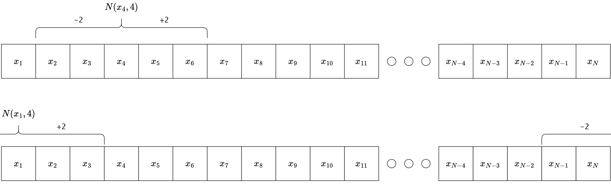

---
output:
  pdf_document: default
  html_document: default
editor_options:
  chunk_output_type: console
---
# PSO Variations
The standard PSO analysed in the previews chapter is capable to solve a wide range of problems but is very slow and often gets stuck in local minima. This chapter analyses different variations of the standard PSO in finance related problems. The first variant is the PSO with functional stretching, which should reduces stagnation in local minimas. ...............

### Testproblem: Discrete ITP-MSTE
All variants are tested on a discrete ITP-MSTE to track the S&P 500 with a tracking portfolio consisting of the top 50 assets in the S&P 500. The daily data used to solve the ITP ranges from 2018-01-01 to 2019-12-31, and the assets must be in the S&P 500 at the end of the time frame and have no missing values. The top 50 assets are selected by solving a continuous ITP-MSTE using a `solve.QP()` approach and the assets with the 50 highest weights are selected. The tracking portfolio is discrete and has a net asset value of twenty thousand USD. The tracking portfolio is discretized using closing prices on 2019-12-31 and returns are calculated as simple returns from the adjusted closing prices. The maximum weighting for each asset is 10% to reduce the dimension space of the problem. Additional constraints are long only and portfolio weights $w$ should satisfy $1 \leq \textstyle\sum w_i \geq 0.99$. All variants are run 100 times and compared to 100 runs of the standard PSO function created in the previous chapter. The swarm size for the PSO and all variations is 100 and the iterations are set to 100. 

The next plot analyzes the behavior of the 100 standard PSO runs in each iteration by plotting the median of the best fitness achieved at each iteration. The confidence bands for the 95% and 5% quantiles of the best fitness values are plotted in the same color as the median, with less transparency:

```{r variants1, echo= knitr::is_html_output(), class.source="code_fold_it_collapsed"}
nav <- 20000
 
from <- "2018-01-01"
to <- "2019-12-31"

spx_composition <- buffer(
  get_spx_composition(),
  "AS_spx_composition"
)


pool_data <- buffer(
  get_yf(
    tickers = spx_composition %>% 
      filter(Date<=to) %>% 
      filter(Date==max(Date)) %>% 
      pull(Ticker), 
    from = from, 
    to = to
  ), 
  "AS_sp500_asset_data"
)
pool_data$returns <- 
  pool_data$returns[, colSums(is.na(pool_data$returns))==0]
pool_data$prices <- pool_data$prices[, colnames(pool_data$returns)]


bm_returns <- buffer(
  get_yf(tickers = "%5EGSPC", from = from, to = to)$returns, 
  "AS_sp500"
) %>% setNames(., "S&P 500")


pool_returns <- pool_data$returns
mat <- list(
  Dmat = t(pool_returns) %*% pool_returns,
  dvec = t(pool_returns) %*% bm_returns,
  Amat = t(rbind(
    rep(1, ncol(pool_returns)), # sum up to 1
    diag(1, 
         nrow=ncol(pool_returns), 
         ncol=ncol(pool_returns)) # long only
  )),
  bvec = c(
    1, # sum up to 1
    rep(0, ncol(pool_returns)) # long only
  ),
  meq = 1
)

# search 100 best tickers
qp <- solve.QP(
  Dmat = mat$Dmat, dvec = mat$dvec, 
  Amat = mat$Amat, bvec = mat$bvec, meq = mat$meq
)
sub_ticker <- colnames(pool_returns)[order(qp$solution, decreasing = T)[1:50]]
pool_data$returns <- pool_data$returns[, sub_ticker]
pool_data$prices <- pool_data$prices[, sub_ticker]

prices <- last(pool_data$prices)

mat <- list(
  Dmat = t(pool_data$returns) %*% pool_data$returns,
  dvec = t(pool_data$returns) %*% bm_returns,
  Amat = t(rbind(
    rep(1, ncol(pool_data$returns)), # sum up to 1
    diag(1, 
         nrow=ncol(pool_data$returns), 
         ncol=ncol(pool_data$returns)) # long only
  )),
  bvec = c(
    1, # sum up to 1
    rep(0, ncol(pool_data$returns)) # long only
  ),
  meq = 1
)


calc_fit <- function(x){
  as.numeric(0.5 * t(x) %*% mat$Dmat %*% x - t(mat$dvec) %*% x)
}
calc_const <- function(x){
  const <- t(mat$Amat) %*% x - mat$bvec
  const[mat$meq] <- -pmax(0, abs(const[mat$meq]+0.005)-0.005)
  sum(pmin(0, const)^2)
}

set.seed(0)

df_SPSO <- NULL
for(i in 1:50){
  res_SPSO_time <- system.time({
    res_SPSO <- pso(
      par = rep(0, ncol(pool_data$returns)),
      fn = function(x){
        x <- as.vector(round(x*nav/prices)*prices/nav)
        fitness <- calc_fit(x)
        constraints <- calc_const(x)
        return(fitness+10*constraints)
      },
      lower = 0,
      upper = 0.1,
      control = list(
        s = 50, # swarm size
        c.p = 0.5, # inherit best
        c.g = 0.5, # global best
        maxiter = 400, # iterations
        w0 = 1.2, # starting inertia weight
        wN = 0, # ending inertia weight
        save_fit = T # save more information
      )
    )
  })
  
  df_SPSO <- rbind(df_SPSO, 
    data.frame(
      "run" = i,
      suppressWarnings(rbind(data.frame(
        "type" = "PSO", "time"=res_SPSO_time[3], "const_break"=calc_const(res_SPSO$solution), res_SPSO$fit_data %>% select(iter, "mean_fit"=mean, "best_fit"=best)
      )))
    )
  )
}

df_res <- df_SPSO %>% 
  group_by(iter, type) %>% 
  summarise(time_mean=mean(time), const_break_mean=mean(const_break), best_fit_q1 = quantile(best_fit, 0.05), best_fit_q3 = quantile(best_fit, 0.95), best_fit_mean = mean(best_fit), best_fit_median = quantile(best_fit, 0.5)) %>% 
  ungroup()

plot_ly() %>% 
  add_trace(data = df_res, x=~iter, y=~best_fit_median, name = "PSO", mode="lines", type = 'scatter', line = list(color="rgba(255, 51, 0, 1)")) %>% 
  add_trace(data = df_res, x=~iter, y=~best_fit_q1, name = "PSO_q1", mode="lines", type = 'scatter', line = list(color="rgba(255, 51, 0, 0.4)"), showlegend=F) %>% 
  add_trace(data = df_res, x=~iter, y=~best_fit_q3, name = "PSO_q3", mode="lines", type = 'scatter', fill="tonexty", line = list(color="rgba(255, 51, 0, 0.4)"), fillcolor = "rgba(255, 51, 0, 0.4)", showlegend=F) %>% 
  layout(yaxis=list(range=c(min(df_res[df_res$iter>3,]$best_fit_q3)-0.001,  max(df_res[df_res$iter>3,]$best_fit_q3)+0.001), title="best fitness")) %>% 
  html_save()
```

The aggregated statistics of the last iterations of all 100 runs can be found in the table below:

```{r variants2, echo=F}
reactable(
  df_res[df_res$iter==max(df_res$iter),],
  columns = list(
    iter = colDef(width=60),
    type = colDef(width=90),
    time_mean = colDef(format = colFormat(digits=2), width=90),
    const_break_mean = colDef(format = colFormat(digits=4), width=150),
    best_fit_q1 = colDef(format = colFormat(digits=4), width=130),
    best_fit_q3 = colDef(format = colFormat(digits=4), width=130),
    best_fit_mean = colDef(format = colFormat(digits=4), width=130),
    best_fit_median = colDef(format = colFormat(digits=4), width=130)
  ),
  compact = T,
  rownames = F
) %>% 
  html_save(., vwidth = 1000)
```


## Function Stretching
PSO often gets stuck in local minimas, that means if the current global best position is a local minima with a larger neighborhood around it containing higher fitness, it's hard for the PSO to escape and find the global minima. Function stretching tries to accomplish that the PSO can escape from such local minimas, by transforming the fitness function in a manner that is described in [@PaVr2002]. It states that after a local minima is found a two stage transformation proposed by Vrahatis 1996 can be used to stretch the original function in a way that the detected local minima transforms into a maxima, but any position with less fitness will stay unchanged. The two stages of the transformation with a detected local minima $\bar{x}$ are:
$$
  G(x) = f(x) +  \gamma_1 \cdot \| x-\bar{x} \| \cdot (\text{sign}(f(x)-f(\bar{x}))+1)
$$
and
$$
  H(x) = G(x) + \gamma_2 \cdot \frac{\text{sign}\biggl(f(x)-f(\bar{x})\biggr)+1}{\text{tanh}\biggl( \mu \cdot (G(x)-G(\bar{x})) \biggr)}
$$
The function $G(\bar{x})$ can be simplified to $f(\bar{x})$ and the $\text{sign}()$ function is defined as follows:
$$
  \text{sign}(x) = 
  \begin{cases}
    1, & \text{if}\ \ x > 0\\
    0, & \text{if}\ \ x = 0\\
    -1, & \text{if}\ \ x < 0
  \end{cases}
$$
The source suggests to choose the following parameter values as default:
\begin{align*}
  \gamma_1 &= 5000 \\
  \gamma_2 &= 0.5 \\
  \mu &= 10^{-10}
\end{align*}

To understand the transformation more deeply, it's used to stretch a simple function in $\mathbb{R}^1$, that is defined as:
```{r}
fn <- function(pos){
  cos(pos) + 1/10 * pos
}
```
and the domain of definition is chosen to be $x \in [-20, 20]$. Suppose the PSO gets stuck in the local minima located at $\bar{x} = \pi - \text{arcsin}(\frac{1}{10})$. The initial function and the transformed function is plotted in the chart below, respectively:
```{r, echo= knitr::is_html_output(), class.source="code_fold_it_collapsed"}
fn1 <- function(pos, pos_best, pos_best_fit){
  res <- fn(pos)
  G <- res + 5000 * sqrt(sum((pos - pos_best)^2))/length(pos) * (sign(res - pos_best_fit) + 1)
  H <- G + 0.5 * (sign(res - pos_best_fit) + 1)/(tanh(10^(-10) * (G - pos_best_fit)))
  return(H)
}

X <- seq(-20, 20, 0.001)
x_best <- pi-asin(1/10)
x_best_fit <- fn(x_best)

p1 <- plot_ly(x=X, y=sapply(X, fn), type="scatter", mode="lines", name="fn")
p2 <- plot_ly(x=X, y=sapply(X, fn1, pos_best=x_best, pos_best_fit=x_best_fit), type="scatter", mode="lines", name="fn_stretched", line=list(color="orange")) %>% 
  layout(yaxis=list(range=c(-2, 20)*10^5))

subplot(p1, p2, shareY=T, nrows=2) %>% 
  html_save(., vheight=700, vwidth=800)
```
It can be seen that the fitness around the local minima $\bar{x}$ are stretched upwards, which makes it much easier for the PSO to walk the hill downwards and fall into new minimas with lower fitness. All domains with lower fitness stay unchanged, which can be seen in the zoomed version of the lower chart from above:
```{r, echo=F}
plot_ly(x=X, y=sapply(X, fn1, pos_best=x_best, pos_best_fit=x_best_fit), type="scatter", mode="lines", name="fn_stretched", line=list(color="orange")) %>% 
  add_trace(x=X, y=rep(fn(pi-asin(1/10)), length(X)), type="scatter", mode="lines", name="local_minima", line=list(dash="dot", color="grey")) %>% 
  layout(yaxis=list(range=c(1.1*min(sapply(X, fn)), 1.1*max(sapply(X, fn))))) %>% 
  html_save(., vheight=350, vwidth=800)
```

### Implementation
It is not possible to know if the PSO is stuck in a local minima so a stagnation value was added that increases by one, if the global best particle do not change. After ten iterations without a change, a local minima is supposed and the transformation of the objective function takes place. Afterwards all personal best fitness have to be reevaluated, to work with the evaluated space and the stagnation value is set to zero. To prevent a transformation closely at the end of all iterations, the current iteration needs to be below maximal iterations minus twenty, to enable the transformation.


### Test PSO with Function Stretching
The PSO with function stretching is called `PSO-fnS` and is evaluated on the test problem with $\gamma_1 = 5000$, $\gamma_2 = 0.5$ and $\mu = 10^{-10}$:

```{r variants3, echo= knitr::is_html_output(), class.source="code_fold_it_collapsed"}
set.seed(0)
# R/PSO_functions.R : pso_fn_stretching()

df <- NULL
for(i in 1:50){
  res_pso_fns_time <- system.time({
    res_pso_fns <- pso_fn_stretching(
      par = rep(0, ncol(pool_data$returns)),
      fn = function(x){
        x <- as.vector(round(x*nav/prices)*prices/nav)
        fitness <- calc_fit(x)
        constraints <- calc_const(x)
        return(fitness+10*constraints)
      },
      lower = 0,
      upper = 0.1,
      control = list(
        s = 50, # swarm size
        c.p = 0.5, # inherit best
        c.g = 0.5, # global best
        maxiter = 400, # iterations
        w0 = 1.2, # starting inertia weight
        wN = 0, # ending inertia weight
        fn_stretching = T,
        save_fit = T
      )
    )
  })
  
  df <- rbind(df, 
    data.frame(
      "run" = i,
      suppressWarnings(data.frame(
        "type" = "PSO-fnS", "time"=res_pso_fns_time[3], "const_break"=calc_const(res_pso_fns$solution), res_pso_fns$trace_fit %>% select(iter, mean_fit, best_fit)
      ))
    )
  )
}


df_res <- rbind(df_SPSO, df) %>% 
  #mutate(best_fit = best_fit +1) %>% 
  group_by(iter, type) %>% 
  summarise(time_mean=mean(time), const_break_mean=mean(const_break), best_fit_q1 = quantile(best_fit, 0.05), best_fit_q3 = quantile(best_fit, 0.95), best_fit_mean = mean(best_fit), best_fit_median = quantile(best_fit, 0.5)) %>% 
  ungroup()


plot_ly() %>% 
  add_trace(data = df_res %>% filter(type=="PSO"), x=~iter, y=~best_fit_median, name = "PSO", mode="lines", type = 'scatter', line = list(color="rgba(255, 51, 0, 1)")) %>% 
  add_trace(data = df_res %>% filter(type=="PSO"), x=~iter, y=~best_fit_q1, name = "PSO_q1", mode="lines", type = 'scatter', line = list(color="rgba(255, 51, 0, 0.4)"), showlegend=F) %>% 
  add_trace(data = df_res %>% filter(type=="PSO"), x=~iter, y=~best_fit_q3, name = "PSO_q3", mode="lines", type = 'scatter', fill="tonexty", line = list(color="rgba(255, 51, 0, 0.4)"), fillcolor = "rgba(255, 51, 0, 0.4)", showlegend=F) %>% 
  add_trace(data = df_res %>% filter(type=="PSO-fnS"), x=~iter, y=~best_fit_median, name = "PSO-fnS", mode="lines", type = 'scatter',line = list(color="rgba(0, 102, 204, 1)")) %>% 
  add_trace(data = df_res %>% filter(type=="PSO-fnS"), x=~iter, y=~best_fit_q1, name = "PSO-fnS_q1", mode="lines", type = 'scatter', line = list(color="rgba(0, 102, 204, 0.3)"), showlegend=F) %>% 
  add_trace(data = df_res %>% filter(type=="PSO-fnS"), x=~iter, y=~best_fit_q3, name = "PSO-fnS_q3", mode="lines", type = 'scatter', fill="tonexty", line = list(color="rgba(0, 102, 204, 0.3)"), fillcolor = "rgba(0, 102, 204, 0.3)", showlegend=F) %>% 
  layout(yaxis=list(range=c(min(df_res[df_res$iter>3,]$best_fit_q3)-0.001,  max(df_res[df_res$iter>3,]$best_fit_q3)+0.001), title="best fitness")) %>% 
  html_save()
  

```

The aggregated statistics of the last iterations of all 100 runs can be found in the table below:

```{r variants4, echo=F}
reactable(
  df_res[df_res$iter==max(df_res$iter),],
  columns = list(
    iter = colDef(width=60),
    type = colDef(width=90),
    time_mean = colDef(format = colFormat(digits=2), width=90),
    const_break_mean = colDef(format = colFormat(digits=4), width=150),
    best_fit_q1 = colDef(format = colFormat(digits=4), width=130),
    best_fit_q3 = colDef(format = colFormat(digits=4), width=130),
    best_fit_mean = colDef(format = colFormat(digits=4), width=130),
    best_fit_median = colDef(format = colFormat(digits=4), width=130)
  ),
  compact = T,
  rownames = F
) %>% 
  html_save(., vwidth = 1000)
```


## Local PSO
A local PSO is a more generic case of the global PSO. It's only difference lies in the selection of the global best particle, by defining a neighborhood. Each particle $x_i$ has a neighborhood $N(x_i, \bar{k})$ and the global best particle in it's neighborhood is named local best particle of $x_i$. If the neighborhood is chosen big enough to contain all particles, it matches with the standard PSO (global PSO). A simple definition of a neighborhood with $k$ neighbors for particles $x_i$ stated in [@Enge2013] would be:

$$
  N(x_i, k) = \{ x_{i-\bar{k}}, x_{i-(\bar{k}-1)}, x_{i-(\bar{k}-2)}, \cdots, x_{i}, \cdots, x_{i+(\bar{k}-2)}, x_{i+(\bar{k}-1)}, x_{i+\bar{k}} \}
$$
with
$$
  \bar{k} = floor(\frac{k}{2}) = \lfloor \frac{k}{2} \rfloor
$$
To visualize this, the following image defines the neighborhoods $N(x_4, 4)$ and $N(x_1, 4)$:


In the later case, it can be seen, that overflowing boundary's will continue on the opposite site of the arranged particles.

### Implementation
First the neighbors for each particle are saved in a suited data structure bevor running the main part of the PSO. The local version has no global best overall, instead it needs to calculate the global best for each particles neighborhood in every step.

### Test Local PSO
The PSO with particle neighborhoods is called `PSO-local` and is evaluated on the test problem with $k=20$:

```{r variants5, echo= knitr::is_html_output(), class.source="code_fold_it_collapsed"}
set.seed(0)
# R/PSO_functions.R : pso_local()

df <- NULL
for(i in 1:50){

  res_pso_local_time <- system.time({
    res_pso_local <- pso_local(
      par = rep(0, ncol(pool_data$returns)),
      fn = function(x){
        x <- as.vector(round(x*nav/prices)*prices/nav)
        fitness <- calc_fit(x)
        constraints <- calc_const(x)
        return(fitness+10*constraints)
      },
      lower = 0,
      upper = 0.1,
      control = list(
        s = 50, # swarm size
        c.p = 0.5, # inherit best
        c.g = 0.5, # global best
        maxiter = 400, # iterations
        w0 = 1, # starting inertia weight
        wN = 0.4, # ending inertia weight
        save_fit = T,
        k=20
      )
    )
  })
  
  df <- rbind(df, 
    data.frame(
      "run" = i,
      suppressWarnings(data.frame(
        "type" = "PSO-local", "time"=res_pso_local_time[3], "const_break"=calc_const(res_pso_local$solution), res_pso_local$fit_data %>% select(iter, "mean_fit"=mean, "best_fit" = best)
      ))
    )
  )
}


df_res <- rbind(df_SPSO, df) %>% 
  #mutate(best_fit = best_fit +1) %>% 
  group_by(iter, type) %>% 
  summarise(time_mean=mean(time), const_break_mean=mean(const_break), best_fit_q1 = quantile(best_fit, 0.05), best_fit_q3 = quantile(best_fit, 0.95), best_fit_mean = mean(best_fit), best_fit_median = quantile(best_fit, 0.5)) %>% 
  ungroup()


plot_ly() %>% 
  add_trace(data = df_res %>% filter(type=="PSO"), x=~iter, y=~best_fit_median, name = "PSO", mode="lines", type = 'scatter', line = list(color="rgba(255, 51, 0, 1)")) %>% 
  add_trace(data = df_res %>% filter(type=="PSO"), x=~iter, y=~best_fit_q1, name = "PSO_q1", mode="lines", type = 'scatter', line = list(color="rgba(255, 51, 0, 0.4)"), showlegend=F) %>% 
  add_trace(data = df_res %>% filter(type=="PSO"), x=~iter, y=~best_fit_q3, name = "PSO_q3", mode="lines", type = 'scatter', fill="tonexty", line = list(color="rgba(255, 51, 0, 0.4)"), fillcolor = "rgba(255, 51, 0, 0.4)", showlegend=F) %>% 
  add_trace(data = df_res %>% filter(type=="PSO-local"), x=~iter, y=~best_fit_median, name = "PSO-local", mode="lines", type = 'scatter',line = list(color="rgba(0, 102, 204, 1)")) %>% 
  add_trace(data = df_res %>% filter(type=="PSO-local"), x=~iter, y=~best_fit_q1, name = "PSO-local_q1", mode="lines", type = 'scatter', line = list(color="rgba(0, 102, 204, 0.3)"), showlegend=F) %>% 
  add_trace(data = df_res %>% filter(type=="PSO-local"), x=~iter, y=~best_fit_q3, name = "PSO-local_q3", mode="lines", type = 'scatter', fill="tonexty", line = list(color="rgba(0, 102, 204, 0.3)"), fillcolor = "rgba(0, 102, 204, 0.3)", showlegend=F) %>% 
  layout(yaxis=list(range=c(min(df_res[df_res$iter>7,]$best_fit_q3)-0.001,  max(df_res[df_res$iter>7,]$best_fit_q3)+0.001), title="best fitness")) %>% 
  html_save()
  

```

The aggregated statistics of the last iterations of all 100 runs can be found in the table below:

```{r variants6, echo=F}
reactable(
  df_res[df_res$iter==max(df_res$iter),],
  columns = list(
    iter = colDef(width=60),
    type = colDef(width=90),
    time_mean = colDef(format = colFormat(digits=2), width=90),
    const_break_mean = colDef(format = colFormat(digits=4), width=150),
    best_fit_q1 = colDef(format = colFormat(digits=4), width=130),
    best_fit_q3 = colDef(format = colFormat(digits=4), width=130),
    best_fit_mean = colDef(format = colFormat(digits=4), width=130),
    best_fit_median = colDef(format = colFormat(digits=4), width=130)
  ),
  compact = T,
  rownames = F
) %>% 
  html_save(., vwidth = 1000)
```

It can be seen that it is superior to the standard PSO in this case. Particularly in preventing stagnation in local minimas, that can be seen in the tighter quantile bands at the end.

## Preserving Feasibility
SCI2002Constrained.pdf


## Self-Adaptive Velocity

```{r variants3, echo= knitr::is_html_output(), class.source="code_fold_it_collapsed"}
set.seed(0)
# R/PSO_functions.R : pso_fn_stretching()

df <- NULL
for(i in 1:50){
  res_pso_sAvel_time <- system.time({
    res_pso_sAvel <- pso_self_adaptive_velocity(
      par = rep(0, ncol(pool_data$returns)),
      fn = function(x){
        x <- as.vector(round(x*nav/prices)*prices/nav)
        fitness <- calc_fit(x)
        constraints <- calc_const(x)
        return(fitness+10*constraints)
      },
      lower = 0,
      upper = 0.1,
      control = list(
        s = 50, # swarm size
        maxiter = 400, # iterations
        save_fit = T
      )
    )
  })
  
  df <- rbind(df, 
    data.frame(
      "run" = i,
      suppressWarnings(data.frame(
        "type" = "PSO-sAvel", "time"=res_pso_sAvel_time[3], "const_break"=calc_const(res_pso_sAvel$solution), res_pso_sAvel$fit_data %>% select(iter, mean_fit=mean, best_fit=best)
      ))
    )
  )
}


df_res <- rbind(df_SPSO, df) %>% 
  #mutate(best_fit = best_fit +1) %>% 
  group_by(iter, type) %>% 
  summarise(time_mean=mean(time), const_break_mean=mean(const_break), best_fit_q1 = quantile(best_fit, 0.05), best_fit_q3 = quantile(best_fit, 0.95), best_fit_mean = mean(best_fit), best_fit_median = quantile(best_fit, 0.5)) %>% 
  ungroup()


plot_ly() %>% 
  add_trace(data = df_res %>% filter(type=="PSO"), x=~iter, y=~best_fit_median, name = "PSO", mode="lines", type = 'scatter', line = list(color="rgba(255, 51, 0, 1)")) %>% 
  add_trace(data = df_res %>% filter(type=="PSO"), x=~iter, y=~best_fit_q1, name = "PSO_q1", mode="lines", type = 'scatter', line = list(color="rgba(255, 51, 0, 0.4)"), showlegend=F) %>% 
  add_trace(data = df_res %>% filter(type=="PSO"), x=~iter, y=~best_fit_q3, name = "PSO_q3", mode="lines", type = 'scatter', fill="tonexty", line = list(color="rgba(255, 51, 0, 0.4)"), fillcolor = "rgba(255, 51, 0, 0.4)", showlegend=F) %>% 
  add_trace(data = df_res %>% filter(type=="PSO-sAvel"), x=~iter, y=~best_fit_median, name = "PSO-sAvel", mode="lines", type = 'scatter',line = list(color="rgba(0, 102, 204, 1)")) %>% 
  add_trace(data = df_res %>% filter(type=="PSO-sAvel"), x=~iter, y=~best_fit_q1, name = "PSO-sAvel_q1", mode="lines", type = 'scatter', line = list(color="rgba(0, 102, 204, 0.3)"), showlegend=F) %>% 
  add_trace(data = df_res %>% filter(type=="PSO-sAvel"), x=~iter, y=~best_fit_q3, name = "PSO-sAvel_q3", mode="lines", type = 'scatter', fill="tonexty", line = list(color="rgba(0, 102, 204, 0.3)"), fillcolor = "rgba(0, 102, 204, 0.3)", showlegend=F) %>% 
  layout(yaxis=list(range=c(min(df_res[df_res$iter>20,]$best_fit_q3)-0.001,  max(df_res[df_res$iter>20,]$best_fit_q3)+0.001), title="best fitness")) %>% 
  html_save()
  

```

The aggregated statistics of the last iterations of all 100 runs can be found in the table below:

```{r variants4, echo=F}
reactable(
  df_res[df_res$iter==max(df_res$iter),],
  columns = list(
    iter = colDef(width=60),
    type = colDef(width=90),
    time_mean = colDef(format = colFormat(digits=2), width=90),
    const_break_mean = colDef(format = colFormat(digits=4), width=150),
    best_fit_q1 = colDef(format = colFormat(digits=4), width=130),
    best_fit_q3 = colDef(format = colFormat(digits=4), width=130),
    best_fit_mean = colDef(format = colFormat(digits=4), width=130),
    best_fit_median = colDef(format = colFormat(digits=4), width=130)
  ),
  compact = T,
  rownames = F
) %>% 
  html_save(., vwidth = 1000)
```


## Test Local and Preserving Feasibility
```{r variants_last, echo=F}
# res_PSO_l_preF <- pso_local_prevFeas(
#   par = rep(0, ncol(pool_data$returns)),
#   fn_fit = function(x){
#     x <- as.vector(round(x*nav/prices)*prices/nav)
#     fitness <- calc_fit(x)
#     constraints <- calc_const(x)
#     return(fitness)
#   },
#   fn_const = function(x){
#     x <- as.vector(round(x*nav/prices)*prices/nav)
#     constraints <- calc_const(x)
#     return(10*constraints)
#   },
#   lower = 0,
#   upper = 0.1,
#   control = list(
#     s = 100, # swarm size
#     c.p = 0.5, # inherit best
#     c.g = 0.5, # global best
#     maxiter = 100, # iterations
#     w0 = 1.2, # starting inertia weight
#     wN = 0, # ending inertia weight
#     save_fit = T, # save more information
#     k=20
#   )
# )
# 


set.seed(0)
# R/PSO_functions.R : pso_local_prevFeas()

df <- NULL
for(i in 1:100){

  res_pso_l_preF_time <- system.time({
    res_pso_l_preF <- pso_local_prevFeas(
      par = rep(0, ncol(pool_data$returns)),
      fn_fit = function(x){
        x <- as.vector(round(x*nav/prices)*prices/nav)
        fitness <- calc_fit(x)
        constraints <- calc_const(x)
        return(fitness)
      },
      fn_const = function(x){
        x <- as.vector(round(x*nav/prices)*prices/nav)
        constraints <- calc_const(x)
        return(10*constraints)
      },
      lower = 0,
      upper = 0.1,
      control = list(
        s = 50, # swarm size
        c.p = 0.5, # inherit best
        c.g = 0.5, # global best
        maxiter = 200, # iterations
        w0 = 1.2, # starting inertia weight
        wN = 0, # ending inertia weight
        save_fit = T, # save more information
        k=30
      )
    )
  })
  
  df <- rbind(df, 
    data.frame(
      "run" = i,
      suppressWarnings(data.frame(
        "type" = "PSO-local-prevFeas", "time"=res_pso_l_preF_time[3], "const_break"=calc_const(res_pso_l_preF$solution), res_pso_l_preF$fit_data %>% select(iter, "mean_fit"=mean, "best_fit" = best)
      ))
    )
  )
}


df_res <- rbind(df_SPSO, df) %>% 
  #mutate(best_fit = best_fit +1) %>% 
  group_by(iter, type) %>% 
  summarise(time_mean=mean(time), const_break_mean=mean(const_break), best_fit_q1 = quantile(best_fit, 0.05), best_fit_q3 = quantile(best_fit, 0.95), best_fit_mean = mean(best_fit), best_fit_median = quantile(best_fit, 0.5)) %>% 
  ungroup()


plot_ly() %>% 
  add_trace(data = df_res %>% filter(type=="PSO"), x=~iter, y=~best_fit_median, name = "PSO", mode="lines", type = 'scatter', line = list(color="rgba(255, 51, 0, 1)")) %>% 
  add_trace(data = df_res %>% filter(type=="PSO"), x=~iter, y=~best_fit_q1, name = "PSO_q1", mode="lines", type = 'scatter', line = list(color="rgba(255, 51, 0, 0.4)"), showlegend=F) %>% 
  add_trace(data = df_res %>% filter(type=="PSO"), x=~iter, y=~best_fit_q3, name = "PSO_q3", mode="lines", type = 'scatter', fill="tonexty", line = list(color="rgba(255, 51, 0, 0.4)"), fillcolor = "rgba(255, 51, 0, 0.4)", showlegend=F) %>% 
  add_trace(data = df_res %>% filter(type=="PSO-local-prevFeas"), x=~iter, y=~best_fit_median, name = "PSO-local-prevFeas", mode="lines", type = 'scatter',line = list(color="rgba(0, 102, 204, 1)")) %>% 
  add_trace(data = df_res %>% filter(type=="PSO-local-prevFeas"), x=~iter, y=~best_fit_q1, name = "PSO-local-prevFeas_q1", mode="lines", type = 'scatter', line = list(color="rgba(0, 102, 204, 0.3)"), showlegend=F) %>% 
  add_trace(data = df_res %>% filter(type=="PSO-local-prevFeas"), x=~iter, y=~best_fit_q3, name = "PSO-local-prevFeas_q3", mode="lines", type = 'scatter', fill="tonexty", line = list(color="rgba(0, 102, 204, 0.3)"), fillcolor = "rgba(0, 102, 204, 0.3)", showlegend=F) %>% 
  layout(yaxis=list(range=c(min(df_res[df_res$iter>7,]$best_fit_q3)-0.001,  max(df_res[df_res$iter>7,]$best_fit_q3)+0.001), title="best fitness")) %>% 
  html_save()

```


