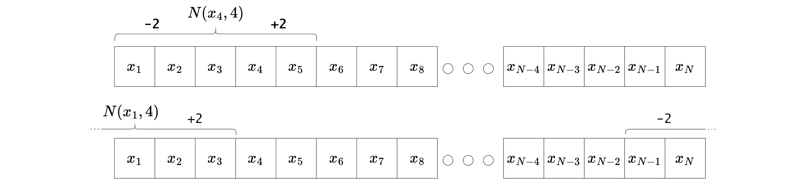

---
output:
  pdf_document: default
  html_document: default
editor_options:
  chunk_output_type: console
---
# PSO Variations {#psovariants}
The standard PSO analyzed in the previous chapter is capable of solving a wide range of problems, but often gets stuck in local minima. In this chapter, different variants of the standard PSO are analyzed using a problem from the financial domain. The first variant is the PSO with function stretching, which is designed to allow the PSO to escape from local minima if they are discovered. The second variant is the local PSO, which is designed to reduce the probability of getting stuck in local minima by limiting the spread of information in the swarm. The third variant, the PSO with feasibility preservation, tries to optimize within the feasibility space and therefore provide only feasible solutions. The last variant is the PSO with self-adaptive velocity, which tries to adjust the control parameters according to certain rules and randomness.


## Testproblem Discrete ITP-MSTE
All variants are tested on a discrete ITP-MSTE to replicate the SP500TR with a tracking portfolio consisting of the top 50 assets in the S&P 500 derived from the example with discarding in section \@ref(exampleitpsolveqp). The daily data used to solve the ITP ranges from 2018-01-01 to 2019-12-31, and the assets must be in the SP500TR at the end of the time frame and have no missing values. The tracking portfolio is discrete and has a net asset value of twenty thousand USD. The tracking portfolio is discretized using closing prices on 2019-12-31, and returns are calculated as simple returns using the adjusted closing prices. The maximum weighting for each asset is 10% to reduce the dimension space of the problem. Additional constraints are long only and portfolio weights $w$ should satisfy $0.99 \leq \textstyle\sum w_i \leq 1$. All variants are run 100 times and compared to 100 runs of the standard PSO created in the previous chapter. The swarm size for the PSO and all variants is 50 and the iterations are set to 400. All PSO's start with the zero vector as the initial particle position to test the ability to find the feasible space.

The next plot analyzes the behavior of the 100 standard PSO runs in each iteration by plotting the median of the best fitness achieved in each iteration. The confidence bands for the 95% and 5% quantiles of the best fitness values are plotted in the same color as the median, with less transparency:


```{r variants1, eval = F, echo= knitr::is_html_output(), class.source="code_fold_it_collapsed"}
nav <- 20000
 
from <- "2018-01-01"
to <- "2019-12-31"

spx_composition <- buffer(
  get_spx_composition(),
  "AS_spx_composition"
)


pool_data <- buffer(
  get_yf(
    tickers = spx_composition %>% 
      filter(Date<=to) %>% 
      filter(Date==max(Date)) %>% 
      pull(Ticker), 
    from = from, 
    to = to
  ), 
  "AS_sp500_asset_data"
)

load("data/assets_pool_50.rdata")

pool_data$returns <- pool_data$returns[, assets_pool_50]
pool_data$prices <- pool_data$prices[, assets_pool_50]


bm_returns <- buffer(
  get_yf(tickers = "^SP500TR", from = from, to = to)$returns, 
  "AS_sp500tr"
) %>% setNames(., "SP500TR")


pool_returns <- pool_data$returns
mat <- list(
  Dmat = t(pool_returns) %*% pool_returns,
  dvec = t(pool_returns) %*% bm_returns,
  Amat = t(rbind(
    -rep(1, ncol(pool_returns)), # sum w <= 1
    rep(1, ncol(pool_returns)), # sum w >= 0.99
    diag(1, 
         nrow=ncol(pool_returns), 
         ncol=ncol(pool_returns)) # long only
  )),
  bvec = c(
    -1, # sum w <= 1
    0.99, # sum w >= 0.99
    rep(0, ncol(pool_returns)) # long only
  ),
  meq = 0
)

prices <- last(pool_data$prices)

calc_fit <- function(x){
  as.numeric(0.5 * t(x) %*% mat$Dmat %*% x - t(mat$dvec) %*% x)
}
calc_const <- function(x){
  const <- t(mat$Amat) %*% x - mat$bvec
  sum(pmin(0, const)^2)
}

set.seed(0)

SPSO_feasable_solutions <- NULL
df_SPSO <- NULL
for(i in 1:100){
  res_SPSO_time <- system.time({
    res_SPSO <- pso(
      par = rep(0, ncol(pool_data$returns)),
      fn = function(x){
        x <- as.vector(round(x*nav/prices)*prices/nav)
        fitness <- calc_fit(x)
        constraints <- calc_const(x)
        return(fitness+100*constraints)
      },
      lower = 0,
      upper = 0.1,
      control = list(
        s = 50, # swarm size
        c.p = 0.5, # inherit best
        c.g = 0.5, # global best
        maxiter = 400, # iterations
        w0 = 1.2, # starting inertia weight
        wN = 0, # ending inertia weight
        save_fit = T # save more information
      )
    )
  })
  res_SPSO$solution <- as.vector(round(res_SPSO$solution*nav/prices)*prices/nav)
  
  df_SPSO <- rbind(df_SPSO, 
    data.frame(
      "run" = i,
      suppressWarnings(rbind(data.frame(
        "type" = "PSO", "time"=res_SPSO_time[3], "const_break"=calc_const(res_SPSO$solution), res_SPSO$fit_data %>% select(iter, "mean_fit"=mean, "best_fit"=best)
      )))
    )
  )
  
  if(calc_const(as.vector(round(res_SPSO$solution*nav/prices)*prices/nav)) == 0){
    SPSO_feasable_solutions <- cbind(SPSO_feasable_solutions, as.vector(round(res_SPSO$solution*nav/prices)*prices/nav))
  }
  
}

df_res <- df_SPSO %>% 
  group_by(iter, type) %>% 
  summarise(time_mean=mean(time), const_break_mean=mean(const_break), best_fit_q1 = quantile(best_fit, 0.05), best_fit_q3 = quantile(best_fit, 0.95), best_fit_mean = mean(best_fit), best_fit_median = quantile(best_fit, 0.5)) %>% 
  ungroup()

save(df_res, df_SPSO, nav, from, to, prices, calc_fit, calc_const, mat, pool_returns, bm_returns, SPSO_feasable_solutions, pool_data, file="data/save_variant1.rdata")

```


```{r variants1s, echo= knitr::is_html_output(), class.source="code_fold_it_collapsed", fig.cap = "Fitness of the standard PSO for comparison with later variants", strip.white=T}

load("data/save_variant1.rdata")

plot_ly() %>% 
  add_trace(data = df_res, x=~iter, y=~best_fit_median, name = "PSO", mode="lines", type = 'scatter', line = list(color="rgba(255, 51, 0, 1)")) %>% 
  add_trace(data = df_res, x=~iter, y=~best_fit_q1, name = "PSO_q1", mode="lines", type = 'scatter', line = list(color="rgba(255, 51, 0, 0.4)"), showlegend=F) %>% 
  add_trace(data = df_res, x=~iter, y=~best_fit_q3, name = "PSO_q3", mode="lines", type = 'scatter', fill="tonexty", line = list(color="rgba(255, 51, 0, 0.4)"), fillcolor = "rgba(255, 51, 0, 0.4)", showlegend=F) %>% 
  layout(yaxis=list(range=c(min(df_res[df_res$iter>30,]$best_fit_q1)-0.0002,  max(df_res[df_res$iter>30,]$best_fit_q3)+0.0005), title="best fitness")) %>% 
  html_save(., vheight=345, vwidth = 850, expand=c(-15,0,-3,0))
```


The aggregate statistics of the last iterations of all 100 runs can be found in the table below:


```{r variants2, echo=F, fig.cap = "Statistics of the standard PSO for comparison with later variants", strip.white=T}
reactable(
  df_res[df_res$iter==max(df_res$iter),],
  defaultColDef = colDef(align = "left"),
  columns = list(
    iter = colDef(width=40),
    type = colDef(width=85),
    time_mean = colDef(format = colFormat(digits=2), width=80),
    const_break_mean = colDef(format = colFormat(digits=6), width=135),
    best_fit_q1 = colDef(format = colFormat(digits=6), width=90),
    best_fit_q3 = colDef(format = colFormat(digits=6), width=90),
    best_fit_mean = colDef(format = colFormat(digits=6), width=100),
    best_fit_median = colDef(format = colFormat(digits=6), width=115)
  ),
  compact = T,
  rownames = F,
  style = list(fontFamily="Computer Modern, sans-serif", fontSize=13)
) %>% 
  html_save(., vwidth = 808, expand = c(-45,-35,-55,-35))
```


## Function Stretching
PSO often gets stuck in local minima, i.e. when the current global best position is a local minimum with a surrounding region, with only higher fitnesses. In such situations, it is difficult for the PSO to escape to find the global minimum. Function stretching attempts to allow the PSO to escape such local minima by transforming the fitness function in the same way as described in [@PaVr2002]. After finding a local minimum, a two-stage transformation proposed by Vrahatis in 1996 can be used to stretch the original function such that the discovered local minimum is transformed into a maximum and any position with less fitness remains unchanged. The two stages of the transformation with a discovered local minimum $\bar{x}$ are:

\begin{equation} 
G(x) = f(x) +  \gamma_1 \cdot \| x-\bar{x} \| \cdot (\text{sign}(f(x)-f(\bar{x}))+1)
(\#eq:fnstretchG)
\end{equation} 
and
\begin{equation} 
  H(x) = G(x) + \gamma_2 \cdot \frac{\text{sign}\biggl(f(x)-f(\bar{x})\biggr)+1}{\text{tanh}\biggl( \mu \cdot (G(x)-G(\bar{x})) \biggr)}.
(\#eq:fnstretchH)
\end{equation} 

The value $G(\bar{x})$ can be simplified to $f(\bar{x})$, the norm used in $G(x)$ is the Manhattan norm and the $\text{sign}()$ function is defined as follows:

$$
  \text{sign}(x) = 
  \begin{cases}
    1, & \text{if}\ \ x > 0\\
    0, & \text{if}\ \ x = 0\\
    -1, & \text{if}\ \ x < 0.
  \end{cases}
$$

In the source it is suggested to select the following parameter values as default:

\begin{align*}
  \gamma_1 &= 5000 \\
  \gamma_2 &= 0.5 \\
  \mu &= 10^{-10}.
\end{align*}

It is difficult to interpret both transformations accurately, especially in higher dimensions, but some concepts can be recognized by looking only at the most important parts. The first transformation $G(x)$ uplifts all values greater than or equal to the local minimum and increases the uplift as a function of distance from the local minimum. The second function $H(x)$ also does not change any values below the local minimum and otherwise focuses on all values near the local minimum, stretching it to infinity and dropping steeply to repel particles.

To better understand the transformation, it is used to stretch a simple function in $\mathbb{R}^1$ defined as follows:

$$
f(x) = cos(x)+\frac{1}{10}\cdot x
$$

and translated to the objective function:


```{r}
fn <- function(pos){
  cos(pos) + 1/10 * pos
}
```


The domain of definition is chosen as $x \in [-20, 20]$. Suppose the PSO gets stuck in the local minimum at $\bar{x} = \pi - \text{arcsin}(\frac{1}{10}) \approx 3.04$. The original function `fn` and the transformed function `fn_stretched`, which matches $H(x)$ in equation \@ref(eq:fnstretchH), are shown in the following graph:


```{r, echo= knitr::is_html_output(), class.source="code_fold_it_collapsed", fig.cap="The effect of function stretching in a 1D example"}
fn1 <- function(pos, pos_best, pos_best_fit){
  res <- fn(pos)
  G <- res + 5000 * sqrt(sum((pos - pos_best)^2))/length(pos) * (sign(res - pos_best_fit) + 1)
  H <- G + 0.5 * (sign(res - pos_best_fit) + 1)/(tanh(10^(-10) * (G - pos_best_fit)))
  return(H)
}

X <- seq(-20, 20, 0.001)
x_best <- pi-asin(1/10)
x_best_fit <- fn(x_best)

p1 <- plot_ly(x=X, y=sapply(X, fn), type="scatter", mode="lines", name="fn") %>% 
   add_trace(x=X, y=rep(fn(pi-asin(1/10)), length(X)), type="scatter", mode="lines", name="local_minima", line=list(dash="dot", color="grey"))
p2 <- plot_ly(x=X, y=sapply(X, fn1, pos_best=x_best, pos_best_fit=x_best_fit), type="scatter", mode="lines", name="fn_stretched", line=list(color="orange")) %>% 
  layout(yaxis=list(range=c(-2, 20)*10^5))

subplot(p1, p2, shareY=T, nrows=2, margin=0.05) %>% 
  html_save(., vheight=480, vwidth=800, expand = c(-10,0,-15,0))
```


It can be seen that the fitness is stretched upward around the local minimum $\bar{x}$, making it much easier for the PSO to go down the hill and fall into new minima with lower fitness. It can be observed that on the right hand side there was only higher fitness before and after the transformation a local minimum has emerged which has a large area where only higher fitness values are located. In the worst case this can lead to a new local minimum from which it is even more difficult to escape. All regions with lower fitness remain unchanged, as can be seen in the zoomed version of the bottom diagram from above:


```{r, echo=F, fig.cap = "Zoomed version of the lower graphic from the figure above"}
plot_ly(x=X, y=sapply(X, fn1, pos_best=x_best, pos_best_fit=x_best_fit), type="scatter", mode="lines", name="fn_stretched", line=list(color="orange")) %>% 
  add_trace(x=X, y=rep(fn(pi-asin(1/10)), length(X)), type="scatter", mode="lines", name="local_minima", line=list(dash="dot", color="grey")) %>% 
  layout(yaxis=list(range=c(1.1*min(sapply(X, fn)), 1.1*max(sapply(X, fn))))) %>% 
  html_save(., vheight=240, vwidth=800, expand = c(-10,0,-15,0))
```


### Implementation
Since it is not possible to know if the PSO is stuck in a local minimum, a stagnation value was added that increases by one if the global best particle does not change. After ten iterations with no change, a local minimum is assumed and the transformation of the original objective function $f(x)$ takes place. After that, all personal best fitness values must be re-evaluated to work with the evaluated space and the stagnation value is set to zero. To prevent transformation just at the end of all iterations, the current iteration must be less than the maximum iteration minus twenty to allow transformation to occur. The transformed function $H(x)$ remains the objective function until the next local minimum is suspected, which again leads to a transformation of the original function $f(x)$.


### Test PSO with Function Stretching
The PSO with function stretching is called `PSO-fnS` and is evaluated on the test problem with $\gamma_1 = 5000$, $\gamma_2 = 0.5$ and $\mu = 10^{-10}$:


```{r variants3, eval = F, echo= knitr::is_html_output(), class.source="code_fold_it_collapsed"}
load("data/save_variant1.rdata")
set.seed(0)
# R/PSO_functions.R : pso_fn_stretching()

df <- NULL
for(i in 1:100){
  res_pso_fns_time <- system.time({
    res_pso_fns <- pso_fn_stretching(
      par = rep(0, ncol(pool_data$returns)),
      fn = function(x){
        x <- as.vector(round(x*nav/prices)*prices/nav)
        fitness <- calc_fit(x)
        constraints <- calc_const(x)
        return(fitness+100*constraints)
      },
      lower = 0,
      upper = 0.1,
      control = list(
        s = 50, # swarm size
        c.p = 0.5, # inherit best
        c.g = 0.5, # global best
        maxiter = 400, # iterations
        w0 = 1.2, # starting inertia weight
        wN = 0, # ending inertia weight
        fn_stretching = T,
        save_fit = T
      )
    )
  })
  res_pso_fns$solution <- as.vector(round(res_pso_fns$solution*nav/prices)*prices/nav)
  
  df <- rbind(df, 
    data.frame(
      "run" = i,
      suppressWarnings(data.frame(
        "type" = "PSO-fnS", "time"=res_pso_fns_time[3], "const_break"=calc_const(res_pso_fns$solution), res_pso_fns$trace_fit %>% select(iter, mean_fit, best_fit)
      ))
    )
  )
}


df_res <- rbind(df_SPSO, df) %>% 
  #mutate(best_fit = best_fit +1) %>% 
  group_by(iter, type) %>% 
  summarise(time_mean=mean(time), const_break_mean=mean(const_break), best_fit_q1 = quantile(best_fit, 0.05), best_fit_q3 = quantile(best_fit, 0.95), best_fit_mean = mean(best_fit), best_fit_median = quantile(best_fit, 0.5)) %>% 
  ungroup()

save(df_res, df, file="data/save_variant2.rdata")
```


```{r variants3s, echo= knitr::is_html_output(), class.source="code_fold_it_collapsed", fig.cap="Comparison of fitness between the PSO with functional stretching and the standard PSO"}

load("data/save_variant2.rdata")

plot_ly() %>% 
  add_trace(data = df_res %>% filter(type=="PSO"), x=~iter, y=~best_fit_median, name = "PSO", mode="lines", type = 'scatter', line = list(color="rgba(255, 51, 0, 1)")) %>% 
  add_trace(data = df_res %>% filter(type=="PSO"), x=~iter, y=~best_fit_q1, name = "PSO_q1", mode="lines", type = 'scatter', line = list(color="rgba(255, 51, 0, 0.4)"), showlegend=F) %>% 
  add_trace(data = df_res %>% filter(type=="PSO"), x=~iter, y=~best_fit_q3, name = "PSO_q3", mode="lines", type = 'scatter', fill="tonexty", line = list(color="rgba(255, 51, 0, 0.4)"), fillcolor = "rgba(255, 51, 0, 0.4)", showlegend=F) %>% 
  add_trace(data = df_res %>% filter(type=="PSO-fnS"), x=~iter, y=~best_fit_median, name = "PSO-fnS", mode="lines", type = 'scatter',line = list(color="rgba(0, 102, 204, 1)")) %>% 
  add_trace(data = df_res %>% filter(type=="PSO-fnS"), x=~iter, y=~best_fit_q1, name = "PSO-fnS_q1", mode="lines", type = 'scatter', line = list(color="rgba(0, 102, 204, 0.3)"), showlegend=F) %>% 
  add_trace(data = df_res %>% filter(type=="PSO-fnS"), x=~iter, y=~best_fit_q3, name = "PSO-fnS_q3", mode="lines", type = 'scatter', fill="tonexty", line = list(color="rgba(0, 102, 204, 0.3)"), fillcolor = "rgba(0, 102, 204, 0.3)", showlegend=F) %>% 
  layout(yaxis=list(range=c(min(df_res[df_res$iter>30,]$best_fit_q1)-0.0002,  max(df_res[df_res$iter>30,]$best_fit_q3)+0.0005), title="best fitness")) %>% 
  html_save(., vheight=345, vwidth = 850, expand=c(-15,0,-3,0))
  

```


The aggregate statistics of the last iterations of all 100 runs can be found in the table below:


```{r variants4, echo=F, fig.cap="Comparison of statistics between the PSO with functional stretching and the standard PSO"}
reactable(
  df_res[df_res$iter==max(df_res$iter),],
  defaultColDef = colDef(align = "left"),
  columns = list(
    iter = colDef(width=40),
    type = colDef(width=85),
    time_mean = colDef(format = colFormat(digits=2), width=80),
    const_break_mean = colDef(format = colFormat(digits=6), width=135),
    best_fit_q1 = colDef(format = colFormat(digits=6), width=90),
    best_fit_q3 = colDef(format = colFormat(digits=6), width=90),
    best_fit_mean = colDef(format = colFormat(digits=6), width=100),
    best_fit_median = colDef(format = colFormat(digits=6), width=115)
  ),
  compact = T,
  rownames = F,
  style = list(fontFamily="Computer Modern, sans-serif", fontSize=13)
) %>% 
  html_save(., vwidth = 808, expand = c(-45,-35,-55,-35))
```


It can be seen that the function stretching did not bring any advantages in this particular problem. Perhaps it is due to the unfavorable values for $\gamma_1$, $\gamma_2$ and $\mu$, which lead to too strong repulsion of the particles. Another reason could be that the stretching of the function generates new local minima which are even more difficult to overcome than the original ones, especially in higher dimensions.


## Local PSO
The local PSO is a more general case of the standard PSO, which is also referred to as global PSO. The only difference is the selection of the global best particle by defining a neighborhood. Each particle $x_i$ has a neighborhood $N(x_i, \bar{k})$, and the global best particle in its neighborhood is called the local best particle of $x_i$. If the neighborhood is chosen large enough to contain all particles, it corresponds to the standard PSO (global PSO). A simple definition of a neighborhood with $k$ neighbors for particles $x_i$ given in [@Enge2013] would be:

$$
  N(x_i, k) = \{ x_{i-\bar{k}}, x_{i-(\bar{k}-1)}, x_{i-(\bar{k}-2)}, \cdots, x_{i}, \cdots, x_{i+(\bar{k}-2)}, x_{i+(\bar{k}-1)}, x_{i+\bar{k}} \}
$$

with

$$
  \bar{k} = floor(\frac{k}{2}) = \lfloor \frac{k}{2} \rfloor.
$$

To illustrate this, the following figure defines the neighborhoods $N(x_4, 4)$ and $N(x_1, 4)$:





In the latter case, it can be seen that the overflowing boundary will continue on the opposite side of the arranged particles.


### Implementation
First, the neighbors for each particle are stored in a suitable data structure before the main part of the PSO is executed. In the local version there is no global best particle, instead the global best particle for the neighborhood of each particle has to be calculated in each step.

### Test Local PSO
The PSO with particle neighborhoods is called `PSO-local` and is evaluated on the test problem with $k=10$:


```{r variants5, eval = F, echo= knitr::is_html_output(), class.source="code_fold_it_collapsed"}
load("data/save_variant1.rdata")
set.seed(0)
# R/PSO_functions.R : pso_local()


df <- NULL
for(i in 1:100){

  res_pso_local_time <- system.time({
    res_pso_local <- pso_local(
      par = rep(0, ncol(pool_data$returns)),
      fn = function(x){
        x <- as.vector(round(x*nav/prices)*prices/nav)
        fitness <- calc_fit(x)
        constraints <- calc_const(x)
        return(fitness+100*constraints)
      },
      lower = 0,
      upper = 0.1,
      control = list(
        s = 50, # swarm size
        c.p = 0.5, # inherit best
        c.g = 0.5, # global best
        maxiter = 400, # iterations
        w0 = 1.2, # starting inertia weight
        wN = 0, # ending inertia weight
        save_fit = T,
        k=10
      )
    )
  })
  res_pso_local$solution <- as.vector(round(res_pso_local$solution*nav/prices)*prices/nav)
  
  df <- rbind(df, 
    data.frame(
      "run" = i,
      suppressWarnings(data.frame(
        "type" = "PSO-local", "time"=res_pso_local_time[3], "const_break"=calc_const(res_pso_local$solution), res_pso_local$fit_data %>% select(iter, "mean_fit"=mean, "best_fit" = best)
      ))
    )
  )
}


df_res <- rbind(df_SPSO, df) %>% 
  #mutate(best_fit = best_fit +1) %>% 
  group_by(iter, type) %>% 
  summarise(time_mean=mean(time), const_break_mean=mean(const_break), best_fit_q1 = quantile(best_fit, 0.05), best_fit_q3 = quantile(best_fit, 0.95), best_fit_mean = mean(best_fit), best_fit_median = quantile(best_fit, 0.5)) %>% 
  ungroup()

save(df_res, df, file="data/save_variant3.rdata")
```


```{r variants5s, echo= knitr::is_html_output(), class.source="code_fold_it_collapsed", fig.cap="Comparison of fitness between the local PSO and the standard PSO"}

load("data/save_variant3.rdata")

plot_ly() %>% 
  add_trace(data = df_res %>% filter(type=="PSO"), x=~iter, y=~best_fit_median, name = "PSO", mode="lines", type = 'scatter', line = list(color="rgba(255, 51, 0, 1)")) %>% 
  add_trace(data = df_res %>% filter(type=="PSO"), x=~iter, y=~best_fit_q1, name = "PSO_q1", mode="lines", type = 'scatter', line = list(color="rgba(255, 51, 0, 0.4)"), showlegend=F) %>% 
  add_trace(data = df_res %>% filter(type=="PSO"), x=~iter, y=~best_fit_q3, name = "PSO_q3", mode="lines", type = 'scatter', fill="tonexty", line = list(color="rgba(255, 51, 0, 0.4)"), fillcolor = "rgba(255, 51, 0, 0.4)", showlegend=F) %>% 
  add_trace(data = df_res %>% filter(type=="PSO-local"), x=~iter, y=~best_fit_median, name = "PSO-local", mode="lines", type = 'scatter',line = list(color="rgba(0, 102, 204, 1)")) %>% 
  add_trace(data = df_res %>% filter(type=="PSO-local"), x=~iter, y=~best_fit_q1, name = "PSO-local_q1", mode="lines", type = 'scatter', line = list(color="rgba(0, 102, 204, 0.3)"), showlegend=F) %>% 
  add_trace(data = df_res %>% filter(type=="PSO-local"), x=~iter, y=~best_fit_q3, name = "PSO-local_q3", mode="lines", type = 'scatter', fill="tonexty", line = list(color="rgba(0, 102, 204, 0.3)"), fillcolor = "rgba(0, 102, 204, 0.3)", showlegend=F) %>% 
  layout(yaxis=list(range=c(min(df_res[df_res$iter>30,]$best_fit_q1)-0.0002,  max(df_res[df_res$iter>30,]$best_fit_q3)+0.0005), title="best fitness")) %>% 
  html_save(., vheight=345, vwidth = 850, expand=c(-15,0,-3,0))
  

```


The aggregate statistics of the last iterations of all 100 runs can be found in the table below:


```{r variants6, echo=F, fig.cap="Comparison of statistics between the local PSO and the standard PSO"}
reactable(
  df_res[df_res$iter==max(df_res$iter),],
  defaultColDef = colDef(align = "left"),
  columns = list(
    iter = colDef(width=40),
    type = colDef(width=85),
    time_mean = colDef(format = colFormat(digits=2), width=80),
    const_break_mean = colDef(format = colFormat(digits=6), width=135),
    best_fit_q1 = colDef(format = colFormat(digits=6), width=90),
    best_fit_q3 = colDef(format = colFormat(digits=6), width=90),
    best_fit_mean = colDef(format = colFormat(digits=6), width=100),
    best_fit_median = colDef(format = colFormat(digits=6), width=115)
  ),
  compact = T,
  rownames = F,
  style = list(fontFamily="Computer Modern, sans-serif", fontSize=13)
) %>% 
  html_save(., vwidth = 808, expand = c(-45,-35,-55,-35))
```


It can be seen that it is superior to the standard PSO in this case. Especially in preventing stagnation in local minimas, which can be seen in the narrower quantile bands at the end.

## Preserving Feasibility
Other variants of PSO often provide solutions that are infeasible, resulting in the need to run them multiple times. To ensure that each solution is feasible, a new variant was investigated in [@XiEb2002] that preserves the feasibility of the solutions. To be precise, this is not a variant of its own, but a different method for handling constraints instead of the commonly used penalty method. Nevertheless, it must change the core of the PSO implementation, which is why it is classified as its own variant in this work. The difference to the standard PSO is that the initialization of the particles is repeated until all positions are feasible. After that, only feasible solutions are stored as global or personal best positions, resulting in a guaranteed feasible final solution. Even the first step is the most difficult to achieve in practice. To illustrate this, the result of trying to find a feasible position among a million randomly generated positions is as follows:


```{r, echo= knitr::is_html_output(), class.source="code_fold_it_collapsed"}
set.seed(0)
fn_const = function(x){
  x <- as.vector(round(x*nav/prices)*prices/nav)
  constraints <- calc_const(x)
  return(constraints)
}

time <- system.time({
  X <- mrunif(
    nr = ncol(pool_data$returns), nc=10^6, lower=0, upper=0.1
  )
  X_const <- apply(X, 2, fn_const)
})

print(paste0("Feasable positions: ", sum(X_const==0)))
print(paste0("Elapsed time: ", time[3], " seconds"))
rm(X, X_const)
```


It can be seen that after a million randomly generated positions, there was not a single feasible position. For this reason, the first step has been modified to start with only one feasible position, randomly selected from one of the final solutions of the standard PSO. The standard PSO was also repeated with the same starting positions to allow comparison.

### Test Preserving Feasibility PSO
This section compares the PSO with feasibility preservation and the standard PSO. Both PSOs use the same feasible solutions as starting positions:


```{r variants6next, eval = F, echo= knitr::is_html_output(), class.source="code_fold_it_collapsed"}
load("data/save_variant1.rdata")
set.seed(0)
# R/PSO_functions.R : pso_preserving_feasibility()

sel_sol <- round(runif(100,1,ncol(SPSO_feasable_solutions)))


df <- NULL
for(i in 1:100){

  res_pso_preFe_time <- system.time({
    res_pso_preFe <- pso_preserving_feasibility(
      par = SPSO_feasable_solutions[,sel_sol[i]],
      fn_fit = function(x){
        x <- as.vector(round(x*nav/prices)*prices/nav)
        constraints <- calc_const(x)
        fitness <- calc_fit(x)
        return(fitness + 100*constraints)
      },
      fn_const = function(x){
        x <- as.vector(round(x*nav/prices)*prices/nav)
        constraints <- calc_const(x)
        return(100*constraints)
      },
      lower = 0,
      upper = 0.1,
      control = list(
        s = 50, # swarm size
        c.p = 0.5, # inherit best
        c.g = 0.5, # global best
        maxiter = 200, # iterations
        w0 = 1.2, # starting inertia weight
        wN = 0, # ending inertia weight
        save_fit = T,
        k=10
      )
    )
  })
  res_pso_preFe$solution <- as.vector(round(res_pso_preFe$solution*nav/prices)*prices/nav)
  
  df <- rbind(df, 
    data.frame(
      "run" = i,
      suppressWarnings(data.frame(
        "type" = "PSO-preFe", "time"=res_pso_preFe_time[3], "const_break"=calc_const(res_pso_preFe$solution), res_pso_preFe$fit_data %>% select(iter, "mean_fit"=mean, "best_fit" = best)
      ))
    )
  )
}


df_SPSO2 <- NULL
for(i in 1:100){
  res_SPSO_time <- system.time({
    res_SPSO <- pso(
      par = SPSO_feasable_solutions[,sel_sol[i]],
      fn = function(x){
        x <- as.vector(round(x*nav/prices)*prices/nav)
        fitness <- calc_fit(x)
        constraints <- calc_const(x)
        return(fitness+100*constraints)
      },
      lower = 0,
      upper = 0.1,
      control = list(
        s = 50, # swarm size
        c.p = 0.5, # inherit best
        c.g = 0.5, # global best
        maxiter = 200, # iterations
        w0 = 1.2, # starting inertia weight
        wN = 0, # ending inertia weight
        save_fit = T # save more information
      )
    )
  })
  res_SPSO$solution <- as.vector(round(res_SPSO$solution*nav/prices)*prices/nav)
  
  df_SPSO2 <- rbind(df_SPSO2, 
    data.frame(
      "run" = i,
      suppressWarnings(rbind(data.frame(
        "type" = "PSO", "time"=res_SPSO_time[3], "const_break"=calc_const(res_SPSO$solution), res_SPSO$fit_data %>% select(iter, "mean_fit"=mean, "best_fit"=best)
      )))
    )
  )
  
}


df_res <- rbind(df_SPSO2, df) %>% 
  #mutate(best_fit = best_fit +1) %>% 
  group_by(iter, type) %>% 
  summarise(time_mean=mean(time), const_break_mean=mean(const_break), best_fit_q1 = quantile(best_fit, 0.05), best_fit_q3 = quantile(best_fit, 0.95), best_fit_mean = mean(best_fit), best_fit_median = quantile(best_fit, 0.5)) %>% 
  ungroup()

df_res$iter <- df_res$iter+400

save(df_res, df, file="data/save_variant4.rdata")
```


```{r variants6nextss, echo= knitr::is_html_output(), class.source="code_fold_it_collapsed", fig.cap="Comparison of fitness between the PSO with feasibility preservation and the standard PSO, starting from the same randomly selected initial particles obtained from the last iterations of the standard PSO solutions"}

load("data/save_variant4.rdata")

plot_ly() %>% 
  add_trace(data = df_res %>% filter(type=="PSO"), x=~iter, y=~best_fit_median, name = "PSO", mode="lines", type = 'scatter', line = list(color="rgba(255, 51, 0, 1)")) %>% 
  add_trace(data = df_res %>% filter(type=="PSO"), x=~iter, y=~best_fit_q1, name = "PSO_q1", mode="lines", type = 'scatter', line = list(color="rgba(255, 51, 0, 0.4)"), showlegend=F) %>% 
  add_trace(data = df_res %>% filter(type=="PSO"), x=~iter, y=~best_fit_q3, name = "PSO_q3", mode="lines", type = 'scatter', fill="tonexty", line = list(color="rgba(255, 51, 0, 0.4)"), fillcolor = "rgba(255, 51, 0, 0.4)", showlegend=F) %>% 
  add_trace(data = df_res %>% filter(type=="PSO-preFe"), x=~iter, y=~best_fit_median, name = "PSO-preFe", mode="lines", type = 'scatter',line = list(color="rgba(0, 102, 204, 1)")) %>% 
  add_trace(data = df_res %>% filter(type=="PSO-preFe"), x=~iter, y=~best_fit_q1, name = "PSO-preFe_q1", mode="lines", type = 'scatter', line = list(color="rgba(0, 102, 204, 0.3)"), showlegend=F) %>% 
  add_trace(data = df_res %>% filter(type=="PSO-preFe"), x=~iter, y=~best_fit_q3, name = "PSO-preFe_q3", mode="lines", type = 'scatter', fill="tonexty", line = list(color="rgba(0, 102, 204, 0.3)"), fillcolor = "rgba(0, 102, 204, 0.3)", showlegend=F) %>% 
  layout(yaxis=list(range=c(min(df_res[df_res$iter>30,]$best_fit_q1)-0.0002,  max(df_res[df_res$iter>30,]$best_fit_q3)+0.0005), title="best fitness")) %>% 
  html_save(., vheight=345, vwidth = 850, expand=c(-15,0,-3,0))
  

```


The aggregate statistics of the last iterations of all 100 runs can be found in the table below:


```{r variants6next2, echo=F, fig.cap = "Comparison of statistics between the PSO with feasibility preservation and the standard PSO, starting from the same randomly selected initial particles obtained from the last iterations of the standard PSO solutions"}
reactable(
  df_res[df_res$iter==max(df_res$iter),],
  defaultColDef = colDef(align = "left"),
  columns = list(
    iter = colDef(width=40),
    type = colDef(width=85),
    time_mean = colDef(format = colFormat(digits=2), width=80),
    const_break_mean = colDef(format = colFormat(digits=6), width=135),
    best_fit_q1 = colDef(format = colFormat(digits=6), width=90),
    best_fit_q3 = colDef(format = colFormat(digits=6), width=90),
    best_fit_mean = colDef(format = colFormat(digits=6), width=100),
    best_fit_median = colDef(format = colFormat(digits=6), width=115)
  ),
  compact = T,
  rownames = F,
  style = list(fontFamily="Computer Modern, sans-serif", fontSize=13)
) %>% 
  html_save(., vwidth = 808, expand = c(-45,-35,-55,-35))
```


The results indicate that the PSO with feasibility preservation is not able to solve finance-related problems that have a very small feasible space. It is more efficient to repeat the PSO with the previous best position until the solution is feasible.

## Self-Adaptive Velocity
A PSO approach with self-adaptive velocity that attempts to reduce hyperparameters was analyzed in [@FaYa2014]. The self-adaptive velocity is enabled by multiple velocity update schemes that are used randomly. Moreover, all hyperparameters are self-adaptive, since each particle has its own coefficients $c_g$, $c_p$, and $w$, which change after each iteration depending on the fitness and other factors. The resulting PSO has no real hyperparameters that need to be tuned, and thus can be used as a general-purpose PSO. 


### Implementation
The process of this PSO variant is significantly different from the standard PSO, so all changes are summarized in steps.


1\) Initialize: Each particle $d$ must initialize its own inertial weight $w_d^0=0.5$ and acceleration coefficients $c_{p,d}^0 = c_{g,d}^0 = 2$.


2\) Velocity and positions: Update the velocity of each particle $d$ with the following switch-case for a uniform random number $r = \text{Unif}(0,1)$ in iteration $i+1$:

\begin{align*}
  v_d^{i+1} &= w_d^i \cdot v_d^{i}+c_{p,d}^i \cdot Z \cdot (p_{p,d}^i-x_d^i) + c_{g,d}^i \cdot Z \cdot (p_{g}^i-x_d^i) \\
  Z &= \begin{cases}
    \text{Unif}(0,1), & \text{if}\ \ r > 0.8\\
    \text{Cauchy}(\mu_1, \sigma_1), & \text{if}\ \ 0.8 \geq r > 0.4\\
    \text{Cauchy}(\mu_2, \sigma_2), & \text{if}\ \ 0.4 \geq r\\
  \end{cases}
\end{align*}

with

\begingroup
\allowdisplaybreaks
\begin{align*}
  \mu_1 &= 0.1 \cdot (1-(\frac{i}{i_{max}})^2) + 0.3 \\
  \sigma_1 &= 0.1 \\
  \mu_2 &= 0.4 \cdot (1-(\frac{i}{i_{max}})^2) + 0.2 \\
  \sigma_2 &= 0.4
\end{align*}
\endgroup

and $\text{Cauchy}(\mu, \sigma)$ is a random number generated from the Cauchy distribution obtained with `rcauchy()` in R. The position update is the same as for the standard PSO. When a particle $d$ has left the feasible search space in its coordinate $z$, it is moved back with the following switch-case for $r = \text{Unif}(0,1)$:

$$
  x_{z,d} = 
  \begin{cases}
    \text{generate uniform in the defined space}, & \text{if}\ \ r > 0.7\\
    \text{push back to boundary}, & \text{otherwise.}\ \ \\
  \end{cases}
$$


3\) Fitness evaluation: In the same way as for the standard PSO.


4\) Self-adaptive control parameters: For an objective function $f()$ and the maximum fitness of all particles $f_{max} = \text{max}(f(X^{i+1}))$, the parameters $w_d^{i}$, $c_{p,d}^{i}$ and $c_{g,d}^{i}$ are adjusted for each particle $d$ as follows:

\begin{align*}
  W^i_d &= \frac{\left| f(x_d^{i+1})-f_{max} \right|}{\sum_d\left| f(x_d^{i+1})-f_{max} \right|} \\
  w_d^{i+1} &= \text{Cauchy}(\sum_d W^i_d \cdot w_d^{i}, 0.2) \\
  c_{p,d}^{i+1} &= \text{Cauchy}(\sum_d W^i_d \cdot c_{p,d}^{i}, 0.3) \\
  c_{g,d}^{i+1} &= \text{Cauchy}(\sum_d W^i_d \cdot c_{g,d}^{i}, 0.3).
\end{align*}

Then, the parameters are adjusted to their limits using the following formulas:

\begin{align*}
w_d^{i+1} &= 
  \begin{cases}
    \text{Unif}(0,1), & \text{if}\ \ w_d^{i+1} > 1\\
    \text{Unif}(0,0.1), & \text{if}\ \  w_d^{i+1} < 0\\
    w_d^{i+1}, & \text{otherwise}
  \end{cases}\\
c_{p,d}^{i+1} &= 
  \begin{cases}
    \text{Unif}(0,1) \cdot 4, & \text{if}\ \ c_{p,d}^{i+1} > 4\\
    \text{Unif}(0,1), & \text{if}\ \  c_{p,d}^{i+1} < 0\\
    c_{p,d}^{i+1}, & \text{otherwise}
  \end{cases}\\
c_{g,d}^{i+1} &= 
  \begin{cases}
    \text{Unif}(0,1) \cdot 4, & \text{if}\ \ c_{g,d}^{i+1} > 4\\
    \text{Unif}(0,1), & \text{if}\ \  c_{g,d}^{i+1} < 0\\
    c_{g,d}^{i+1}, & \text{otherwise.}
  \end{cases}\\
\end{align*}


5\) Update the best positions: Update the personal best $P$ and global best $p_g$ positions as in the standard PSO.


6\) Repeat: Steps 2 to 5 are repeated until the maximum iteration $i_{max}$ is reached.


### Analyse Implementation
The random use of the distributions for the velocity update increases the diversity of the swarm. The coefficients of iteration $i$ with 100 maximum iterations are distributed as follows:  


```{r, echo=F, fig.cap = "Comparison of the different distributions used in the velocity update of the PSO with self-adapting velocity depending on the iteration"}
x <- seq(-1, 2, 0.01)
i_max <- 100

p1 <- plot_ly() %>% 
  layout(xaxis=list(range=c(-1, 2)), yaxis=list(range=c(-0.1,3.3)))
for(i in c(1, seq(50,i_max, 50))){
 p1 <- p1 %>% add_trace(x=x, y=dcauchy(x, 0.1*(1-(i/i_max)^2)+0.3, 0.1), mode="lines", type="scatter", name=paste0("Cauchy(mu1, sig1): i=",i))
}

p2 <- plot_ly() %>% 
  layout(xaxis=list(range=c(-1, 2)), yaxis=list(range=c(-0.1,3.3)))
for(i in c(1, seq(50,i_max, 50))){
 p2 <- p2 %>% add_trace(x=x, y=dcauchy(x, 0.4*(1-(i/i_max)^2)+0.2, 0.4), mode="lines", type="scatter", name=paste0("Cauchy(mu2, sig2): i=",i))
}

p3 <- plot_ly(x=c(0,0,1,1), y=c(0,1,1,0), mode="lines", type="scatter", name="Unif(0,1)") %>% 
  layout(xaxis=list(range=c(-1, 2)), yaxis=list(range=c(-0.1,3.3)))


subplot(p1, p2, p3, nrows=3) %>% 
  html_save(., vheight=800, vwidth = 900)
```


It can be seen that the randomness of the motion increases compared to the uniform distribution and the center of the Cauchy distributions slowly decreases towards the absolute term. In addition, the two Cauchy distributions differ in explorability and exploitability, indicated by probabilities outside $[0, 1]$.

Even more difficult to interpret is the adjusting of the control parameters. The value $W_d^i$ is a weighting of the distances to the worst fitness, resulting in a higher weighting of the particles with good fitness. Later, the control parameters are adjusted using the Cauchy distribution with a weighted value of the previous control parameters as the center, giving higher weights to the control parameters that produced better fitness. This results in random control parameters distributed around the best previous control parameters. The resulting behavior can be described with a small quote, "If exploration is beneficial, more exploration is done. If not, more is exploited."


### Test PSO with Self-Adaptive Velocity
The PSO with self-adaptive velocity is called `PSO-SAvel` and is evaluated for the test problem with the constants used in the implementation section:


```{r variants7, eval = F, echo= knitr::is_html_output(), class.source="code_fold_it_collapsed"}
load("data/save_variant1.rdata")
set.seed(0)
# R/PSO_functions.R : pso_self_adaptive_velocity()

df <- NULL
for(i in 1:100){
  res_pso_SAvel_time <- system.time({
    res_pso_SAvel <- pso_self_adaptive_velocity(
      par = rep(0, ncol(pool_data$returns)),
      fn = function(x){
        x <- as.vector(round(x*nav/prices)*prices/nav)
        fitness <- calc_fit(x)
        constraints <- calc_const(x)
        return(fitness+100*constraints)
      },
      lower = 0,
      upper = 0.1,
      control = list(
        s = 50, # swarm size
        maxiter = 400, # iterations
        save_fit = T
      )
    )
  })
  res_pso_SAvel$solution <- as.vector(round(res_pso_SAvel$solution*nav/prices)*prices/nav)
  
  df <- rbind(df, 
    data.frame(
      "run" = i,
      suppressWarnings(data.frame(
        "type" = "PSO-SAvel", "time"=res_pso_SAvel_time[3], "const_break"=calc_const(res_pso_SAvel$solution), res_pso_SAvel$fit_data %>% select(iter, mean_fit=mean, best_fit=best)
      ))
    )
  )
}


df_res <- rbind(df_SPSO, df) %>% 
  #mutate(best_fit = best_fit +1) %>% 
  group_by(iter, type) %>% 
  summarise(time_mean=mean(time), const_break_mean=mean(const_break), best_fit_q1 = quantile(best_fit, 0.05), best_fit_q3 = quantile(best_fit, 0.95), best_fit_mean = mean(best_fit), best_fit_median = quantile(best_fit, 0.5)) %>% 
  ungroup()


save(df_res, df, file="data/save_variant5.rdata")
```


```{r variants7s, echo= knitr::is_html_output(), class.source="code_fold_it_collapsed", fig.cap="Comparison of fitness between the PSO with self-adaptive velocity and the standard PSO"}

load("data/save_variant5.rdata")

plot_ly() %>% 
  add_trace(data = df_res %>% filter(type=="PSO"), x=~iter, y=~best_fit_median, name = "PSO", mode="lines", type = 'scatter', line = list(color="rgba(255, 51, 0, 1)")) %>% 
  add_trace(data = df_res %>% filter(type=="PSO"), x=~iter, y=~best_fit_q1, name = "PSO_q1", mode="lines", type = 'scatter', line = list(color="rgba(255, 51, 0, 0.4)"), showlegend=F) %>% 
  add_trace(data = df_res %>% filter(type=="PSO"), x=~iter, y=~best_fit_q3, name = "PSO_q3", mode="lines", type = 'scatter', fill="tonexty", line = list(color="rgba(255, 51, 0, 0.4)"), fillcolor = "rgba(255, 51, 0, 0.4)", showlegend=F) %>% 
  add_trace(data = df_res %>% filter(type=="PSO-SAvel"), x=~iter, y=~best_fit_median, name = "PSO-SAvel", mode="lines", type = 'scatter',line = list(color="rgba(0, 102, 204, 1)")) %>% 
  add_trace(data = df_res %>% filter(type=="PSO-SAvel"), x=~iter, y=~best_fit_q1, name = "PSO-SAvel_q1", mode="lines", type = 'scatter', line = list(color="rgba(0, 102, 204, 0.3)"), showlegend=F) %>% 
  add_trace(data = df_res %>% filter(type=="PSO-SAvel"), x=~iter, y=~best_fit_q3, name = "PSO-SAvel_q3", mode="lines", type = 'scatter', fill="tonexty", line = list(color="rgba(0, 102, 204, 0.3)"), fillcolor = "rgba(0, 102, 204, 0.3)", showlegend=F) %>% 
  layout(yaxis=list(range=c(min(df_res[df_res$iter>30,]$best_fit_q1)-0.0002,  max(df_res[df_res$iter>30,]$best_fit_q3)+0.0005), title="best fitness")) %>% 
  html_save(., vheight=345, vwidth = 850, expand=c(-15,0,-3,0))
  

```


The aggregate statistics of the last iterations of all 100 runs can be found in the table below:  


```{r variants8, echo=F, fig.cap="Comparison of statistics between the PSO with self-adaptive velocity and the standard PSO"}
reactable(
  df_res[df_res$iter==max(df_res$iter),],
  defaultColDef = colDef(align = "left"),
  columns = list(
    iter = colDef(width=40),
    type = colDef(width=85),
    time_mean = colDef(format = colFormat(digits=2), width=80),
    const_break_mean = colDef(format = colFormat(digits=6), width=135),
    best_fit_q1 = colDef(format = colFormat(digits=6), width=90),
    best_fit_q3 = colDef(format = colFormat(digits=6), width=90),
    best_fit_mean = colDef(format = colFormat(digits=6), width=100),
    best_fit_median = colDef(format = colFormat(digits=6), width=115)
  ),
  compact = T,
  rownames = F,
  style = list(fontFamily="Computer Modern, sans-serif", fontSize=13)
) %>% 
  html_save(., vwidth = 808, expand = c(-45,-35,-55,-35))
```


The results look very promising, and with fewer hyperparameters to fine-tune, this may be one of the best variants for general use of a PSO.


## PSO R-Package
In this section, the existing package `pso` from R is used to compare the results with the standard PSO. The PSO from the existing package is called `PSO-pkg` and has been reconfigured to have the same hyperparameters as the standard PSO. It must be said that the `PSO-pkg` differs in the initialization of the velocity and does not use the compression coefficient of one tenth of the initialized velocity. The diagram below compares the fitness:


```{r variantspkg, eval = F, echo= knitr::is_html_output(), class.source="code_fold_it_collapsed"}
load("data/save_variant1.rdata")
set.seed(0)

df <- NULL
for(i in 1:100){
  res_pso_pkg_time <- system.time({
    res_pso_pkg <-suppressMessages(psoptim(
      par = rep(0, ncol(pool_data$returns)),
      fn = function(x){
        x <- as.vector(round(x*nav/prices)*prices/nav)
        fitness <- calc_fit(x)
        constraints <- calc_const(x)
        return(fitness+100*constraints)
      },
      lower = 0,
      upper = 0.1,
      control = list(
        s = 50, # swarm size
        maxit = 400, # iterations
        w = c(1.2, 0),
        c.p = 0.5,
        c.g = 0.5,
        k = 50,
        p=1,
        type="SPSO2007",
        hybrid=F,
        rand.order=F,
        trace.stats = T,
        trace=T
      )
    ))
  })
  res_pso_pkg$par <- as.vector(round(res_pso_pkg$par*nav/prices)*prices/nav)
  
  df_raw <- data.frame("iter"=res_pso_pkg$stats$it, "best_fit"=lapply(res_pso_pkg$stats$f, min) %>% unlist() %>% as.vector())
  min_fit <- df_raw[1,]$best_fit
  for(k in 2:nrow(df_raw)){
    if(min_fit < df_raw[k,]$best_fit){
      df_raw[k,]$best_fit <- min_fit
    }else{
      min_fit <- df_raw[k,]$best_fit
    }
  }
  
  df <- rbind(df, 
    data.frame(
      "run" = i,
      suppressWarnings(data.frame(
        "type" = "PSO-pkg", "time"=res_pso_pkg_time[3], "const_break"=calc_const(res_pso_pkg$par), df_raw
      ))
    )
  )
}


df_res <- bind_rows(df_SPSO, df) %>% 
  #mutate(best_fit = best_fit +1) %>% 
  group_by(iter, type) %>% 
  summarise(time_mean=mean(time), const_break_mean=mean(const_break), best_fit_q1 = quantile(best_fit, 0.05), best_fit_q3 = quantile(best_fit, 0.95), best_fit_mean = mean(best_fit), best_fit_median = quantile(best_fit, 0.5)) %>% 
  ungroup()

save(df_res, df, file="data/save_variant6.rdata")
```


```{r variantspkgs, echo= knitr::is_html_output(), class.source="code_fold_it_collapsed", fig.cap="Comparison of fitness between the PSO R-package with standard PSO settings and the standard PSO"}

load("data/save_variant6.rdata")

plot_ly() %>% 
  add_trace(data = df_res %>% filter(type=="PSO"), x=~iter, y=~best_fit_median, name = "PSO", mode="lines", type = 'scatter', line = list(color="rgba(255, 51, 0, 1)")) %>% 
  add_trace(data = df_res %>% filter(type=="PSO"), x=~iter, y=~best_fit_q1, name = "PSO_q1", mode="lines", type = 'scatter', line = list(color="rgba(255, 51, 0, 0.4)"), showlegend=F) %>% 
  add_trace(data = df_res %>% filter(type=="PSO"), x=~iter, y=~best_fit_q3, name = "PSO_q3", mode="lines", type = 'scatter', fill="tonexty", line = list(color="rgba(255, 51, 0, 0.4)"), fillcolor = "rgba(255, 51, 0, 0.4)", showlegend=F) %>% 
  add_trace(data = df_res %>% filter(type=="PSO-pkg"), x=~iter, y=~best_fit_median, name = "PSO-pkg", mode="lines", type = 'scatter',line = list(color="rgba(0, 102, 204, 1)")) %>% 
  add_trace(data = df_res %>% filter(type=="PSO-pkg"), x=~iter, y=~best_fit_q1, name = "PSO-pkg_q1", mode="lines", type = 'scatter', line = list(color="rgba(0, 102, 204, 0.3)"), showlegend=F) %>% 
  add_trace(data = df_res %>% filter(type=="PSO-pkg"), x=~iter, y=~best_fit_q3, name = "PSO-pkg_q3", mode="lines", type = 'scatter', fill="tonexty", line = list(color="rgba(0, 102, 204, 0.3)"), fillcolor = "rgba(0, 102, 204, 0.3)", showlegend=F) %>% 
  layout(yaxis=list(range=c(min(df_res[df_res$iter>30,]$best_fit_q1)-0.0002,  max(df_res[df_res$iter>30,]$best_fit_q3)+0.0005), title="best fitness")) %>% 
  html_save(., vheight=345, vwidth = 850, expand=c(-15,0,-3,0))
  

```


The existing PSO package is slightly different from the standard PSO, which is most likely due to the different velocity initialization. It is important to note that the existing PSO package has many features and variants that are disabled for this comparison.
The aggregate statistics of the last iterations of all 100 runs can be found in the table below:


```{r variants9, echo=F, fig.cap="Comparison of statistics between the PSO R-package with standard PSO settings and the standard PSO"}
reactable(
  df_res[df_res$iter==max(df_res$iter),],
  defaultColDef = colDef(align = "left"),
  columns = list(
    iter = colDef(width=40),
    type = colDef(width=85),
    time_mean = colDef(format = colFormat(digits=2), width=80),
    const_break_mean = colDef(format = colFormat(digits=6), width=135),
    best_fit_q1 = colDef(format = colFormat(digits=6), width=90),
    best_fit_q3 = colDef(format = colFormat(digits=6), width=90),
    best_fit_mean = colDef(format = colFormat(digits=6), width=100),
    best_fit_median = colDef(format = colFormat(digits=6), width=115)
  ),
  compact = T,
  rownames = F,
  style = list(fontFamily="Computer Modern, sans-serif", fontSize=13)
) %>% 
  html_save(., vwidth = 808, expand = c(-45,-35,-55,-35))
```


## Comparison with other Methaheuristics

In addition to the PSO, there are other metaheuristics that also treat the optimization problem as a black box and can thus be brought to a generic form. This is exactly what has been done in the R package `metaheuristicOpt` by implementing 19 more metaheuristics besides the PSO. Therefore, this package can be used to compare which metaheuristic is suitable for a specific type of optimization problem. The implemented metaheuristics are the standard versions, which is why no statement about variants of these metaheuristics can be given. Likewise, it is not guaranteed how performant the respective metaheuristics have been implemented. Nevertheless, this package is a great help to quickly and easily test different metaheuristics for an explicit problem. The metaheuristics implemented in the R package `metaheuristicOpt` are the following:

```{r, fig.cap = "List of methaheuristics from the R package `metaheuristicOpt`", echo=F}
reactable(
  data.frame(
    "abbreviation" = c(
      "ABC", 
      "ALO",
      "BA",
      "BHO",
      "CLONALG",
      "CS",
      "CSO",
      "DA",
      "DE",
      "FFA",
      "GA",
      "GOA",
      "GWO",
      "HS",
      "KH",
      "MFO",
      "SCA",
      "SFL",
      "WOA"
      ),
    "full name"= c(
      "Artificial Bee Colony Algorithm",
      "Ant Lion Optimizer Algorithm",
      "Bat Algorithm",
      "Black-Hole based Optimization Algorithm",
      "Clonal Selection Algorithm",
      "Cuckoo search Algorithm",
      "Cat Swarm Optimization Algorithm",
      "Dragonfly Algorithm",
      "Differential Evolution Algorithm",
      "Firefly Algorithm",
      "Genetic Algorithm",
      "Grasshopper Algorithm",
      "Grey Wolf Optimizer Algorithm",
      "Harmony Search Algorithm",
      "Krill-Herd Algorithm",
      "Moth Flame Optimization Algorithm",
      "Sine Cosine Algorithm",
      "Shuffled Frog Leaping Algorithm",
      "Whale Optimization Algorithm"
      )
  ), 
  style = list(fontFamily="Computer Modern, sans-serif", fontSize=13)
) %>% 
  html_save(., expand = c(-40,-20,-45,-20))
```

These 19 metaheuristics are used to solve the test problem defined at the beginning of this chapter. The same settings are used as for the PSO variants, i.e. each run has a population size of 50, which corresponds to the number of particles in the swarm. The maximum iteration is 400 and each metaheuristic is run 100 times. Unlike the analysis above, only the last iteration of each run is recorded and compared. The data collected from each run of a metaheuristic are the fitness, the constraint breaks, and the runtime. Aggregated to the respective metaheuristic, the 5% and 95% quantiles of the fitness and the constraint breaks are calculated for the 100 runs, as well as the mean fitness, mean constraint breaks and mean runtime.

The data collected from each run of a metaheuristic are the fitness, the constraint breaks, and the run time. Aggregated for the respective metaheuristic, the 5% and 95% quantiles of the fitness and constraint breaks are calculated for the 100 runs, as well as the mean fitness, mean constraint breaks and mean runtime. These metrics are used to compare the respective metaheuristics in a ranking. The score calculated for this purpose is computed using the ranking in the respective category, which takes values from 1 to 24. The resulting score is a weighted sum of these individual rankings as follows:

$$
  \text{score} = 2 \cdot \text{q_5%_fit_rnk} + \text{mean_fit_rnk} + \text{q_95%_fit_rnk} + 0.25 \cdot \text{q_5%_const_break_rnk} + 0.25 \cdot \text{mean_const_break_rnk} + 0.5 \cdot \text{q_95%_const_break_rnk} + 2 \cdot \text{mean_runtime_rnk}
$$

The score is to be interpreted in such a way that a smaller number is better than a larger one. It can be seen that the highest weight is on the 5% quantile of fitness, as this is representative of the best solutions after repeating the metaheuristic several times. Overall, this is a subjective ranking to compare the metaheuristics with a single number. In the following chart should therefore be all the necessary information to allow the reader to form his or here own opinion:


Since fitness is one of the most important metrics, it is additionally visualized in the boxplot below:


