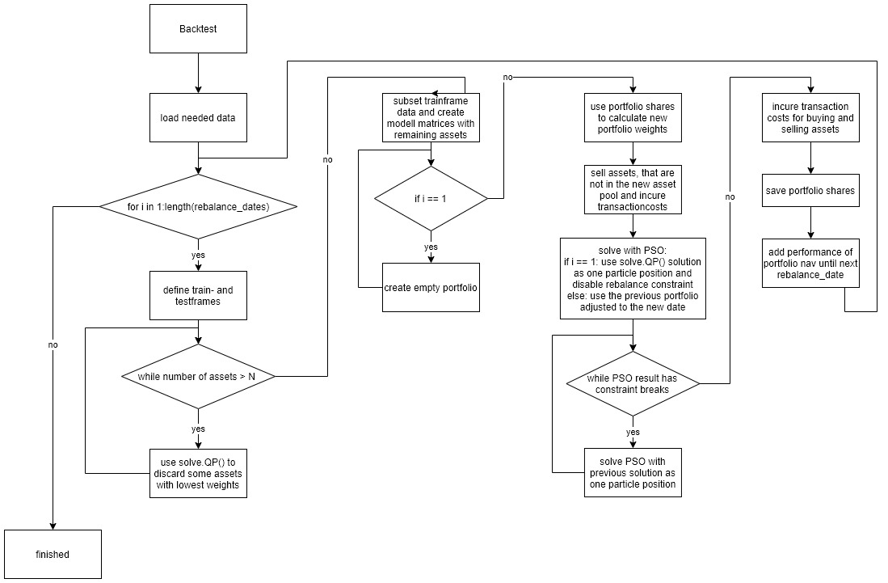

---
output:
  pdf_document: default
  html_document: default
editor_options:
  chunk_output_type: console
---
# Real Life ITP Example

(Vorhaben)
focus auf testphase legen, diskrete (20k), long only, 0<w<0.1, ITP S&P500 tracken mit weniger als 50 titeln und mehr als 30, vorauswahl von assetpool?, umschichtungs constraint, transaktionskosten 1 euro, 


The previous chapters have analyzed the capability's of a PSO and the quality of the results by solving a problem in a single timepoint. In practice, the stability of future results on multiple timepoints is of higher interest. Therefore the next sections provide additional constraints that are needed to simulate real portfolios over multiple rebalancing dates, starting by adding transaction costs to the problem. The first reblancing date will define a problem that simulates a portfolio manager that has a defined amount of cash and tries to construct a portfolio from it, like in the last chapter. After the first iteration the portfolio manager needs to sell old assets and buy new ones. Of course do this produce additional transaction costs and effort, which is why most portfolio managers consider a maximal rebalancing constraint, that tries to limit the amount of sold and bought assets. The simulation of multiple rebalancing dates is called a backtest, which tries to simulate the performance of a portfolio dependent on the previous portfolio and the historic data of each rebalancing date. Later the objective is analyzed more deeply with focus on the forecast ability. And at last a complete backtest of a ITP in a practice near setting is evaluated and analyzed.


## Transaction Costs
The costs to buy or sell assets needs to be considered, because it can have a huge impact after several years of investment. There are many different costs that can occur dependent on the concepts of the broker, liquidity of assets and types of assets. For more information have a look at [@AkGa2022] or [@NySe2022]. To keep it simple, we focus on the situation of a private investor using a online broker that has a fixed fee per transaction for US equity's contained in the SP500TR. Each transaction consists of one or multiple shares of one asset and a transaction can ether be a sell or a buy transaction. The fixed transaction fee is set on 1 USD like done by the online broker Trade Republic. The PSO can consider the transaction costs by increasing the objective value, but it is difficult to make the intensity of the transaction cost value compareable to the objective value. The objective value $v^o$ of the ITP with MSTE approach as in \@ref(ITPMSTE) is defined as:
$$
 v^o = \left\Vert r_{p}-r_{bm} \right\Vert_2^2 = \sum_{t=1}^T (r_{t,p}-r_{t,bm})^2
$$
The $v^o$ is the square tracking error or more precise the squared difference of the portfolio returns $r_p$ and the benchmark returns $r_{bm}$. To create a comparable value $v^{tc}$ for the transaction costs, the aim is to interpret the absolute loss by transactions as a absolute error in returns $r_{tc}$ accruing in $t_0$ (before the first data point in $t_1$). This absolute error $r_{tc}$ can be calculated by counting the transactions needed divided by the net asset value $nav$. The transactions needed can be calculated by comparing the shares vector of the previous portfolio $s^{prev}$ and the rebalanced portfolio shares vector $s^{reba}$. This results in the following formula for the absolute error return $r_{tc}$:
$$
 r_{tc} = \sum_{n=1}^N g(s^{prev}_n-s^{reba}_n)
$$
with 
$$
  g(x) =    \begin{cases}
  0 &\text{, if }\ x = 0\\
  1 &\text{, else}
  \end{cases}
$$

This results in the following transaction costs value $v^{tc}$:
$$
v^{tc} = \left\Vert r_{tc} \right\Vert_2^2 = r_{tc}^2
$$

The idea is to use the $v^{tc}$ value and increase the objective value $v^o$ of the ITP with MSTE approach, but these are still not the same. The $v^o$ is the sum of squared positive or negative errors and $v^{tc}$ is a squared negative error. To increase the impact of the transaction costs there should be a coefficient $k$ to increase the intensity, which results in the following minimization problem:
$$
  min \ \  v^o + k \cdot v^{tc}
$$
A suitable value for $k$ could be calculated by dividing the number of training days with the number of holding period days increased with factor $5$. This can roughly be interpreted that the transaction costs error is weighted as a $5$ days error in the test period. For example a 4 months training period with 96 working days and a holding period of 1 month with 24 working days produces the following value:
$$
  k = \frac{96}{24} \cdot 5 = 20
$$
If the holding period gets reduced, the intensity coefficient increases, which is a suitable behavior. Nonetheless should there be more analysed and fine tuned.


## Rebalancing Constraint
The rebalancing constraint restricts the changes made in weights by taking into account the previous portfolio weights vector $w^{prev}$ recalculated to the present day by using the previous shares vector and the reblananced portfolio weights vector $w^{reba}$. The value that gets restricted by the rebalancing constraint should take into account weights that gets moved between assets and additional weights added. For example if the previous portfolio had a weights vector $w^{prev} = [0.5, 0.4]$ at the current reblancing date and the reblananced portfolio has a weights vector $w^{reba} = [0.8, 0.2]$. The rebalanced weight from the secound asset to the first is $0.2$ and the additional weight added is $0.1$, which results in a rebalancing of $0.2+0.1=0.3$ weight. This following is the foluma to calculate the reblanancing weight $w^{rb}$:
$$
  w^{rb} := \frac{\left\Vert w^{prev}-w^{reba} \right\Vert_1 - |\sum w^{prev} - \sum w^{reba}|}{2}+|\sum w^{prev} - \sum w^{reba}|
$$
and with a reblanancing constraint of $30%$ ($0.3$), the rebalanced portfolio is feasible if:
$$
  w^{rb} \leq 0.3
$$


## Objective
The objective is to simulate a tracking portfolio that tracks the S&P 500 with a pool of 100 assets, contained in the SP500TR, over multiple reblanacing dates ranging from 2016-05-01 till 2022-10-27 with one month intervalls. The pool of assets is created for each rebalancing date by using the solve.QP() approach with steadily discarding of assets like in \@ref(exampleitpsolveqp) with an maximal change of 10 assets on each rebalancing date, to reduce forced rebalancing. All considered assets have no missing values in the test and training period. Additionaly serves the solution of the solve.QP() approach as benchmark and the continuous solution is used as one particle position for the first rebalancing date. The tracking portfolio is solved by using the self-adaptive velocity PSO from the last chapter, which produces stable results. The tracking portfolio has the following constraints: discrete amount of shares, long only, maximal weight of 10%, $0.96 \leq \sum w_i \leq 0.995$, rebalancing less than 30% weight, considered transaction costs with $k=10$, net asset value of 20000 USD, training period length of four months and test period length of one month. 

Each PSO run uses 100 particles and iterates 100 times. The PSO is repeated until the constraint breaks and rebalancing constraint is satisfied and afterwards it runs additional three times to increase the quality of the feasible solution. Each rebalancing portfolio is simulated with the portfolio return function from \@ref(portfolioreturns) until the next rebalancing date. In each step the weights and shares of the tracking portfolio are calculated and the shares are used to calculate the weights at the next rebalancing date. If assets are missing in the next asset pool they are sold and reduce the net asset value because of the transaction costs. The same happens by buying assets. A rough visualisation of the process can be found in the following diagramm:



## Complete ITP Example
The following charts visualize the test period of the whole backtests. The `QP` line is continuous and represents the optimal solution using the ITP MSTE approach. The discretized solution using the PSO is named `PSO` and the `PSO_TE` considers all transaction costs. Everything is compared to the SP500TR which is the objective to track. Furthermore there are used different values for the transaction costs intensity $k$ of each backtest:
```{r, echo=F, include=F}
set.seed(0)

train_months <- 4
test_months <- 1
nav <- 20000
 
from <- "2016-01-01"
to <- "2022-10-27"

spx_composition <- buffer(
  get_spx_composition(),
  "AS_spx_composition"
) %>% 
  filter(Date >= from, Date <= to) 
#ticker <- spx_composition$Ticker %>% table() %>% sort(., decreasing = T) %>% .[.>=81] %>% names()

pool_data <- buffer(
  get_yf(
    tickers = spx_composition %>% 
      filter(Date<=to) %>% 
      filter(Date==max(Date)) %>% 
      pull(Ticker), 
    from = from, 
    to = to
  ), 
  "AS_sp500_assets_long"
)


bm_returns_raw <- buffer(
  get_yf(tickers = "^SP500TR", from = from, to = to)$returns,
  "AS_sp500tr_long"
) %>% setNames(., "SP500TR")


rebalance_dates <- data.frame("DATE"=index(pool_data$prices)) %>% 
  mutate(key=substr(DATE, 1, 7)) %>% 
  group_by(key) %>% 
  filter(DATE==min(DATE, na.rm=T)) %>% 
  pull(DATE) %>% 
  sort() %>% 
  c(., as.Date("2022-11-01"))

#rebalance_dates <- rebalance_dates[1:13]

calc_fit <- function(x){
  as.numeric(0.5 * t(x) %*% mat$Dmat %*% x - t(mat$dvec) %*% x + 0.5 * mat$const)
}
calc_const <- function(x){
  const <- t(mat$Amat) %*% x - mat$bvec
  sum(abs(pmin(0, const)))
}

QP_perf <- NULL
QP_infos <- NULL
QP_tickers <- list()
QP_solutions <- list()
for(i in (train_months+1):(length(rebalance_dates)-1)){

  print(i)
  date <- rebalance_dates[i]
  date_from <- rebalance_dates[i-train_months]
  
  train_frame <- paste0(date_from, "/", date)
  test_frame <- paste0(date+1, "/", rebalance_dates[i+test_months])
  
  ticker_in_spx <- spx_composition %>% filter(Date <= date) %>% filter(Date == max(Date)) %>% pull(Ticker) %>% unique()
  
  valid_prices_ticker <- pool_data$prices[date, colnames(pool_data$prices) %in% ticker_in_spx]
  valid_prices_ticker <- valid_prices_ticker[, colSums(is.na(valid_prices_ticker))==0] %>% colnames()
  returns_all <- pool_data$returns[train_frame, colnames(pool_data$returns) %in% ticker_in_spx] %>% 
    .[,colSums(is.na(.))==0] %>% 
    .[, colnames(.) %in% valid_prices_ticker] %>% 
    .[, !is.na(colnames(.))]
  
  ticker_temp <- colnames(returns_all)
  
  for(k in c(length(ticker_temp), seq(from=length(ticker_temp)-length(ticker_temp)%%5, to = 100, by=-5))){
    if(k!=length(ticker_temp)){
      ticker_temp <- ticker_temp[ticker_temp %in% names(res_QP$solution %>% sort(., decreasing = T) %>% .[1:k])]
    }
    returns <- returns_all[, colnames(returns_all) %in% ticker_temp]
  
    bm_returns <- bm_returns_raw[train_frame,]
    
    mat <- list(
      Dmat = as.matrix(nearPD(t(returns) %*% returns)$mat),
      dvec = t(returns) %*% bm_returns,
      const = t(bm_returns) %*% bm_returns,
      Amat = t(rbind(
        -rep(1, ncol(returns)), # sum w <= 0.995
        rep(1, ncol(returns)), # sum w >= 0.96
        diag(1, 
             nrow=ncol(returns), 
             ncol=ncol(returns)), # long only
        diag(-1, 
             nrow=ncol(returns), 
             ncol=ncol(returns)) # smaller than 
      )),
      bvec = c(
        -0.995, # sum w <= 0.995
        0.96, # sum w >= 0.96
        rep(0, ncol(returns)), # long only
        rep(-0.1, ncol(returns)) # smaller than 
      ),
      meq = 0
    )
  
    res_QP <- solve.QP(
      Dmat = mat$Dmat,
      dvec = mat$dvec,
      Amat = mat$Amat,
      bvec = mat$bvec,
      meq = mat$meq
    )
    res_QP$solution <- setNames(res_QP$solution, colnames(returns))
  }
  
  if(i == (train_months+1)){
    QP_tickers[[i]] <- ticker_temp
    QP_solutions[[i]] <- res_QP$solution[ticker_temp]/sum(res_QP$solution[ticker_temp])
  }else{
    tickers_old <- QP_tickers[[i-1]]
    tickers_new <- ticker_temp[!ticker_temp %in% tickers_old]
    tickers_new <- names(sort(res_QP$solution[tickers_new], decreasing = T) %>% .[1:min(length(.),10)])
    ticker_new <- unique(c(tickers_old, tickers_new)) %>% .[!is.na(.)]
    
    returns <- returns_all[, colnames(returns_all) %in% ticker_new]
  
    bm_returns <- bm_returns_raw[train_frame,]
    
    mat <- list(
      Dmat = as.matrix(nearPD(t(returns) %*% returns)$mat),
      dvec = t(returns) %*% bm_returns,
      const = t(bm_returns) %*% bm_returns,
      Amat = t(rbind(
        -rep(1, ncol(returns)), # sum w <= 1
        rep(1, ncol(returns)), # sum w >= 0.99
        diag(1, 
             nrow=ncol(returns), 
             ncol=ncol(returns)), # long only
        diag(-1, 
             nrow=ncol(returns), 
             ncol=ncol(returns)) # smaller than 
      )),
      bvec = c(
        -0.995, # sum w <= 1
        0.96, # sum w >= 0.99
        rep(0, ncol(returns)), # long only
        rep(-0.1, ncol(returns)) # smaller than 
      ),
      meq = 0
    )
  
    res_QP <- solve.QP(
      Dmat = mat$Dmat,
      dvec = mat$dvec,
      Amat = mat$Amat,
      bvec = mat$bvec,
      meq = mat$meq
    )
    res_QP$solution <- setNames(res_QP$solution, colnames(returns))
    
    tickers_new <- names(sort(res_QP$solution, decreasing = T)[1:100])
    
    if(length(unique(tickers_new)) != 100 || sum(is.na(tickers_new)) > 0){
      break()
    }
    QP_tickers[[i]] <- tickers_new
    QP_solutions[[i]] <- res_QP$solution[tickers_new]/sum(res_QP$solution[tickers_new])
  }
  
  res_QP$perf <- calc_portfolio_returns(pool_data$returns[test_frame, colnames(returns)], res_QP$solution)
  res_QP$const_break <- calc_const(res_QP$solution)
  
  
  QP_perf <- rbind.xts(
    QP_perf,
    setNames(res_QP$perf, "QP")
  )
  
  QP_infos <- bind_rows(
    QP_infos,
    data.frame(
      "type" = "QP",
      "MSTE_returns" = sum((returns %*% res_QP$solution - bm_returns)^2)
    )
  )

}

#save(QP_perf, QP_infos, QP_tickers, QP_solutions, file="analyses/ITP_long_QP_v12.rdata")


# for(i in 2:length(QP_tickers)){
#   print(paste0("in: ", sum(QP_tickers[[i-1]] %in% QP_tickers[[i]]), "   not in:", sum(!QP_tickers[[i-1]] %in% QP_tickers[[i]])))
# }

rebalance_const <- function(old_wgt, new_wgt, first_date = F){
  reblance_wgt <- if(first_date){
    0
  }else{
    (sum(abs(old_wgt-new_wgt))-abs(sum(old_wgt)-sum(new_wgt)))/2+abs(sum(old_wgt)-sum(new_wgt))
  }
  reblance_fit <- max(reblance_wgt-0.3,0)
  return(reblance_fit)
}

transaction_cost_constraint <- function(old_shares, new_shares, nav){
   tc_return <- sum((new_shares-old_shares)!=0)/nav
   return(tc_return^2)
}

set.seed(0)
MSTE_perf <- NULL
MSTE_infos <- NULL
MSTE_nav <- xts(nav, order.by = rebalance_dates[train_months+1])
portfolio_shares <- setNames(rep(0, ncol(pool_data$returns)), colnames(pool_data$returns))
portfolio_wgts <- setNames(rep(0, ncol(pool_data$returns)), colnames(pool_data$returns))
res_pso_SAvel_MSTE <- list()
res_pso_SAvel_MSTE$const_break <- 1
res_pso_SAvel_MSTE$rebalance_constraint <- 1
for(i in (train_months+1):(length(rebalance_dates)-1)){
  save_nav <- MSTE_nav[nrow(MSTE_nav),]
  print(i)
  date <- rebalance_dates[i]
  date_from <- rebalance_dates[i-train_months]
  
  train_frame <- paste0(date_from, "/", date)
  test_frame <- paste0(date+1, "/", rebalance_dates[i+test_months])
  
  ticker_in_spx <- QP_tickers[[i]]#spx_composition %>% filter(Date <= date) %>% filter(Date == max(Date)) %>% pull(Ticker)
  
  returns <- pool_data$returns[train_frame, colnames(pool_data$returns) %in% ticker_in_spx] %>% 
    .[,colSums(is.na(.))==0]
  
  prices <- pool_data$prices[date, colnames(returns)]
  
  bm_returns <- bm_returns_raw[train_frame,]
  
  
  mat <- list(
    Dmat = t(returns) %*% (returns),
    dvec = t(returns) %*% (bm_returns),
    const = t(bm_returns) %*% bm_returns,
    Amat = t(rbind(
      -rep(1, ncol(returns)), # sum w <= 1
      rep(1, ncol(returns)), # sum w >= 0.99
      diag(1, 
           nrow=ncol(returns), 
           ncol=ncol(returns)) # long only
    )),
    bvec = c(
      -0.995, # sum w <= 1
      0.96, # sum w >= 0.99
      rep(0, ncol(returns)) # long only
    ),
    meq = 0
  )
  
  # sell transaction costs because not in S&P anymore
  MSTE_nav[nrow(MSTE_nav),] <- last(MSTE_nav) - 1 * sum(portfolio_shares[!names(portfolio_shares) %in% colnames(returns)]!=0)
  
   
  portfolio_shares_temp <- setNames(portfolio_shares[colnames(returns)], colnames(returns))
  portfolio_shares_temp[is.na(portfolio_shares_temp)] <- 0
  portfolio_wgt_temp <- portfolio_shares_temp * prices / as.numeric(last(MSTE_nav))
  
  restart <<- 4
  for(k in 1:100){
    if(res_pso_SAvel_MSTE$const_break == 0 && res_pso_SAvel_MSTE$rebalance_constraint < 0.1){
      restart <<- restart - 1
    }else{
      restart <<- 3
    }
    if( k == 1 || res_pso_SAvel_MSTE$const_break != 0 || res_pso_SAvel_MSTE$rebalance_constraint > 0.1 || restart > 0){
      res_pso_SAvel_MSTE <- pso_self_adaptive_velocity(
        par = if(k==1){if(i==(train_months+1)){QP_solutions[[i]]}else{portfolio_wgt_temp}}else{res_pso_SAvel_MSTE$solution}, # QP_solutions[[date]]
        fn = function(x){
          shares <- round(x*as.numeric(last(MSTE_nav))/prices)
          x <- as.vector(shares*prices/as.numeric(last(MSTE_nav)))
          fitness <- 2*calc_fit(x)
          constraints <- calc_const(x)
          rebalance_constraint <- rebalance_const(
            old_wgt = as.vector(portfolio_wgt_temp),
            new_wgt = x,
            first_date = (i == (train_months+1))
          )
          tc_constraint <- transaction_cost_constraint(
            old_shares = as.vector(portfolio_shares_temp), 
            new_shares = as.vector(shares), 
            nav = as.numeric(last(MSTE_nav))
          )
          return(fitness + 100*constraints + 100*rebalance_constraint + 0*tc_constraint)
        },
        lower = 0,
        upper = 0.1,
        control = list(
          s = 100, # swarm size
          maxiter = 100 # iterations
        )
      )
      res_pso_SAvel_MSTE$solution <- as.vector(round(res_pso_SAvel_MSTE$solution*as.numeric(last(MSTE_nav))/prices)*prices/as.numeric(last(MSTE_nav)))
      res_pso_SAvel_MSTE$perf <- calc_portfolio_returns(pool_data$returns[test_frame, colnames(returns)], res_pso_SAvel_MSTE$solution)
      res_pso_SAvel_MSTE$fitness <- 2*calc_fit(res_pso_SAvel_MSTE$solution)
      res_pso_SAvel_MSTE$const_break <- calc_const(res_pso_SAvel_MSTE$solution)
      res_pso_SAvel_MSTE$rebalance_constraint <- 100*rebalance_const(
            old_wgt = as.vector(portfolio_wgt_temp),
            new_wgt = res_pso_SAvel_MSTE$solution,
            first_date = (i == (train_months+1))
          )
      res_pso_SAvel_MSTE$transaction_cost_constraint <- 0*transaction_cost_constraint(
            old_shares = as.vector(portfolio_shares_temp), 
            new_shares = round(res_pso_SAvel_MSTE$solution*as.numeric(last(MSTE_nav))/prices), 
            nav = as.numeric(last(MSTE_nav))
      )
    }
  }
  
  
  # buy and sell transation costs
  MSTE_nav[nrow(MSTE_nav),] <- last(MSTE_nav) - 1 * sum( (portfolio_shares_temp-round(res_pso_SAvel_MSTE$solution*as.numeric(last(MSTE_nav))/prices))!=0)
  
  
  portfolio_shares <- setNames(as.vector(round(res_pso_SAvel_MSTE$solution*as.numeric(last(MSTE_nav))/prices)), colnames(prices))
  portfolio_wgt <- setNames(as.vector(res_pso_SAvel_MSTE$solution), colnames(prices))
  
  
  MSTE_perf <- rbind.xts(
    MSTE_perf,
    setNames(res_pso_SAvel_MSTE$perf, "PSO_MSTE")
  )
  
  MSTE_infos <- bind_rows(
    MSTE_infos,
    data.frame(
      "type" = "PSO_MSTE",
      "fittness" = res_pso_SAvel_MSTE$fitness,
      "const_break" = res_pso_SAvel_MSTE$const_break,
      "rebalance_constraint" = res_pso_SAvel_MSTE$rebalance_constraint,
      "transaction_cost_constraint" = res_pso_SAvel_MSTE$transaction_cost_constraint,
      "MSTE_returns" = sum((returns %*% res_pso_SAvel_MSTE$solution - bm_returns)^2),
      "sum_wgt" = sum(portfolio_wgt),
      "min_wgt" = min(portfolio_wgt),
      "n_assets" = sum(portfolio_wgt!=0),
      "transaction_costs" = as.numeric(save_nav) - as.numeric(MSTE_nav[nrow(MSTE_nav),])
    )
  )
  
  MSTE_nav <- rbind.xts(MSTE_nav, ret_to_cumret(res_pso_SAvel_MSTE$perf)[-1,]/100 * as.numeric(last(MSTE_nav)))
  
}

#save(MSTE_perf, MSTE_infos, MSTE_nav, file="analyses/ITP_long_MSTE_v12_30tc.rdata")


perf_all <- cbind.xts(
  QP_perf,
  MSTE_perf, 
  setNames(pri_to_ret(MSTE_nav), "PSO_MSTE_TR")#,
  #CRT_perf,
  #setNames(pri_to_ret(CRT_nav), "CRT_TR")
)
perf_all <- cbind.xts(perf_all, bm_returns_raw[paste0(min(index(perf_all)),"/", max(index(perf_all))),])


#save.image("analyses/ITP_praxis_v11.rdata")
plotly_line_chart_xts(ret_to_cumret(perf_all))

```

```{r}
bm_returns_raw <- buffer(
  get_yf(tickers = "^SP500TR", from = from, to = to)$returns,
  "AS_sp500tr_long"
) %>% setNames(., "SP500TR")

load("analyses/ITP_long_QP_v12.rdata")
# QP_perf, QP_infos, QP_tickers, QP_solutions


load("analyses/ITP_long_MSTE_v12_0tc.rdata")
MSTE_perf_0tc <- MSTE_perf
MSTE_infos_0tc <- MSTE_infos
MSTE_nav_0tc <- MSTE_nav
perf_all <- cbind.xts(
  setNames(QP_perf, "QP_MSTE_cont"),
  setNames(MSTE_perf, "PSO_MSTE_disc"), 
  setNames(pri_to_ret(MSTE_nav), "PSO_MSTE_disc_TR")
)
perf_all <- cbind.xts(perf_all, bm_returns_raw[paste0(min(index(perf_all)),"/", max(index(perf_all))),])

p_0tc <- plotly_line_chart_xts(ret_to_cumret(perf_all))
  
  
  
load("analyses/ITP_long_MSTE_v12_10tc.rdata")
MSTE_perf_10tc <- MSTE_perf
MSTE_infos_10tc <- MSTE_infos
MSTE_nav_10tc <- MSTE_nav
load("analyses/ITP_long_MSTE_v12_20tc.rdata")
MSTE_perf_20tc <- MSTE_perf
MSTE_infos_20tc <- MSTE_infos
MSTE_nav_20tc <- MSTE_nav
load("analyses/ITP_long_MSTE_v12_30tc.rdata")
MSTE_perf_30tc <- MSTE_perf
MSTE_infos_30tc <- MSTE_infos
MSTE_nav_30tc <- MSTE_nav


```


