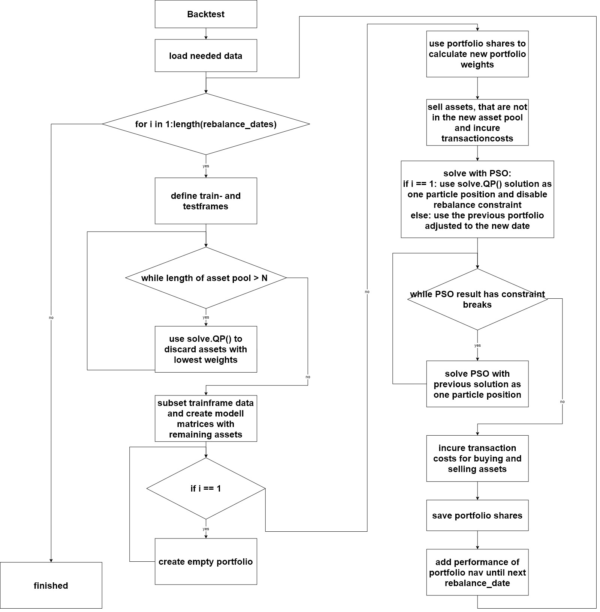

---
output:
  pdf_document: default
  html_document: default
editor_options:
  chunk_output_type: console
---
# Real Life ITP Example {#reallife}
In the previous chapters, the capabilities of the PSO and the quality of its results were analyzed based on the solution of a problem at a single point in time. In practice, the stability of future outcomes at multiple points in time is of greater interest. Therefore, the next sections provide additional constraints needed to simulate real portfolios over multiple rebalancing time points, first by adding transaction costs to the problem. For the first rebalancing time point, a problem is defined that simulates a portfolio manager who has a certain amount of cash and attempts to construct a portfolio from it, as described in the last section. After the first iteration, the portfolio manager must sell old assets and buy new ones. This, of course, incurs additional transaction costs and effort, so most portfolio managers consider a maximum rebalancing constraint that attempts to limit the amount of assets sold and purchased. The simulation of multiple rebalancing dates is called a backtest, which attempts to simulate the performance of a portfolio as a function of the previous portfolio and historical data for each rebalancing date. Later, a full backtest of an ITP-MSTE is evaluated and analyzed in a real-world environment.


## Transaction Costs
The cost of buying or selling assets must be considered as it can have a significant impact after several years of investment. There are many different costs that can be incurred depending on the concepts of the broker, the liquidity of the assets and the type of assets. For more information, see [@AkGa2022] or [@NySe2022]. For simplicity, we focus on the situation of a retail investor using an online broker that charges a fixed fee per transaction for the U.S. stocks included in the SP500TR. Each transaction consists of one or more shares of exactly one asset, and a transaction can be either a sale or a purchase. The fixed transaction fee is set at 1 USD, as is done by the online broker Trade Republic. The PSO can account for the transaction cost by increasing the objective value, but it is difficult to make the intensity of the transaction cost value comparable to the objective value. The objective value $v^o$ of the ITP with MSTE approach, as in section \@ref(ITPMSTE), is defined as:

$$
 v^o = \left\Vert r_{p}-r_{bm} \right\Vert_2^2 = \sum_{t=1}^T (r_{t,p}-r_{t,bm})^2.
$$

The objective value $v^o$ is the squared tracking error or, more precisely, the squared difference of the portfolio returns $r_p$ and the benchmark returns $r_{bm}$. To create a comparable value $v^{tc}$ for transaction costs, we attempt to interpret the absolute loss due to transactions as the absolute error of return $r_{tc}$ incurred in $t_0$ (before the first data point in $t_1$). This absolute error $r_{tc}$ can be calculated by counting the required transactions divided by the net asset value $nav$. The required transactions can be calculated by comparing the shares vector of the previous portfolio $s^{prev}$ and the shares vector of the rebalanced portfolio $s^{reba}$. This results in the following formula for the absolute error return $r_{tc}$:

$$
 r_{tc} = \frac{1 \cdot \sum_{n=1}^N g(s^{prev}_n-s^{reba}_n) }{nav}
$$

with

$$
  g(x) =    \begin{cases}
  0 &\text{, if }\ x = 0\\
  1 &\text{, else,}
  \end{cases}
$$

This results in the following transaction costs value $v^{tc}$:

$$
v^{tc} = \left\Vert r_{tc} \right\Vert_2^2 = r_{tc}^2.
$$

The idea is to use the $v^{tc}$ value and increase the objective value $v^o$ of the ITP with MSTE approach, but these values are still not the same. The $v^o$ is the sum of squared positive or negative errors and $v^{tc}$ is a squared negative error. To increase the impact of the transaction cost, a coefficient $k$ should increase the intensity, which leads to the following minimization problem:

$$
  min \ \  v^o + k \cdot v^{tc}.
$$

A suitable value for $k$ could be calculated by dividing the number of training days by the number of days in the holding period increased by a factor of $2.5$. This can be roughly interpreted as weighting the transaction cost error as the $2.5$-day error in the test period. For example, a 4-month training period with 96 working days and a holding period of 1 month with 24 working days yields the following value:

$$
  k = \frac{96}{24} \cdot 2.5 = 10.
$$

When the holding period is shortened, the intensity coefficient increases, which is a suitable behavior. Nevertheless, it should be analyzed and fine-tuned more.


## Rebalancing Constraint
The rebalancing constraint restricts the changes in weights by considering the previous portfolio weight vector $w^{prev}$, which is recalculated using the previous shares vector and the rebalanced portfolio weight vector $w^{reba}$. The value constrained by the rebalancing constraint should take into account the weights moved between assets and additional weights added. Example: the previous portfolio had a weight vector $w^{prev} = [0.5, 0.4]$ as of the current rebalancing date and the rebalanced portfolio has a weight vector $w^{reba} = [0.8, 0.2]$. The rebalanced weight from the second to the first asset is $0.2$ and the additional weight added is $0.1$, resulting in a rebalance of $0.2+0.1=0.3$ weight. Below is the formula for calculating the rebalancing weight $w^{rb}$:

$$
  w^{rb} := \frac{\left\Vert w^{prev}-w^{reba} \right\Vert_1 - |\sum w^{prev} - \sum w^{reba}|}{2}+|\sum w^{prev} - \sum w^{reba}|
$$

and with a rebalancing constraint of, say, 30%, the rebalanced portfolio is feasible if:

$$
  w^{rb} \leq 0.3.
$$


## Objective
The goal is to simulate a tracking portfolio that tracks the SP500TR with a pool of 100 assets included in SP500TR over multiple rebalancing dates between 2016-05-01 and 2022-10-27 with one-month intervals. The pool of assets is created for each rebalancing date using the solve.QP approach, continuously discarding assets as in section \@ref(exampleitpsolveqp), with a maximum of 10 assets changing on each rebalancing date to reduce forced rebalancing. All considered assets have no missing values in the training period. In addition, the solve.QP approach serves as a benchmark and the continuous solution is used as a particle position for the first rebalancing date. The tracking portfolio is solved using the self-adaptive velocity PSO from the last chapter, which yielded stable results. The tracking portfolio has the following constraints: discrete number of stocks, long only, maximum weight of 10%, $0.96 \leq \sum w_i \leq 0.995$, rebalancing under 30% weight, considering transaction cost with diffrent values for $k$, net asset value of 20000 USD, length of training period of four months and testing period of one month. 


Each PSO run uses 100 particles and iterates 100 times. The PSO is repeated until the constraints are satisfied. Then it is run four more times to improve the quality of the feasible solution. Each rebalancing portfolio is simulated with the portfolio return function from section \@ref(portfolioreturns) until the next rebalancing date. In each step the weights and shares of the tracking portfolio are calculated and the shares are used to calculate the weights at the next rebalancing date. If assets are missing in the next asset pool, they are sold and reduce the net asset value due to transaction costs. The same is done by buying or selling any remaining assets. A rough illustration of the process can be found in the following figure:\pagebreak





## Complete ITP Example
The following charts visualize the test period of the whole backtests. The `QP_MSTE_cont` line represents the performance of the continuous solution of the ITP-MSTE objective solved with solve.QP and stays the same for all backtests. The discretized solution using the PSO is named `PSO_MSTE_disc` and the `PSO_MSTE_disc_TR` considers all transaction costs in its performance. Everything is compared to the SP500TR which is the objective to track. Furthermore there are used different values for the transaction costs intensity $k \in \{0, 10, 20, 30\}$ of each backtest which can be seen in the legends by `0tc`, `10tc`, `20tc` and `30tc`.


```{r 91, echo=F, include=F, eval=F}
set.seed(0)

train_months <- 4
test_months <- 1
nav <- 20000

from <- "2016-01-01"
to <- "2022-10-27"

spx_composition <- buffer(
  get_spx_composition(),
  "AS_spx_composition"
) %>%
  filter(Date >= from, Date <= to)
#ticker <- spx_composition$Ticker %>% table() %>% sort(., decreasing = T) %>% .[.>=81] %>% names()

pool_data <- buffer(
  get_yf(
    tickers = spx_composition %>%
      filter(Date<=to) %>%
      filter(Date==max(Date)) %>%
      pull(Ticker),
    from = from,
    to = to
  ),
  "AS_sp500_assets_long"
)


bm_returns_raw <- buffer(
  get_yf(tickers = "^SP500TR", from = from, to = to)$returns,
  "AS_sp500tr_long"
) %>% setNames(., "SP500TR")


rebalance_dates <- data.frame("DATE"=index(pool_data$prices)) %>%
  mutate(key=substr(DATE, 1, 7)) %>%
  group_by(key) %>%
  filter(DATE==min(DATE, na.rm=T)) %>%
  pull(DATE) %>%
  sort() %>%
  c(., as.Date("2022-11-01"))

#rebalance_dates <- rebalance_dates[1:13]

calc_fit <- function(x){
  as.numeric(0.5 * t(x) %*% mat$Dmat %*% x - t(mat$dvec) %*% x + 0.5 * mat$const)
}
calc_const <- function(x){
  const <- t(mat$Amat) %*% x - mat$bvec
  sum(abs(pmin(0, const)))
}

QP_perf <- NULL
QP_infos <- NULL
QP_tickers <- list()
QP_solutions <- list()
for(i in (train_months+1):(length(rebalance_dates)-1)){

  print(i)
  date <- rebalance_dates[i]
  date_from <- rebalance_dates[i-train_months]

  train_frame <- paste0(date_from, "/", date)
  test_frame <- paste0(date+1, "/", rebalance_dates[i+test_months])

  ticker_in_spx <- spx_composition %>% filter(Date <= date) %>% filter(Date == max(Date)) %>% pull(Ticker) %>% unique()

  valid_prices_ticker <- pool_data$prices[date, colnames(pool_data$prices) %in% ticker_in_spx]
  valid_prices_ticker <- valid_prices_ticker[, colSums(is.na(valid_prices_ticker))==0] %>% colnames()
  returns_all <- pool_data$returns[train_frame, colnames(pool_data$returns) %in% ticker_in_spx] %>%
    .[,colSums(is.na(.))==0] %>%
    .[, colnames(.) %in% valid_prices_ticker] %>%
    .[, !is.na(colnames(.))]

  ticker_temp <- colnames(returns_all)

  for(k in c(length(ticker_temp), seq(from=length(ticker_temp)-length(ticker_temp)%%5, to = 100, by=-5))){
    if(k!=length(ticker_temp)){
      ticker_temp <- ticker_temp[ticker_temp %in% names(res_QP$solution %>% sort(., decreasing = T) %>% .[1:k])]
    }
    returns <- returns_all[, colnames(returns_all) %in% ticker_temp]

    bm_returns <- bm_returns_raw[train_frame,]

    mat <- list(
      Dmat = as.matrix(nearPD(t(returns) %*% returns)$mat),
      dvec = t(returns) %*% bm_returns,
      const = t(bm_returns) %*% bm_returns,
      Amat = t(rbind(
        -rep(1, ncol(returns)), # sum w <= 0.995
        rep(1, ncol(returns)), # sum w >= 0.96
        diag(1,
             nrow=ncol(returns),
             ncol=ncol(returns)), # long only
        diag(-1,
             nrow=ncol(returns),
             ncol=ncol(returns)) # smaller than
      )),
      bvec = c(
        -0.995, # sum w <= 0.995
        0.96, # sum w >= 0.96
        rep(0, ncol(returns)), # long only
        rep(-0.1, ncol(returns)) # smaller than
      ),
      meq = 0
    )

    res_QP <- solve.QP(
      Dmat = mat$Dmat,
      dvec = mat$dvec,
      Amat = mat$Amat,
      bvec = mat$bvec,
      meq = mat$meq
    )
    res_QP$solution <- setNames(res_QP$solution, colnames(returns))
  }

  if(i == (train_months+1)){
    QP_tickers[[i]] <- ticker_temp
    QP_solutions[[i]] <- res_QP$solution[ticker_temp]/sum(res_QP$solution[ticker_temp])
  }else{
    tickers_old <- QP_tickers[[i-1]]
    tickers_new <- ticker_temp[!ticker_temp %in% tickers_old]
    tickers_new <- names(sort(res_QP$solution[tickers_new], decreasing = T) %>% .[1:min(length(.),10)])
    ticker_new <- unique(c(tickers_old, tickers_new)) %>% .[!is.na(.)]

    returns <- returns_all[, colnames(returns_all) %in% ticker_new]

    bm_returns <- bm_returns_raw[train_frame,]

    mat <- list(
      Dmat = as.matrix(nearPD(t(returns) %*% returns)$mat),
      dvec = t(returns) %*% bm_returns,
      const = t(bm_returns) %*% bm_returns,
      Amat = t(rbind(
        -rep(1, ncol(returns)), # sum w <= 1
        rep(1, ncol(returns)), # sum w >= 0.99
        diag(1,
             nrow=ncol(returns),
             ncol=ncol(returns)), # long only
        diag(-1,
             nrow=ncol(returns),
             ncol=ncol(returns)) # smaller than
      )),
      bvec = c(
        -0.995, # sum w <= 1
        0.96, # sum w >= 0.99
        rep(0, ncol(returns)), # long only
        rep(-0.1, ncol(returns)) # smaller than
      ),
      meq = 0
    )

    res_QP <- solve.QP(
      Dmat = mat$Dmat,
      dvec = mat$dvec,
      Amat = mat$Amat,
      bvec = mat$bvec,
      meq = mat$meq
    )
    res_QP$solution <- setNames(res_QP$solution, colnames(returns))

    tickers_new <- names(sort(res_QP$solution, decreasing = T)[1:100])

    if(length(unique(tickers_new)) != 100 || sum(is.na(tickers_new)) > 0){
      break()
    }
    QP_tickers[[i]] <- tickers_new
    QP_solutions[[i]] <- res_QP$solution[tickers_new]/sum(res_QP$solution[tickers_new])
  }

  res_QP$perf <- calc_portfolio_returns(pool_data$returns[test_frame, colnames(returns)], res_QP$solution)
  res_QP$const_break <- calc_const(res_QP$solution)


  QP_perf <- rbind.xts(
    QP_perf,
    setNames(res_QP$perf, "QP")
  )

  QP_infos <- bind_rows(
    QP_infos,
    data.frame(
      "type" = "QP",
      "MSTE_returns" = sum((returns %*% res_QP$solution - bm_returns)^2)
    )
  )

}

#save(QP_perf, QP_infos, QP_tickers, QP_solutions, file="analyses/ITP_long_QP_v12.rdata")


# for(i in 2:length(QP_tickers)){
#   print(paste0("in: ", sum(QP_tickers[[i-1]] %in% QP_tickers[[i]]), "   not in:", sum(!QP_tickers[[i-1]] %in% QP_tickers[[i]])))
# }

rebalance_const <- function(old_wgt, new_wgt, first_date = F){
  reblance_wgt <- if(first_date){
    0
  }else{
    (sum(abs(old_wgt-new_wgt))-abs(sum(old_wgt)-sum(new_wgt)))/2+abs(sum(old_wgt)-sum(new_wgt))
  }
  reblance_fit <- max(reblance_wgt-0.3,0)
  return(reblance_fit)
}

transaction_cost_constraint <- function(old_shares, new_shares, nav){
   tc_return <- sum((new_shares-old_shares)!=0)/nav
   return(tc_return^2)
}


set.seed(0)
MSTE_perf <- NULL
MSTE_infos <- NULL
MSTE_nav <- xts(nav, order.by = rebalance_dates[train_months+1])
portfolio_shares <- setNames(rep(0, ncol(pool_data$returns)), colnames(pool_data$returns))
portfolio_wgts <- setNames(rep(0, ncol(pool_data$returns)), colnames(pool_data$returns))
res_pso_SAvel_MSTE <- list()
res_pso_SAvel_MSTE$const_break <- 1
res_pso_SAvel_MSTE$rebalance_constraint <- 1
for(i in (train_months+1):(length(rebalance_dates)-1)){
  save_nav <- MSTE_nav[nrow(MSTE_nav),]
  print(i)
  date <- rebalance_dates[i]
  date_from <- rebalance_dates[i-train_months]

  train_frame <- paste0(date_from, "/", date)
  test_frame <- paste0(date+1, "/", rebalance_dates[i+test_months])

  ticker_in_spx <- QP_tickers[[i]]#spx_composition %>% filter(Date <= date) %>% filter(Date == max(Date)) %>% pull(Ticker)

  returns <- pool_data$returns[train_frame, colnames(pool_data$returns) %in% ticker_in_spx] %>%
    .[,colSums(is.na(.))==0]

  prices <- pool_data$prices[date, colnames(returns)]

  bm_returns <- bm_returns_raw[train_frame,]


  mat <- list(
    Dmat = t(returns) %*% (returns),
    dvec = t(returns) %*% (bm_returns),
    const = t(bm_returns) %*% bm_returns,
    Amat = t(rbind(
      -rep(1, ncol(returns)), # sum w <= 1
      rep(1, ncol(returns)), # sum w >= 0.99
      diag(1,
           nrow=ncol(returns),
           ncol=ncol(returns)) # long only
    )),
    bvec = c(
      -0.995, # sum w <= 1
      0.96, # sum w >= 0.99
      rep(0, ncol(returns)) # long only
    ),
    meq = 0
  )

  # sell transaction costs because not in S&P anymore
  MSTE_nav[nrow(MSTE_nav),] <- last(MSTE_nav) - 1 * sum(portfolio_shares[!names(portfolio_shares) %in% colnames(returns)]!=0)


  portfolio_shares_temp <- setNames(portfolio_shares[colnames(returns)], colnames(returns))
  portfolio_shares_temp[is.na(portfolio_shares_temp)] <- 0
  portfolio_wgt_temp <- portfolio_shares_temp * prices / as.numeric(last(MSTE_nav))

  restart <<- 4
  for(k in 1:100){
    if(res_pso_SAvel_MSTE$const_break == 0 && res_pso_SAvel_MSTE$rebalance_constraint < 0.1){
      restart <<- restart - 1
    }else{
      restart <<- 3
    }
    if( k == 1 || res_pso_SAvel_MSTE$const_break != 0 || res_pso_SAvel_MSTE$rebalance_constraint > 0.1 || restart > 0){
      res_pso_SAvel_MSTE <- pso_self_adaptive_velocity(
        par = if(k==1){if(i==(train_months+1)){QP_solutions[[i]]}else{portfolio_wgt_temp}}else{res_pso_SAvel_MSTE$solution}, # QP_solutions[[date]]
        fn = function(x){
          shares <- round(x*as.numeric(last(MSTE_nav))/prices)
          x <- as.vector(shares*prices/as.numeric(last(MSTE_nav)))
          fitness <- 2*calc_fit(x)
          constraints <- calc_const(x)
          rebalance_constraint <- rebalance_const(
            old_wgt = as.vector(portfolio_wgt_temp),
            new_wgt = x,
            first_date = (i == (train_months+1))
          )
          tc_constraint <- transaction_cost_constraint(
            old_shares = as.vector(portfolio_shares_temp),
            new_shares = as.vector(shares),
            nav = as.numeric(last(MSTE_nav))
          )
          return(fitness + 100*constraints + 100*rebalance_constraint + 0*tc_constraint)
        },
        lower = 0,
        upper = 0.1,
        control = list(
          s = 100, # swarm size
          maxiter = 100 # iterations
        )
      )
      res_pso_SAvel_MSTE$solution <- as.vector(round(res_pso_SAvel_MSTE$solution*as.numeric(last(MSTE_nav))/prices)*prices/as.numeric(last(MSTE_nav)))
      res_pso_SAvel_MSTE$perf <- calc_portfolio_returns(pool_data$returns[test_frame, colnames(returns)], res_pso_SAvel_MSTE$solution)
      res_pso_SAvel_MSTE$fitness <- 2*calc_fit(res_pso_SAvel_MSTE$solution)
      res_pso_SAvel_MSTE$const_break <- calc_const(res_pso_SAvel_MSTE$solution)
      res_pso_SAvel_MSTE$rebalance_constraint <- 100*rebalance_const(
            old_wgt = as.vector(portfolio_wgt_temp),
            new_wgt = res_pso_SAvel_MSTE$solution,
            first_date = (i == (train_months+1))
          )
      res_pso_SAvel_MSTE$transaction_cost_constraint <- 0*transaction_cost_constraint(
            old_shares = as.vector(portfolio_shares_temp),
            new_shares = round(res_pso_SAvel_MSTE$solution*as.numeric(last(MSTE_nav))/prices),
            nav = as.numeric(last(MSTE_nav))
      )
    }
  }


  # buy and sell transation costs
  MSTE_nav[nrow(MSTE_nav),] <- last(MSTE_nav) - 1 * sum( (portfolio_shares_temp-round(res_pso_SAvel_MSTE$solution*as.numeric(last(MSTE_nav))/prices))!=0)


  portfolio_shares <- setNames(as.vector(round(res_pso_SAvel_MSTE$solution*as.numeric(last(MSTE_nav))/prices)), colnames(prices))
  portfolio_wgt <- setNames(as.vector(res_pso_SAvel_MSTE$solution), colnames(prices))


  MSTE_perf <- rbind.xts(
    MSTE_perf,
    setNames(res_pso_SAvel_MSTE$perf, "PSO_MSTE")
  )

  MSTE_infos <- bind_rows(
    MSTE_infos,
    data.frame(
      "type" = "PSO_MSTE",
      "fittness" = res_pso_SAvel_MSTE$fitness,
      "const_break" = res_pso_SAvel_MSTE$const_break,
      "rebalance_constraint" = res_pso_SAvel_MSTE$rebalance_constraint,
      "transaction_cost_constraint" = res_pso_SAvel_MSTE$transaction_cost_constraint,
      "MSTE_returns" = sum((returns %*% res_pso_SAvel_MSTE$solution - bm_returns)^2),
      "sum_wgt" = sum(portfolio_wgt),
      "min_wgt" = min(portfolio_wgt),
      "n_assets" = sum(portfolio_wgt!=0),
      "transaction_costs" = as.numeric(save_nav) - as.numeric(MSTE_nav[nrow(MSTE_nav),])
    )
  )

  MSTE_nav <- rbind.xts(MSTE_nav, ret_to_cumret(res_pso_SAvel_MSTE$perf)[-1,]/100 * as.numeric(last(MSTE_nav)))

}

save(MSTE_perf, MSTE_infos, MSTE_nav, file="analyses/ITP_long_MSTE_v12_0tc_v3.rdata")


set.seed(0)
MSTE_perf <- NULL
MSTE_infos <- NULL
MSTE_nav <- xts(nav, order.by = rebalance_dates[train_months+1])
portfolio_shares <- setNames(rep(0, ncol(pool_data$returns)), colnames(pool_data$returns))
portfolio_wgts <- setNames(rep(0, ncol(pool_data$returns)), colnames(pool_data$returns))
res_pso_SAvel_MSTE <- list()
res_pso_SAvel_MSTE$const_break <- 1
res_pso_SAvel_MSTE$rebalance_constraint <- 1
for(i in (train_months+1):(length(rebalance_dates)-1)){
  save_nav <- MSTE_nav[nrow(MSTE_nav),]
  print(i)
  date <- rebalance_dates[i]
  date_from <- rebalance_dates[i-train_months]

  train_frame <- paste0(date_from, "/", date)
  test_frame <- paste0(date+1, "/", rebalance_dates[i+test_months])

  ticker_in_spx <- QP_tickers[[i]]#spx_composition %>% filter(Date <= date) %>% filter(Date == max(Date)) %>% pull(Ticker)

  returns <- pool_data$returns[train_frame, colnames(pool_data$returns) %in% ticker_in_spx] %>%
    .[,colSums(is.na(.))==0]

  prices <- pool_data$prices[date, colnames(returns)]

  bm_returns <- bm_returns_raw[train_frame,]


  mat <- list(
    Dmat = t(returns) %*% (returns),
    dvec = t(returns) %*% (bm_returns),
    const = t(bm_returns) %*% bm_returns,
    Amat = t(rbind(
      -rep(1, ncol(returns)), # sum w <= 1
      rep(1, ncol(returns)), # sum w >= 0.99
      diag(1,
           nrow=ncol(returns),
           ncol=ncol(returns)) # long only
    )),
    bvec = c(
      -0.995, # sum w <= 1
      0.96, # sum w >= 0.99
      rep(0, ncol(returns)) # long only
    ),
    meq = 0
  )

  # sell transaction costs because not in S&P anymore
  MSTE_nav[nrow(MSTE_nav),] <- last(MSTE_nav) - 1 * sum(portfolio_shares[!names(portfolio_shares) %in% colnames(returns)]!=0)


  portfolio_shares_temp <- setNames(portfolio_shares[colnames(returns)], colnames(returns))
  portfolio_shares_temp[is.na(portfolio_shares_temp)] <- 0
  portfolio_wgt_temp <- portfolio_shares_temp * prices / as.numeric(last(MSTE_nav))

  restart <<- 4
  for(k in 1:100){
    if(res_pso_SAvel_MSTE$const_break == 0 && res_pso_SAvel_MSTE$rebalance_constraint < 0.1){
      restart <<- restart - 1
    }else{
      restart <<- 3
    }
    if( k == 1 || res_pso_SAvel_MSTE$const_break != 0 || res_pso_SAvel_MSTE$rebalance_constraint > 0.1 || restart > 0){
      res_pso_SAvel_MSTE <- pso_self_adaptive_velocity(
        par = if(k==1){if(i==(train_months+1)){QP_solutions[[i]]}else{portfolio_wgt_temp}}else{res_pso_SAvel_MSTE$solution}, # QP_solutions[[date]]
        fn = function(x){
          shares <- round(x*as.numeric(last(MSTE_nav))/prices)
          x <- as.vector(shares*prices/as.numeric(last(MSTE_nav)))
          fitness <- 2*calc_fit(x)
          constraints <- calc_const(x)
          rebalance_constraint <- rebalance_const(
            old_wgt = as.vector(portfolio_wgt_temp),
            new_wgt = x,
            first_date = (i == (train_months+1))
          )
          tc_constraint <- transaction_cost_constraint(
            old_shares = as.vector(portfolio_shares_temp),
            new_shares = as.vector(shares),
            nav = as.numeric(last(MSTE_nav))
          )
          return(fitness + 100*constraints + 100*rebalance_constraint + 10*tc_constraint)
        },
        lower = 0,
        upper = 0.1,
        control = list(
          s = 100, # swarm size
          maxiter = 100 # iterations
        )
      )
      res_pso_SAvel_MSTE$solution <- as.vector(round(res_pso_SAvel_MSTE$solution*as.numeric(last(MSTE_nav))/prices)*prices/as.numeric(last(MSTE_nav)))
      res_pso_SAvel_MSTE$perf <- calc_portfolio_returns(pool_data$returns[test_frame, colnames(returns)], res_pso_SAvel_MSTE$solution)
      res_pso_SAvel_MSTE$fitness <- 2*calc_fit(res_pso_SAvel_MSTE$solution)
      res_pso_SAvel_MSTE$const_break <- calc_const(res_pso_SAvel_MSTE$solution)
      res_pso_SAvel_MSTE$rebalance_constraint <- 100*rebalance_const(
            old_wgt = as.vector(portfolio_wgt_temp),
            new_wgt = res_pso_SAvel_MSTE$solution,
            first_date = (i == (train_months+1))
          )
      res_pso_SAvel_MSTE$transaction_cost_constraint <- 10*transaction_cost_constraint(
            old_shares = as.vector(portfolio_shares_temp),
            new_shares = round(res_pso_SAvel_MSTE$solution*as.numeric(last(MSTE_nav))/prices),
            nav = as.numeric(last(MSTE_nav))
      )
    }
  }


  # buy and sell transation costs
  MSTE_nav[nrow(MSTE_nav),] <- last(MSTE_nav) - 1 * sum( (portfolio_shares_temp-round(res_pso_SAvel_MSTE$solution*as.numeric(last(MSTE_nav))/prices))!=0)


  portfolio_shares <- setNames(as.vector(round(res_pso_SAvel_MSTE$solution*as.numeric(last(MSTE_nav))/prices)), colnames(prices))
  portfolio_wgt <- setNames(as.vector(res_pso_SAvel_MSTE$solution), colnames(prices))


  MSTE_perf <- rbind.xts(
    MSTE_perf,
    setNames(res_pso_SAvel_MSTE$perf, "PSO_MSTE")
  )

  MSTE_infos <- bind_rows(
    MSTE_infos,
    data.frame(
      "type" = "PSO_MSTE",
      "fittness" = res_pso_SAvel_MSTE$fitness,
      "const_break" = res_pso_SAvel_MSTE$const_break,
      "rebalance_constraint" = res_pso_SAvel_MSTE$rebalance_constraint,
      "transaction_cost_constraint" = res_pso_SAvel_MSTE$transaction_cost_constraint,
      "MSTE_returns" = sum((returns %*% res_pso_SAvel_MSTE$solution - bm_returns)^2),
      "sum_wgt" = sum(portfolio_wgt),
      "min_wgt" = min(portfolio_wgt),
      "n_assets" = sum(portfolio_wgt!=0),
      "transaction_costs" = as.numeric(save_nav) - as.numeric(MSTE_nav[nrow(MSTE_nav),])
    )
  )

  MSTE_nav <- rbind.xts(MSTE_nav, ret_to_cumret(res_pso_SAvel_MSTE$perf)[-1,]/100 * as.numeric(last(MSTE_nav)))

}

save(MSTE_perf, MSTE_infos, MSTE_nav, file="analyses/ITP_long_MSTE_v12_10tc_v3.rdata")


set.seed(0)
MSTE_perf <- NULL
MSTE_infos <- NULL
MSTE_nav <- xts(nav, order.by = rebalance_dates[train_months+1])
portfolio_shares <- setNames(rep(0, ncol(pool_data$returns)), colnames(pool_data$returns))
portfolio_wgts <- setNames(rep(0, ncol(pool_data$returns)), colnames(pool_data$returns))
res_pso_SAvel_MSTE <- list()
res_pso_SAvel_MSTE$const_break <- 1
res_pso_SAvel_MSTE$rebalance_constraint <- 1
for(i in (train_months+1):(length(rebalance_dates)-1)){
  save_nav <- MSTE_nav[nrow(MSTE_nav),]
  print(i)
  date <- rebalance_dates[i]
  date_from <- rebalance_dates[i-train_months]

  train_frame <- paste0(date_from, "/", date)
  test_frame <- paste0(date+1, "/", rebalance_dates[i+test_months])

  ticker_in_spx <- QP_tickers[[i]]#spx_composition %>% filter(Date <= date) %>% filter(Date == max(Date)) %>% pull(Ticker)

  returns <- pool_data$returns[train_frame, colnames(pool_data$returns) %in% ticker_in_spx] %>%
    .[,colSums(is.na(.))==0]

  prices <- pool_data$prices[date, colnames(returns)]

  bm_returns <- bm_returns_raw[train_frame,]


  mat <- list(
    Dmat = t(returns) %*% (returns),
    dvec = t(returns) %*% (bm_returns),
    const = t(bm_returns) %*% bm_returns,
    Amat = t(rbind(
      -rep(1, ncol(returns)), # sum w <= 1
      rep(1, ncol(returns)), # sum w >= 0.99
      diag(1,
           nrow=ncol(returns),
           ncol=ncol(returns)) # long only
    )),
    bvec = c(
      -0.995, # sum w <= 1
      0.96, # sum w >= 0.99
      rep(0, ncol(returns)) # long only
    ),
    meq = 0
  )

  # sell transaction costs because not in S&P anymore
  MSTE_nav[nrow(MSTE_nav),] <- last(MSTE_nav) - 1 * sum(portfolio_shares[!names(portfolio_shares) %in% colnames(returns)]!=0)


  portfolio_shares_temp <- setNames(portfolio_shares[colnames(returns)], colnames(returns))
  portfolio_shares_temp[is.na(portfolio_shares_temp)] <- 0
  portfolio_wgt_temp <- portfolio_shares_temp * prices / as.numeric(last(MSTE_nav))

  restart <<- 4
  for(k in 1:100){
    if(res_pso_SAvel_MSTE$const_break == 0 && res_pso_SAvel_MSTE$rebalance_constraint < 0.1){
      restart <<- restart - 1
    }else{
      restart <<- 3
    }
    if( k == 1 || res_pso_SAvel_MSTE$const_break != 0 || res_pso_SAvel_MSTE$rebalance_constraint > 0.1 || restart > 0){
      res_pso_SAvel_MSTE <- pso_self_adaptive_velocity(
        par = if(k==1){if(i==(train_months+1)){QP_solutions[[i]]}else{portfolio_wgt_temp}}else{res_pso_SAvel_MSTE$solution}, # QP_solutions[[date]]
        fn = function(x){
          shares <- round(x*as.numeric(last(MSTE_nav))/prices)
          x <- as.vector(shares*prices/as.numeric(last(MSTE_nav)))
          fitness <- 2*calc_fit(x)
          constraints <- calc_const(x)
          rebalance_constraint <- rebalance_const(
            old_wgt = as.vector(portfolio_wgt_temp),
            new_wgt = x,
            first_date = (i == (train_months+1))
          )
          tc_constraint <- transaction_cost_constraint(
            old_shares = as.vector(portfolio_shares_temp),
            new_shares = as.vector(shares),
            nav = as.numeric(last(MSTE_nav))
          )
          return(fitness + 100*constraints + 100*rebalance_constraint + 20*tc_constraint)
        },
        lower = 0,
        upper = 0.1,
        control = list(
          s = 100, # swarm size
          maxiter = 100 # iterations
        )
      )
      res_pso_SAvel_MSTE$solution <- as.vector(round(res_pso_SAvel_MSTE$solution*as.numeric(last(MSTE_nav))/prices)*prices/as.numeric(last(MSTE_nav)))
      res_pso_SAvel_MSTE$perf <- calc_portfolio_returns(pool_data$returns[test_frame, colnames(returns)], res_pso_SAvel_MSTE$solution)
      res_pso_SAvel_MSTE$fitness <- 2*calc_fit(res_pso_SAvel_MSTE$solution)
      res_pso_SAvel_MSTE$const_break <- calc_const(res_pso_SAvel_MSTE$solution)
      res_pso_SAvel_MSTE$rebalance_constraint <- 100*rebalance_const(
            old_wgt = as.vector(portfolio_wgt_temp),
            new_wgt = res_pso_SAvel_MSTE$solution,
            first_date = (i == (train_months+1))
          )
      res_pso_SAvel_MSTE$transaction_cost_constraint <- 20*transaction_cost_constraint(
            old_shares = as.vector(portfolio_shares_temp),
            new_shares = round(res_pso_SAvel_MSTE$solution*as.numeric(last(MSTE_nav))/prices),
            nav = as.numeric(last(MSTE_nav))
      )
    }
  }


  # buy and sell transation costs
  MSTE_nav[nrow(MSTE_nav),] <- last(MSTE_nav) - 1 * sum( (portfolio_shares_temp-round(res_pso_SAvel_MSTE$solution*as.numeric(last(MSTE_nav))/prices))!=0)


  portfolio_shares <- setNames(as.vector(round(res_pso_SAvel_MSTE$solution*as.numeric(last(MSTE_nav))/prices)), colnames(prices))
  portfolio_wgt <- setNames(as.vector(res_pso_SAvel_MSTE$solution), colnames(prices))


  MSTE_perf <- rbind.xts(
    MSTE_perf,
    setNames(res_pso_SAvel_MSTE$perf, "PSO_MSTE")
  )

  MSTE_infos <- bind_rows(
    MSTE_infos,
    data.frame(
      "type" = "PSO_MSTE",
      "fittness" = res_pso_SAvel_MSTE$fitness,
      "const_break" = res_pso_SAvel_MSTE$const_break,
      "rebalance_constraint" = res_pso_SAvel_MSTE$rebalance_constraint,
      "transaction_cost_constraint" = res_pso_SAvel_MSTE$transaction_cost_constraint,
      "MSTE_returns" = sum((returns %*% res_pso_SAvel_MSTE$solution - bm_returns)^2),
      "sum_wgt" = sum(portfolio_wgt),
      "min_wgt" = min(portfolio_wgt),
      "n_assets" = sum(portfolio_wgt!=0),
      "transaction_costs" = as.numeric(save_nav) - as.numeric(MSTE_nav[nrow(MSTE_nav),])
    )
  )

  MSTE_nav <- rbind.xts(MSTE_nav, ret_to_cumret(res_pso_SAvel_MSTE$perf)[-1,]/100 * as.numeric(last(MSTE_nav)))

}

save(MSTE_perf, MSTE_infos, MSTE_nav, file="analyses/ITP_long_MSTE_v12_20tc_v3.rdata")


set.seed(0)
MSTE_perf <- NULL
MSTE_infos <- NULL
MSTE_nav <- xts(nav, order.by = rebalance_dates[train_months+1])
portfolio_shares <- setNames(rep(0, ncol(pool_data$returns)), colnames(pool_data$returns))
portfolio_wgts <- setNames(rep(0, ncol(pool_data$returns)), colnames(pool_data$returns))
res_pso_SAvel_MSTE <- list()
res_pso_SAvel_MSTE$const_break <- 1
res_pso_SAvel_MSTE$rebalance_constraint <- 1
for(i in (train_months+1):(length(rebalance_dates)-1)){
  save_nav <- MSTE_nav[nrow(MSTE_nav),]
  print(i)
  date <- rebalance_dates[i]
  date_from <- rebalance_dates[i-train_months]

  train_frame <- paste0(date_from, "/", date)
  test_frame <- paste0(date+1, "/", rebalance_dates[i+test_months])

  ticker_in_spx <- QP_tickers[[i]]#spx_composition %>% filter(Date <= date) %>% filter(Date == max(Date)) %>% pull(Ticker)

  returns <- pool_data$returns[train_frame, colnames(pool_data$returns) %in% ticker_in_spx] %>%
    .[,colSums(is.na(.))==0]

  prices <- pool_data$prices[date, colnames(returns)]

  bm_returns <- bm_returns_raw[train_frame,]


  mat <- list(
    Dmat = t(returns) %*% (returns),
    dvec = t(returns) %*% (bm_returns),
    const = t(bm_returns) %*% bm_returns,
    Amat = t(rbind(
      -rep(1, ncol(returns)), # sum w <= 1
      rep(1, ncol(returns)), # sum w >= 0.99
      diag(1,
           nrow=ncol(returns),
           ncol=ncol(returns)) # long only
    )),
    bvec = c(
      -0.995, # sum w <= 1
      0.96, # sum w >= 0.99
      rep(0, ncol(returns)) # long only
    ),
    meq = 0
  )

  # sell transaction costs because not in S&P anymore
  MSTE_nav[nrow(MSTE_nav),] <- last(MSTE_nav) - 1 * sum(portfolio_shares[!names(portfolio_shares) %in% colnames(returns)]!=0)


  portfolio_shares_temp <- setNames(portfolio_shares[colnames(returns)], colnames(returns))
  portfolio_shares_temp[is.na(portfolio_shares_temp)] <- 0
  portfolio_wgt_temp <- portfolio_shares_temp * prices / as.numeric(last(MSTE_nav))

  restart <<- 4
  for(k in 1:100){
    if(res_pso_SAvel_MSTE$const_break == 0 && res_pso_SAvel_MSTE$rebalance_constraint < 0.1){
      restart <<- restart - 1
    }else{
      restart <<- 3
    }
    if( k == 1 || res_pso_SAvel_MSTE$const_break != 0 || res_pso_SAvel_MSTE$rebalance_constraint > 0.1 || restart > 0){
      res_pso_SAvel_MSTE <- pso_self_adaptive_velocity(
        par = if(k==1){if(i==(train_months+1)){QP_solutions[[i]]}else{portfolio_wgt_temp}}else{res_pso_SAvel_MSTE$solution}, # QP_solutions[[date]]
        fn = function(x){
          shares <- round(x*as.numeric(last(MSTE_nav))/prices)
          x <- as.vector(shares*prices/as.numeric(last(MSTE_nav)))
          fitness <- 2*calc_fit(x)
          constraints <- calc_const(x)
          rebalance_constraint <- rebalance_const(
            old_wgt = as.vector(portfolio_wgt_temp),
            new_wgt = x,
            first_date = (i == (train_months+1))
          )
          tc_constraint <- transaction_cost_constraint(
            old_shares = as.vector(portfolio_shares_temp),
            new_shares = as.vector(shares),
            nav = as.numeric(last(MSTE_nav))
          )
          return(fitness + 100*constraints + 100*rebalance_constraint + 30*tc_constraint)
        },
        lower = 0,
        upper = 0.1,
        control = list(
          s = 100, # swarm size
          maxiter = 100 # iterations
        )
      )
      res_pso_SAvel_MSTE$solution <- as.vector(round(res_pso_SAvel_MSTE$solution*as.numeric(last(MSTE_nav))/prices)*prices/as.numeric(last(MSTE_nav)))
      res_pso_SAvel_MSTE$perf <- calc_portfolio_returns(pool_data$returns[test_frame, colnames(returns)], res_pso_SAvel_MSTE$solution)
      res_pso_SAvel_MSTE$fitness <- 2*calc_fit(res_pso_SAvel_MSTE$solution)
      res_pso_SAvel_MSTE$const_break <- calc_const(res_pso_SAvel_MSTE$solution)
      res_pso_SAvel_MSTE$rebalance_constraint <- 100*rebalance_const(
            old_wgt = as.vector(portfolio_wgt_temp),
            new_wgt = res_pso_SAvel_MSTE$solution,
            first_date = (i == (train_months+1))
          )
      res_pso_SAvel_MSTE$transaction_cost_constraint <- 30*transaction_cost_constraint(
            old_shares = as.vector(portfolio_shares_temp),
            new_shares = round(res_pso_SAvel_MSTE$solution*as.numeric(last(MSTE_nav))/prices),
            nav = as.numeric(last(MSTE_nav))
      )
    }
  }


  # buy and sell transation costs
  MSTE_nav[nrow(MSTE_nav),] <- last(MSTE_nav) - 1 * sum( (portfolio_shares_temp-round(res_pso_SAvel_MSTE$solution*as.numeric(last(MSTE_nav))/prices))!=0)


  portfolio_shares <- setNames(as.vector(round(res_pso_SAvel_MSTE$solution*as.numeric(last(MSTE_nav))/prices)), colnames(prices))
  portfolio_wgt <- setNames(as.vector(res_pso_SAvel_MSTE$solution), colnames(prices))


  MSTE_perf <- rbind.xts(
    MSTE_perf,
    setNames(res_pso_SAvel_MSTE$perf, "PSO_MSTE")
  )

  MSTE_infos <- bind_rows(
    MSTE_infos,
    data.frame(
      "type" = "PSO_MSTE",
      "fittness" = res_pso_SAvel_MSTE$fitness,
      "const_break" = res_pso_SAvel_MSTE$const_break,
      "rebalance_constraint" = res_pso_SAvel_MSTE$rebalance_constraint,
      "transaction_cost_constraint" = res_pso_SAvel_MSTE$transaction_cost_constraint,
      "MSTE_returns" = sum((returns %*% res_pso_SAvel_MSTE$solution - bm_returns)^2),
      "sum_wgt" = sum(portfolio_wgt),
      "min_wgt" = min(portfolio_wgt),
      "n_assets" = sum(portfolio_wgt!=0),
      "transaction_costs" = as.numeric(save_nav) - as.numeric(MSTE_nav[nrow(MSTE_nav),])
    )
  )

  MSTE_nav <- rbind.xts(MSTE_nav, ret_to_cumret(res_pso_SAvel_MSTE$perf)[-1,]/100 * as.numeric(last(MSTE_nav)))

}

save(MSTE_perf, MSTE_infos, MSTE_nav, file="analyses/ITP_long_MSTE_v12_30tc_v3.rdata")


# perf_all <- cbind.xts(
#   QP_perf,
#   MSTE_perf,
#   setNames(pri_to_ret(MSTE_nav), "PSO_MSTE_TR")#,
#   #CRT_perf,
#   #setNames(pri_to_ret(CRT_nav), "CRT_TR")
# )
# perf_all <- cbind.xts(perf_all, bm_returns_raw[paste0(min(index(perf_all)),"/", max(index(perf_all))),])


#save.image("analyses/ITP_praxis_v11.rdata")
#plotly_line_chart_xts(ret_to_cumret(perf_all))

```


```{r 92, echo=F, include=F}
from <- "2016-01-01"
to <- "2022-10-27"
bm_returns_raw <- buffer(
  get_yf(tickers = "^SP500TR", from = from, to = to)$returns,
  "AS_sp500tr_long"
) %>% setNames(., "SP500TR")

load("analyses/ITP_long_QP_v12.rdata")
# QP_perf, QP_infos, QP_tickers, QP_solutions


load("analyses/ITP_long_MSTE_v12_0tc_v3.rdata")
MSTE_perf_0tc <- MSTE_perf
MSTE_infos_0tc <- MSTE_infos
MSTE_nav_0tc <- MSTE_nav
perf_all <- cbind.xts(
  setNames(QP_perf, "QP_MSTE_cont"),
  setNames(MSTE_perf_0tc, "PSO_MSTE_disc_0tc"), 
  setNames(pri_to_ret(MSTE_nav_0tc), "PSO_MSTE_disc_TR_0tc")
)
perf_all <- cbind.xts(perf_all, bm_returns_raw[paste0(min(index(perf_all)),"/", max(index(perf_all))),])
p_0tc <- plotly_line_chart_xts(ret_to_cumret(perf_all))
p_0tc_diff <- setNames( (ret_to_cumret(perf_all$PSO_MSTE_disc_TR_0tc) - ret_to_cumret(perf_all$PSO_MSTE_disc_0tc)) / 100, "PSO_MSTE_disc_0tc_diff")

load("analyses/ITP_long_MSTE_v12_10tc_v3.rdata")
MSTE_perf_10tc <- MSTE_perf
MSTE_infos_10tc <- MSTE_infos
MSTE_nav_10tc <- MSTE_nav
perf_all <- cbind.xts(
  setNames(QP_perf, "QP_MSTE_cont"),
  setNames(MSTE_perf_10tc, "PSO_MSTE_disc_10tc"), 
  setNames(pri_to_ret(MSTE_nav_10tc), "PSO_MSTE_disc_TR_10tc")
)
perf_all <- cbind.xts(perf_all, bm_returns_raw[paste0(min(index(perf_all)),"/", max(index(perf_all))),])
p_10tc <- plotly_line_chart_xts(ret_to_cumret(perf_all))
p_10tc_diff <- setNames( (ret_to_cumret(perf_all$PSO_MSTE_disc_TR_10tc) - ret_to_cumret(perf_all$PSO_MSTE_disc_10tc)) / 100, "PSO_MSTE_disc_10tc_diff")

load("analyses/ITP_long_MSTE_v12_20tc_v3.rdata")
MSTE_perf_20tc <- MSTE_perf
MSTE_infos_20tc <- MSTE_infos
MSTE_nav_20tc <- MSTE_nav
perf_all <- cbind.xts(
  setNames(QP_perf, "QP_MSTE_cont"),
  setNames(MSTE_perf_20tc, "PSO_MSTE_disc_20tc"), 
  setNames(pri_to_ret(MSTE_nav_20tc), "PSO_MSTE_disc_TR_20tc")
)
perf_all <- cbind.xts(perf_all, bm_returns_raw[paste0(min(index(perf_all)),"/", max(index(perf_all))),])
p_20tc <- plotly_line_chart_xts(ret_to_cumret(perf_all))
p_20tc_diff <- setNames( (ret_to_cumret(perf_all$PSO_MSTE_disc_TR_20tc) - ret_to_cumret(perf_all$PSO_MSTE_disc_20tc)) / 100, "PSO_MSTE_disc_20tc_diff")

load("analyses/ITP_long_MSTE_v12_30tc_v3.rdata")
MSTE_perf_30tc <- MSTE_perf
MSTE_infos_30tc <- MSTE_infos
MSTE_nav_30tc <- MSTE_nav
perf_all <- cbind.xts(
  setNames(QP_perf, "QP_MSTE_cont"),
  setNames(MSTE_perf_30tc, "PSO_MSTE_disc_30tc"), 
  setNames(pri_to_ret(MSTE_nav_30tc), "PSO_MSTE_disc_TR_30tc")
)
perf_all <- cbind.xts(perf_all, bm_returns_raw[paste0(min(index(perf_all)),"/", max(index(perf_all))),])
p_30tc <- plotly_line_chart_xts(ret_to_cumret(perf_all))
p_30tc_diff <- setNames(  (ret_to_cumret(perf_all$PSO_MSTE_disc_TR_30tc) - ret_to_cumret(perf_all$PSO_MSTE_disc_30tc)) / 100, "PSO_MSTE_disc_30tc_diff")
#subplot(p_0tc, p_10tc, p_20tc, p_30tc, nrows=4)
#plotly_line_chart_xts(cbind.xts(p_0tc_diff, p_10tc_diff, p_20tc_diff, p_30tc_diff))
```


Backtest for $k=0$:


```{r 93, echo=F, fig.cap = "Comparison of the cumulative daily returns of the backtests with the transaction cost value k=0"}
p_0tc %>% html_save(., vwidth=700, vheight=290, expand=c(-30,20,-15,-20))
```


and the statistics of the discretized PSO with considered transaction costs are:


```{r 94, echo=F, fig.cap = "Comparison of the statistics of the backtests with the transaction cost value k=0"}
bind_rows(
  MSTE_infos_0tc %>% 
  group_by(type) %>% 
  summarise(
    fit=quantile(fittness, 0.95),
    const_break = quantile(const_break, 0.95),
    rebalance_constraint = quantile(rebalance_constraint, 0.95),
    transaction_cost_constraint = quantile(transaction_cost_constraint, 0.95),
    sum_wgt = quantile(sum_wgt, 0.95),
    n_assets = quantile(n_assets, 0.95),
    transaction_costs = quantile(transaction_costs, 0.95)
  ) %>% 
  mutate(
    calc_type = "quantil 95%"
  ) %>% 
  select(calc_type, everything()) %>% 
  select(-c("type")),
  
  MSTE_infos_0tc %>% 
  group_by(type) %>% 
  summarise(
    fit=mean(fittness),
    const_break = mean(const_break),
    rebalance_constraint = mean(rebalance_constraint),
    transaction_cost_constraint = mean(transaction_cost_constraint),
    sum_wgt = mean(sum_wgt),
    n_assets = mean(n_assets),
    transaction_costs = mean(transaction_costs)
  ) %>% 
  mutate(
    calc_type = "mean"
  ) %>% 
  select(calc_type, everything()) %>% 
  select(-c("type")),
  
  MSTE_infos_0tc %>% 
  group_by(type) %>% 
  summarise(
    fit=quantile(fittness, 0.05),
    const_break = quantile(const_break, 0.05),
    rebalance_constraint = quantile(rebalance_constraint, 0.05),
    transaction_cost_constraint = quantile(transaction_cost_constraint, 0.05),
    sum_wgt = quantile(sum_wgt, 0.05),
    n_assets = quantile(n_assets, 0.05),
    transaction_costs = quantile(transaction_costs, 0.05)
  ) %>% 
  mutate(
    calc_type = "quantil 5%"
  ) %>% 
  select(calc_type, everything()) %>% 
  select(-c("type"))
) %>% 
  reactable(
    .,
    defaultColDef = colDef(format = colFormat(digits = 3)),
    columns = list(
      fit = colDef(name = "fitness", format = colFormat(digits = 6)),
      calc_type = colDef(name = "calculation type"),
      const_break = colDef(name = "constraint break"),
      rebalance_constraint = colDef(name = "rebalance constraint"),
      transaction_cost_constraint = colDef(name = "transaction cost constraint"),
      sum_wgt = colDef(name = "sum of weights"),
      n_assets = colDef(name = "count of assets"),
      transaction_costs = colDef(name = "transaction costs (in USD)")
    ),
    style = list(fontFamily="Computer Modern, sans-serif", fontSize=13)
  ) %>% 
  html_save(., vwidth = 900, expand=c(-40,-40,-40,-40))
```


Backtest for $k=10$:


```{r 95, echo=F, fig.cap = "Comparison of the cumulative daily returns of the backtests with the transaction cost value k=10"}
p_10tc %>% html_save(., vwidth=700, vheight=290, expand=c(-30,20,-15,-20))
```


and the statistics of the discretized PSO with considered transaction costs are:


```{r 96, echo=F, fig.cap = "Comparison of the statistics of the backtests with the transaction cost value k=10"}
bind_rows(
  MSTE_infos_10tc %>% 
  group_by(type) %>% 
  summarise(
    fit=quantile(fittness, 0.95),
    const_break = quantile(const_break, 0.95),
    rebalance_constraint = quantile(rebalance_constraint, 0.95),
    transaction_cost_constraint = quantile(transaction_cost_constraint, 0.95),
    sum_wgt = quantile(sum_wgt, 0.95),
    n_assets = quantile(n_assets, 0.95),
    transaction_costs = quantile(transaction_costs, 0.95)
  ) %>% 
  mutate(
    calc_type = "quantil 95%"
  ) %>% 
  select(calc_type, everything()) %>% 
  select(-c("type")),
  
  MSTE_infos_10tc %>% 
  group_by(type) %>% 
  summarise(
    fit=mean(fittness),
    const_break = mean(const_break),
    rebalance_constraint = mean(rebalance_constraint),
    transaction_cost_constraint = mean(transaction_cost_constraint),
    sum_wgt = mean(sum_wgt),
    n_assets = mean(n_assets),
    transaction_costs = mean(transaction_costs)
  ) %>% 
  mutate(
    calc_type = "mean"
  ) %>% 
  select(calc_type, everything()) %>% 
  select(-c("type")),
  
  MSTE_infos_10tc %>% 
  group_by(type) %>% 
  summarise(
    fit=quantile(fittness, 0.05),
    const_break = quantile(const_break, 0.05),
    rebalance_constraint = quantile(rebalance_constraint, 0.05),
    transaction_cost_constraint = quantile(transaction_cost_constraint, 0.05),
    sum_wgt = quantile(sum_wgt, 0.05),
    n_assets = quantile(n_assets, 0.05),
    transaction_costs = quantile(transaction_costs, 0.05)
  ) %>% 
  mutate(
    calc_type = "quantil 5%"
  ) %>% 
  select(calc_type, everything()) %>% 
  select(-c("type"))
) %>% 
  reactable(
    .,
    defaultColDef = colDef(format = colFormat(digits = 3)),
    columns = list(
      fit = colDef(name = "fitness", format = colFormat(digits = 6)),
      calc_type = colDef(name = "calculation type"),
      const_break = colDef(name = "constraint break"),
      rebalance_constraint = colDef(name = "rebalance constraint"),
      transaction_cost_constraint = colDef(name = "transaction cost constraint"),
      sum_wgt = colDef(name = "sum of weights"),
      n_assets = colDef(name = "count of assets"),
      transaction_costs = colDef(name = "transaction costs (in USD)")
    ),
    style = list(fontFamily="Computer Modern, sans-serif", fontSize=13)
  ) %>% 
  html_save(., vwidth = 900, expand=c(-40,-40,-40,-40))
```


Backtest for $k=20$:


```{r 97, echo=F, fig.cap = "Comparison of the cumulative daily returns of the backtests with the transaction cost value k=20"}
p_20tc %>% html_save(., vwidth=700, vheight=290, expand=c(-30,20,-15,-20))
```


and the statistics of the discretized PSO with considered transaction costs are:


```{r 98, echo=F, fig.cap = "Comparison of the statistics of the backtests with the transaction cost value k=20"}
bind_rows(
  MSTE_infos_20tc %>% 
  group_by(type) %>% 
  summarise(
    fit=quantile(fittness, 0.95),
    const_break = quantile(const_break, 0.95),
    rebalance_constraint = quantile(rebalance_constraint, 0.95),
    transaction_cost_constraint = quantile(transaction_cost_constraint, 0.95),
    sum_wgt = quantile(sum_wgt, 0.95),
    n_assets = quantile(n_assets, 0.95),
    transaction_costs = quantile(transaction_costs, 0.95)
  ) %>% 
  mutate(
    calc_type = "quantil 95%"
  ) %>% 
  select(calc_type, everything()) %>% 
  select(-c("type")),
  
  MSTE_infos_20tc %>% 
  group_by(type) %>% 
  summarise(
    fit=mean(fittness),
    const_break = mean(const_break),
    rebalance_constraint = mean(rebalance_constraint),
    transaction_cost_constraint = mean(transaction_cost_constraint),
    sum_wgt = mean(sum_wgt),
    n_assets = mean(n_assets),
    transaction_costs = mean(transaction_costs)
  ) %>% 
  mutate(
    calc_type = "mean"
  ) %>% 
  select(calc_type, everything()) %>% 
  select(-c("type")),
  
  MSTE_infos_20tc %>% 
  group_by(type) %>% 
  summarise(
    fit=quantile(fittness, 0.05),
    const_break = quantile(const_break, 0.05),
    rebalance_constraint = quantile(rebalance_constraint, 0.05),
    transaction_cost_constraint = quantile(transaction_cost_constraint, 0.05),
    sum_wgt = quantile(sum_wgt, 0.05),
    n_assets = quantile(n_assets, 0.05),
    transaction_costs = quantile(transaction_costs, 0.05)
  ) %>% 
  mutate(
    calc_type = "quantil 5%"
  ) %>% 
  select(calc_type, everything()) %>% 
  select(-c("type"))
) %>% 
  reactable(
    .,
    defaultColDef = colDef(format = colFormat(digits = 3)),
    columns = list(
      fit = colDef(name = "fitness", format = colFormat(digits = 6)),
      calc_type = colDef(name = "calculation type"),
      const_break = colDef(name = "constraint break"),
      rebalance_constraint = colDef(name = "rebalance constraint"),
      transaction_cost_constraint = colDef(name = "transaction cost constraint"),
      sum_wgt = colDef(name = "sum of weights"),
      n_assets = colDef(name = "count of assets"),
      transaction_costs = colDef(name = "transaction costs (in USD)")
    ),
    style = list(fontFamily="Computer Modern, sans-serif", fontSize=13)
  ) %>% 
  html_save(., vwidth = 900, expand=c(-40,-40,-40,-40))
```


Backtest for $k=30$:


```{r 99, echo=F, fig.cap = "Comparison of the cumulative daily returns of the backtests with the transaction cost value k=30"}
p_30tc %>% html_save(., vwidth=700, vheight=290, expand=c(-30,20,-15,-20))
```


and the statistics of the discretized PSO with considered transaction costs are:


```{r 910, echo=F, fig.cap = "Comparison of the statistics of the backtests with the transaction cost value k=30"}
bind_rows(
  MSTE_infos_30tc %>% 
  group_by(type) %>% 
  summarise(
    fit=quantile(fittness, 0.95),
    const_break = quantile(const_break, 0.95),
    rebalance_constraint = quantile(rebalance_constraint, 0.95),
    transaction_cost_constraint = quantile(transaction_cost_constraint, 0.95),
    sum_wgt = quantile(sum_wgt, 0.95),
    n_assets = quantile(n_assets, 0.95),
    transaction_costs = quantile(transaction_costs, 0.95)
  ) %>% 
  mutate(
    calc_type = "quantil 95%"
  ) %>% 
  select(calc_type, everything()) %>% 
  select(-c("type")),
  
  MSTE_infos_30tc %>% 
  group_by(type) %>% 
  summarise(
    fit=mean(fittness),
    const_break = mean(const_break),
    rebalance_constraint = mean(rebalance_constraint),
    transaction_cost_constraint = mean(transaction_cost_constraint),
    sum_wgt = mean(sum_wgt),
    n_assets = mean(n_assets),
    transaction_costs = mean(transaction_costs)
  ) %>% 
  mutate(
    calc_type = "mean"
  ) %>% 
  select(calc_type, everything()) %>% 
  select(-c("type")),
  
  MSTE_infos_30tc %>% 
  group_by(type) %>% 
  summarise(
    fit=quantile(fittness, 0.05),
    const_break = quantile(const_break, 0.05),
    rebalance_constraint = quantile(rebalance_constraint, 0.05),
    transaction_cost_constraint = quantile(transaction_cost_constraint, 0.05),
    sum_wgt = quantile(sum_wgt, 0.05),
    n_assets = quantile(n_assets, 0.05),
    transaction_costs = quantile(transaction_costs, 0.05)
  ) %>% 
  mutate(
    calc_type = "quantil 5%"
  ) %>% 
  select(calc_type, everything()) %>% 
  select(-c("type"))
) %>% 
  reactable(
    .,
    defaultColDef = colDef(format = colFormat(digits = 3)),
    columns = list(
      fit = colDef(name = "fitness", format = colFormat(digits = 6)),
      calc_type = colDef(name = "calculation type"),
      const_break = colDef(name = "constraint break"),
      rebalance_constraint = colDef(name = "rebalance constraint"),
      transaction_cost_constraint = colDef(name = "transaction cost constraint"),
      sum_wgt = colDef(name = "sum of weights"),
      n_assets = colDef(name = "count of assets"),
      transaction_costs = colDef(name = "transaction costs (in USD)")
    ),
    style = list(fontFamily="Computer Modern, sans-serif", fontSize=13)
  ) %>% 
  html_save(., vwidth = 900, expand=c(-40,-40,-40,-40))
```


It can be seen that increasing $k$ tends to reduce the average transaction cost in USD. Since each backtest depends on different previous portfolios, further backtests are needed to confirm this result. The absolute loss of `nav` between the results of the PSO without and with transaction costs for each $k$ can be found in the chart below:


```{r, echo=F, fig.cap = "Cumulative daily return loss of the discrete PSO backtests due to transaction costs with respect to the different values of k"}
plotly_line_chart_xts(cbind.xts(p_0tc_diff, p_10tc_diff, p_20tc_diff, p_30tc_diff)) %>% 
  html_save(., vwidth=700, vheight=290, expand=c(-30,20,-15,-20))
```


Another interesting result is that the continuous `solve.QP` approach with a pool of 100 assets had a slightly higher performance than the SP500TR, suggesting that the asset pool in that particular period consists of assets that performed relatively well. This can be inspected in the following performance chart, comparing only the `solve.QP` approach and the SP500TR:


```{r, echo=F, fig.cap = "Comparison of cumulative daily returns of the continuous backtest performed with solve.QP and the SP500TR"}

plotly_line_chart_xts(ret_to_cumret(
  cbind.xts(QP_perf, bm_returns_raw[paste0(min(index(QP_perf)),"/", max(index(QP_perf))),])
)) %>% 
  html_save(., vwidth=700, vheight=290, expand=c(-30,20,-15,-20))

```


