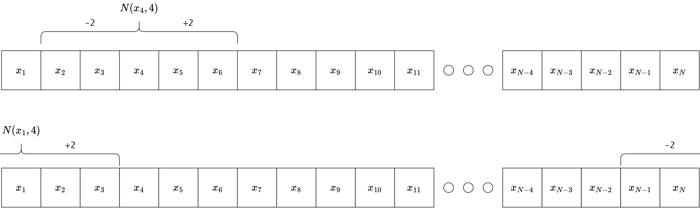

--- 
title: "Asset Allocation using Particle Swarm Optimization in R"
author: "Axel Roth"
date: "`r Sys.Date()`"
documentclass: book
classoption: oneside
github-repo: AxelCode-R/Master-Thesis
link-citations: yes
bibliography:
- book.bib
- packages.bib
site: bookdown::bookdown_site
biblio-style: apalike
editor_options:
  chunk_output_type: console
description: This GitBook is an example of a GitBook for teaching. It can be adapted
  for specific courses. The output format for this example is bookdown::gitbook.
---
```{r, include=FALSE, eval=FALSE}
# Sys.setenv(R_GSCMD="C:\\Program Files (x86)\\gs\\gs9.55.0\\bin\\gswin32.exe")
# #bookdown::render_book('index.Rmd', 'bookdown::pdf_book')
# bookdown::render_book('index.Rmd', 'bookdown::gitbook', new_session = F)
# # serve_book(daemon=T)
# # servr::daemon_stop(1)
# # devtools::install_github("crsh/citr")
# # citr::insert_citation()
# # git add .
# 
# if(FALSE){
#   bookdown::render_book('index.Rmd', 'bookdown::pdf_book')
#   bookdown::render_book('index.Rmd', 'bookdown::gitbook')
# }
# 
```


```{r, echo=FALSE, results='asis'}
# cat(paste0("<style> \n",paste0(readr::read_lines("my_style.css"), collapse = " \n")," </style>"))
# cat(paste0("<script type='text/javascript'> \n",paste0(readr::read_lines("script.js"), collapse = " \n")," </script>"))
```


# Preface {-}
\renewcommand{\chaptermark}[1]{\markboth{\uppercase{#1}}{\uppercase{#1}}}
\chaptermark{Preface}

|||in progress||| \
(soll vor dem TOC kommen denke ich)

\renewcommand{\chaptermark}[1]{\markboth{\uppercase{\thechapter. \ #1}}{}}

<!--chapter:end:index.Rmd-->

```{r, setup, include=F}
#rmarkdown::find_pandoc(version = "2.7.3")
source("global.R")
knitr::opts_chunk$set(cache = T, warning=F, message=F, comment="")
global_buffer_force <- F
```


# Abstract {-}
|||in progress||| \
(zusammenfassung: Vor dem TOC)

1. motivation

2. structure

3. results


<!--chapter:end:0_Abstract.Rmd-->

# Software information and usage
|||in progress|||
wie ich das buch schreibe, R markodwn bookdown und so und welche versionen ich nutze

## R-Version and Packages

## Reproducibility
github und code im bookdown

## R-functions
zb plotly_save

<!--chapter:end:1_Software_information_and_usage.Rmd-->

# Open Data Sources
To increase reproducibility, all data are free and can be loaded from the quantmod R package with the function `getSymbols()`. It is possible to choose between different data sources like yahoo-finance (default), alpha-vantage, google and others. 

## R-Functions
The following functions were created to increase the ease of data collection with the quantmod R package, which can be found in the `R/` directory in the attached [github repository](https://github.com/AxelCode-R/Master-Thesis).

### `get_yf()`
This function is the main wrapper for collecting data with `getSymbols()` from yahoo-finance, and converts prices to returns with the `pri_to_ret()` function explained in \@ref(pritoret). The output is a list containing prices and returns as [xts](https://cran.r-project.org/web/packages/xts/xts.pdf) objects. The arguments that can be passed to `get_yf()` are:  

\vspace{-0.4cm}
+ `tickers`: Vector of symbols (asset names, e.g. "APPL", "GOOG", ...)
+ `from ="2018-01-01"`: R-Date
+ `to = "2019-12-31"`: R-Date
+ `price_type = "close"`: Type of prices to be recorded (e.g. "open", "high", "low", "closed", "adjusted")
+ `return_type = "adjusted"`: Type of return to be recorded (e.g. "open", "high", "low", "closed", "adjusted")
+ `print = F`: Should the function print the return of `getSymbols()`

### `buffer()`
To make data reusable and reduce compilation time, this function stores the data collected with `get_yf()`. It receives an R expression, evaluates it and stores it in the `buffer_data/` directory under the specified name. If this name already exists, it loads the R object from the RData files without evaluating the expression. The evaluation and overwriting of the existing RData file can be forced with `force=T`.


<!--chapter:end:2_Open_Data_Sources.Rmd-->

---
output: html_document
editor_options: 
  chunk_output_type: console
---
# Mathematical Fundations {#mathfundations}
This chapter provides an overview of the mathematical calculations and conventions used in this thesis. It is important to note that most mathematical formulas are written in matrix notation. In most cases, this will result in a direct translation to R code. All necessary assumptions required for the modeled return structure are listed in this chapter so that any reader can understand the formulas given. It is important to note that reality is too complex and can only be partially modeled. Simple, basic models are used that do not stand up to reality, but these models or variations of them are commonly used in the financial world and have proven to be helpful. The complexity of solving advanced and basic models does not differ in PSO because the dimension of the objective function is based on the number of elements that can be selected, see chapter \@ref(challenges).

## Basic Operators
A compendium comparing commonly used mathematical symbols with R code and their meaning is given in the following table:  
```{r operators, echo=F}
reactable(
  data.frame(
    "Latex" = c("&#215;", "&#x2297", 'A<sup>T</sup>', "&middot;"),
    "R"= c("%*%", "%*%","t(A)", "*"),
    "Meaning" = c("Matrix-Product", "Outer-Product", "Transpose of Matrix or Vector A", "Scalar or element-wise Matrix multiplication")
  ), 
  columns <- list(
    Latex = colDef(name = "Latex/Displayed", html = T),
    R = colDef(name="R-Code")
  ),
  style = list(fontFamily="arial", fontSize=13)
) %>% 
  html_save()
```
To understand the listed operators more deeply, the following examples visualize the resulting dimensions and should provide insights into the use of such operators.  

Matrix-Product:
$$\mathcal{R}^{x \times y} \times \mathcal{R}^{y \times z} = \mathcal{R}^{x \times z} $$
and for a vector
$$v \in \mathcal{R}^{N \times 1}: \ \ \mathcal{R}^{1 \times N} \times \mathcal{R}^{N \times 1} = v^T \times v = \sum v_i^2 = \text{scalar}$$
Outer-Product:
$$\mathcal{R}^{x \times 1} \otimes \mathcal{R}^{1 \times x} = \mathcal{R}^{x \times x} $$
Scalar or element-wise Matrix multiplication:
$$R^{x \times y} \cdot R^{x \times y} = \begin{bmatrix}r_{11}^2 &\cdots  & r_{1y}^2 \\ \vdots & \ddots & \vdots  \\ r_{x1}^2 & \cdots & r_{xy}^2 \end{bmatrix}$$

## Return Calculation
Any portfolio optimization strategy based on historical data must start with returns. These returns are calculated using [adjusted closing prices](https://www.investopedia.com/terms/a/adjusted closingprice.asp), which show the percentage change over time. Adjusted closing prices reflect dividends and are adjusted for stock splits and rights offerings. These returns are essential for comparing assets and analyzing dependencies.

### Simple Returns
The default time frame for all raw data in this thesis is one working day and only simple rates of return are used. Assuming there is an asset with price $P$ on working day $t_i$ and the following working day $t_{i+1}$, it follows that the simple rate of return on $t_{i+1}$ can be calculated as follows:
$$
  R_{i+1} = \frac{P_{t_{i+1}}}{P_{t_i}}-1
$$

## Markowitz Modern Portfolio Theory (MPT)
In 1952, Harry Markowitz published his first seminal paper, which had a significant impact on modern finance, primarily by outlining the implications of diversification and efficient portfolios. The definition of an efficient portfolio is a portfolio that has either the maximum expected return for a given risk target or the minimum risk for a given expected return target. A simple quote to define diversification might be, "A portfolio has the same return but less variance than the sum of its parts." This is true when assets are not perfectly correlated, as bad and good performance can offset each other, reducing the likelihood of extreme events. For more information, see [@Mari2005].

### Assumptions of Markowitz Portfolio Theory
The following list contains all Markowitz assumptions according to [@Mari2005]:  

\vspace{-0.4cm}
+ Perfect market without taxes or transaction costs
+ Assets are infinitely divisible
+ Expected Returns, Variances and Covariances contain all information
+ Investors are risk-averse, they will only accept greater risk if they
are compensated with a higher expected return

The assumption that the returns are normally distributed is not required, but is assumed in this case to simplify the problem. It is obvious that these assumptions are unrealistic in reality. More details on the requirements for using other distributions can be found in [@Mari2005]. 

## Portfolio Math
Proofs of the basic calculations required for portfolio optimization, as shown in [@Eric2021], are provided in this section. Returns are presented differently than in most sources, as this is the most common data format used in practice. Suppose there are $N$ assets described by a return vector $R$ of random variables and a portfolio weight vector $w$, respectively:
$$
  R = 
  \begin{bmatrix}
    R_{1} & R_{2} & \cdots & R_{N}  
 \end{bmatrix}
 , \ \ 
 w = 
  \begin{bmatrix}
    w_{1} \\ 
    w_{2} \\
    \vdots \\
    w_{N}  
 \end{bmatrix}
$$

In this thesis, each return is simplified as being normally distributed with $R_i = \mathcal{N}(\mu_i, \sigma_i^2)$. As a result, linear combinations of normally distributed random variables are jointly normally distributed and have a mean, variance, and covariance that can be used to fully describe them.

### Expected Returns
The following formula can be used to get the expected returns of a vector with normally distributed random variables $R \in \mathbb{R}^{1\times N}$:
\begin{align*}
  E[R] &=
  \begin{bmatrix}
    E[R_{1}] & E[R_{2}] & \cdots & E[R_{N}]  
 \end{bmatrix}\\
 &=
 \begin{bmatrix}
    \mu_{1} & \mu_{2} & \cdots & \mu_{N} 
 \end{bmatrix}
 =
 \mu
\end{align*}
and $\mu_i$ can be estimated in R using historical data and the formula for the geometric mean of returns (also called compound returns). The function to calculate the geometric mean of returns from an xts object can be found in \@ref(geomeanret). 


### Expected Portfolio Returns
The following equation can be used to obtain the linear combination of expected returns $\mu$ and a weighting vector $w$ (e.g. portfolio weights):
\begin{align*}
 \mu \times w &=
  \begin{bmatrix}
    E[\mu_{1}] & E[\mu_{2}] & \cdots & E[\mu_{N}]
 \end{bmatrix}
  \times 
  \begin{bmatrix}
    w_{1} \\ 
    w_{2} \\
    \cdots \\
    w_{N}  
 \end{bmatrix} \\
 &=
 E[\mu_{1}] \cdot w_1 + E[\mu_{2}] \cdot w_2 + \cdots + E[\mu_{N}] \cdot w_{N} 
 =
 \mu_P
\end{align*}

<!-- ### Portfolio Returns -->
<!-- Let $R \in \mathbb{R}^{T \times N}$ denote a realized return Matrix of $N$ assets and $T$ days in the past. The portfolio return on each day can be calculated with the formula of the expected portfolio return. This is possible on all days $T$ by: -->
<!-- $$ -->
<!--   R \times w =  -->
<!--   \begin{bmatrix} -->
<!--     R_{1, 1} & R_{1, 2} & \cdots & R_{1, N} \\ -->
<!--     R_{2, 1} & R_{2, 2} & \cdots & R_{2, N} \\ -->
<!--     \vdots  & \vdots & \ddots & \vdots \\ -->
<!--     R_{T, 1} & R_{T, 2} & \cdots & R_{T, N} \\ -->
<!--  \end{bmatrix} -->
<!--   \times  -->
<!--   \begin{bmatrix} -->
<!--     w_{1} \\  -->
<!--     w_{2} \\ -->
<!--     \vdots \\ -->
<!--     w_{N}   -->
<!--  \end{bmatrix} -->
<!--  = -->
<!--    \begin{bmatrix} -->
<!--     R_{1}^P \\  -->
<!--     R_{2}^P \\ -->
<!--     \vdots \\ -->
<!--     R_{N}^P   -->
<!--  \end{bmatrix} -->
<!--  = -->
<!--  R_P -->
<!-- $$ -->


### Covariance
The general formula of the covariance matrix $\textstyle\sum$ of a random vector $R$ with $N$ normally distributed elements and $\sigma_{i,j}$ as correlation of two unique values is described as follows:
\begin{align*}
  Cov(R) &= E[(R-\mu)^T \otimes (R-\mu)] \\
  &=   \begin{bmatrix}
    \sigma_1^2 & \sigma_{1,2} & \cdots & \sigma_{1,N} \\
    \sigma_{2, 1} & \sigma_2^2 & \cdots & \sigma_{2, N} \\
    \vdots  & \vdots & \ddots & \vdots \\
    \sigma_{N, 1} & \sigma_{N, 2} & \cdots & \sigma_N^2 \\
 \end{bmatrix}\\
  &=\textstyle\sum
\end{align*}
and can be estimated in R with the basis function `cov()` and historical data.

### Portfolio Variance {#portvar}
Let $R$ be a random vector with $N$ normally distributed elements and $w$ a weight vector. Assuming that the covariance matrix $\sum$ of $R$ is known, the variance of the linear combination of $R$ can be calculated as follows:
\begin{align*}
  Var(R \times w) &= E[(R \times w - \mu \times w)^2] \\
  &= E[((R - \mu) \times w)^2]
\end{align*}

Since $(R - \mu) \times w$ is a scalar, it can be transformed from $((R - \mu) \times w)^2$ to $((R - \mu) \times w)^T \cdot ((R - \mu) \times w)$ and results in:
\begin{align*}
  Var(R \times w) &= E[((R - \mu) \cdot w)^T \times ((R - \mu) \times w)]\\ 
  &= E[(w^T \times (R - \mu)^T) \cdot ((R - \mu) \times w)]\\ 
  &= w^T \times E[(R - \mu)^T \otimes (R - \mu)] \times w \\
  &= w^T \times Cov(R) \times w \\
  &= w^T \times \textstyle\sum \times w
\end{align*}

The same is true for an estimate of $\textstyle\sum$.


### Portfolio Returns {#portfolioreturns}
Suppose there are $N$ assets forming a portfolio with weights $w$ at time $t_0$, and the portfolio is to pass through several time steps until $t_T$ without rebalancing. What are the portfolio returns at each time step $t_i$? Clearly, assets with positive performance in the current time step will have a higher weight in the next time step. This can be done by adjusting the weights after each time step depending on the returns. The formula for holding a portfolio with weights $\textstyle\sum w = 1$ and return matrix $R \in \mathbb{R}^{T \times N}$, has return $Z_i-1$ on $t_i$ with $i=0, 1, \cdots, T$ for:
$$
  Z_i =
  \begin{cases}
  (1+R_i)\cdot w &\text{ if }i=0\\
  (1+R_i)\cdot \frac{Z_{i-1}}{\sum Z_{i-1}} &\text{ if }i>0
  \end{cases}
$$

This calculation of portfolio returns is implemented in the function `calc_portfolio_returns()` below.

## R-Functions
|||in progress||| \

### `pri_to_ret()` {#pritoret}
|||in progress||| \
((prices to returns))

### `ret_to_cumret()`
|||in progress||| \
((returns to cumulated returns normalized to 100))

### `ret_to_geomeanret()` {#geomeanret}
The geometric mean of returns is a better estimator than the arithmetic mean of returns because it captures the exact mean price changes over a period of time. The variance estimated from the daily returns is a daily variance, so the returns must have the same time base. This can be done by calculating the geometric mean of the returns from multiple daily returns. Assuming there is an asset with returns $r_1 = 0.01$, $r_2=-0.03$, and $r_3=0.02$, it follows that the geometric mean return $r^{geom}$ can be calculated as:
$$
  r^{geom} = ((1+r_1) \cdot (1+r_2) \cdot (1+r_3))^{1/3}-1 = -0.0002353887
$$
And the advantage is that it is a daily average return that gives exactly the same result as the real return, that is:
$$
  (1+r^{geom})^3 = (1+r_1) \cdot (1+r_2) \cdot (1+r_3)
$$
This is not the case with the arithmetic mean of the returns. The general formula for calculating the geometric mean return of $n$ days is:
$$
  r^{geom} = (\prod_{i=1}^n (1+r_i))^{\frac{1}{n}}-1
$$
and as R code:
```{r}
ret_to_geomeanret <- function(xts_ret){
  sapply((1+xts_ret), prod)^(1/nrow(xts_ret))-1
}
```


### `calc_portfolio_returns()`
This is the implementation of a vectorial calculation of portfolio returns over multiple periods with a weighting vector `weights` at $t_0$ and no re-balancing: 
```{r calc_portfolio_returns}
calc_portfolio_returns <- 
  function(xts_returns, weights, name="portfolio"){
  if(sum(weights)!=1){
    xts_returns$temp___X1 <- 0
    weights <- c(weights, 1-sum(weights))
  }
  res <- cumprod((1+xts_returns)) * matrix(
    rep(weights, nrow(xts_returns)), ncol=length(weights), byrow=T)
  res <- xts(
    rowSums(res/c(1, rowSums(res[-nrow(xts_returns),])))-1, 
    order.by=index(xts_returns)) %>% 
    setNames(., name)
  return(res)
}
```
This function has the same results as the `Return.portfolio()` function from the `PortfolioAnalytics` package.


<!--chapter:end:3_Matrix_Algebra_for_Finance.Rmd-->

# Activ vs Passiv Investing
|||in progress||| \
The fundation of Asset Management 


passiv vs activ studie
`https://www.scirp.org/journal/paperinformation.aspx?paperid=92983`


gut gut
file:///C:/Users/Axel/Desktop/Master-Thesis-All/Ziel%20was%20beantwortet%20werden%20soll/Quellen%20nur%20wichtige/Rasmussen2003_Book_QuantitativePortfolioOptimisat.pdf

<!--chapter:end:4_Activ_vs_Passiv_Investing.Rmd-->

---
output: html_document
editor_options: 
  chunk_output_type: console
---
# Challenges of Passiv Investing {#challenges}

In this chapter, we analyze two common challenges of passive investing and create simple use cases to test the PSO. The first challenge is the mean-variance portfolio (MVP) from Markowitz's modern portfolio theory, which, simply put, is an optimal allocation of assets in terms of risk and return. The second challenge is the index tracking problem, which attempts to construct a portfolio with minimal tracking error to a given benchmark.

## Mean-Variance Portfolio (MVP)
Markowitz showed that diversifying risk across multiple assets reduces overall portfolio risk. This result was the beginning of the widely used modern portfolio theory, which uses mathematical models to create portfolios with minimal variance for a given return target. All such optimal portfolios for a given return target are called efficient and constitute the efficient frontier. Markowitz's original MVP without constraints can be solved in a closed form, which is explained in [@Eric2021]. These types of MVP's have no practical use, so only MVP's with constraints and without closed forms are of interest in this thesis.

### MVP Objective
Let there be $N$ assets and their returns on $T$ different days, creating a return matrix $R \in \mathbb{R}^{T \times N}$. Each element $R_{t,i}$ contains the return of the $i$-th asset on day $t$. The covariance matrix of the returns is $\textstyle\sum \in \mathbb{R}^{N \times N}$ and the expected returns are $\mu \in \mathbb{R}^{N}$. The MVP with the risk aversion parameter $\lambda \in [0,1]$, as shown in [@Mari2005], can be formalized as follows:
\begin{equation} 
\underset{w}{min} \ \ \ \lambda \ w^T \textstyle\sum w - (1-\lambda) \ \mu^T w
(\#eq:MVP)
\end{equation} 

The risk aversion parameter $\lambda$ defines the tradeoff between risk and return. With $\lambda = 1$, the minimization problem contains only the variance term, leading to a minimum variance portfolio, and $\lambda = 0$ transforms the problem into a minimization of negative expected returns, leading to a maximum return portfolio. All possible portfolios created by $\lambda \in [0, 1]$ define the efficient frontier.


### MVP example
All possible MVPs together define the efficiency frontier, which is analyzed in this section without going into the details of its calculation. This example uses three assets (stocks: IBM, Google, Apple) and calculates the solution of the MVP for each $\lambda$. First, the daily returns of these three assets from 2018-01-01 to 2019-12-31 are loaded.  
```{r MVP_ex1, include = knitr::is_html_output(), class.source="code_fold_it_collapsed"}
returns <- buffer(
  get_yf(tickers = c("IBM", "GOOG", "AAPL"), from = "2018-01-01", to = "2019-12-31")$returns, 
  "CPI_3_assets"
)
``` 
The cumulative daily returns are:  
```{r MVP_ex2, echo = F}
plotly_line_chart_xts(ret_to_cumret(returns)) %>% 
  html_save()

```
The expected daily returns and the covariance matrix for the three assets can be estimated using the formulas from chapter \@ref(mathfundations):  
```{r MVP_ex3, results = "hold", echo= knitr::is_html_output(), class.source="code_fold_it_collapsed"}
mu <- ret_to_geomeanret(returns)
cat0("estimation of expected daily returns:")
mu
cat("\n")
cov <- as.matrix(nearPD(cov_(returns, mu))$mat)
cat0("estimation of positiv definite covariance matrix:")
cov
```

This is all the data necessary to solve the MVP with $\lambda \in \{0.01, 0.02, ..., 0.99, 1\}$. All 100 portfolios are computed by solving a quadratic minimization problem with the long only ($w_i \geq 0 \ \forall \ i$) constraint and the weights should sum to 1.  
```{r MVP_ex4, echo = knitr::is_html_output(), class.source="code_fold_it_collapsed"}
portfolios <- data.frame()
mu_and_var <- NULL
for(lambda in seq(0.01,1, 0.01)){
    mat <- list(
      Dmat = lambda * cov,
      dvec = (1 - lambda) * mu,
      Amat = t(rbind(
        rep(1, ncol(returns)), # sum up to 1
        diag(1, nrow=ncol(returns), ncol=ncol(returns)) # long only
      )),
      bvec = c(
        1, # sum up to 1
        rep(0, ncol(returns)) # long only
      ),
      meq = 1
    )

    qp <- solve.QP(Dmat = mat$Dmat, dvec = mat$dvec, Amat = mat$Amat, bvec = mat$bvec, meq = mat$meq)

    port <- xts(returns %*% qp$solution, order.by=index(returns))

    mu_and_var <- rbind(
      mu_and_var,
      data.frame("lambda" = lambda, "mu" = mu %*% qp$solution, "sd" = sqrt(t(qp$solution) %*% cov %*% qp$solution))
    )
    portfolios <- rbind(
      portfolios,
      qp$solution
    )
}
portfolios <- data.frame(portfolios)
colnames(portfolios) <- colnames(returns)

```
The resulting daily returns and standard deviations are plotted to create the efficiency frontier:  
```{r MVP_ex5, echo = knitr::is_html_output(), class.source="code_fold_it_collapsed", warning=F, message=F}
plot_ly(data = mu_and_var) %>%
  add_lines(y = ~mu, x = ~sd, name = "efficient frontier", mode="lines", type = 'scatter') %>%
  add_trace(x = ~sd, y=~mu, mode="markers", name = "lambda steps", type = 'scatter') %>%
  layout(
    title = "3-Asset MVP",
    yaxis = list(range=c(min(mu_and_var$mu)*0.9, max(mu_and_var$mu)*1.1)),
    xaxis = list(range=c(min(mu_and_var$sd)*0.95, max(mu_and_var$sd)*1.05)),
    margin = list(
        l = 10,
        r = 10,
        b = 70,
        t = 50,
        pad = 4
    )
  ) %>% 
  html_save()

```
The portfolio compositions for each $\lambda$ are:  
```{r MVP_ex6, echo = knitr::is_html_output(), class.source="code_fold_it_collapsed", warning=F, message=F}
p <- plot_ly(type="bar") %>% layout(title="Portfolio compositions", barmode="stack", xaxis = list(title="lambda", autorange = "reversed"), yaxis = list(title="wgt"))
for(i in 1:ncol(portfolios)){
  p <- p %>%
  add_trace(x=seq(0.01,1, 0.01), y=portfolios[, i], name = colnames(portfolios)[i])
}
p %>% html_save()

```
It can be observed that the minimum variance portfolio was achieved with a diversified composition of the tree assets. With gradually decreased in $\lambda$, the portfolio starts to ignore the variance and invest more in the most risky and highest return asset.

### MVP Compare Estimators
The above MVP used a geometric mean returns to estimate the expected returns $\mu$ and used it as well in the estimation of $\textstyle\sum$. This rises the question if the outcome differs from the classical approach of estimating these parameters with the arithmetic mean returns. The following chart illustrates the efficient frontier for a MVP with arithmetic mean returns as estimator of $\mu$ versus a MVP with geometric mean returns as estimator of $\mu$. To compare the results in one chart, all resulting portfolios are evaluated on the historical data with the arithmetic mean returns:

```{r, echo = knitr::is_html_output(), class.source="code_fold_it_collapsed"}

cov_ <- function(mat, mean_vec=NULL){
  if(is.null(mean_vec)){
    mat_mean <- matrix(data=1, nrow=nrow(mat)) %*% apply(mat, 2, mean)
  }else{
    mat_mean <- matrix(data=1, nrow=nrow(mat)) %*% mean_vec
  }
  mat <- mat - mat_mean

  return((nrow(mat)-1)^(-1) * t(mat) %*% mat)
}


returns <- buffer(
  get_yf(tickers = c("IBM", "GOOG", "AAPL"), from = "2018-01-01", to = "2019-12-31")$returns,
  "CPI_3_assets"
)

# save geo to compare results
mu_arit <- apply(returns, 2, mean) #ret_to_geomeanret(returns)
cov_arit <- cov(returns)

mu <- ret_to_geomeanret(returns) #apply(returns, 2, mean) #ret_to_geomeanret(returns)
cov <- cov_(returns, mean_vec = mu)


portfolios <- data.frame()
mu_and_var <- NULL
for(lambda in seq(0.01,1, 0.01)){
  mat <- list(
    Dmat = lambda * cov,
    dvec = (1 - lambda) * mu,
    Amat = t(rbind(
      rep(1, ncol(returns)), # sum up to 1
      diag(1, nrow=ncol(returns), ncol=ncol(returns)) # long only
    )),
    bvec = c(
      1, # sum up to 1
      rep(0, ncol(returns)) # long only
    ),
    meq = 1
  )

  qp <- solve.QP(Dmat = mat$Dmat, dvec = mat$dvec, Amat = mat$Amat, bvec = mat$bvec, meq = mat$meq)

  port <- xts(returns %*% qp$solution, order.by=index(returns))

  mu_and_var <- rbind(
    mu_and_var,
    data.frame("lambda" = lambda, "mu" = mu_arit %*% qp$solution, "sd" = sqrt(t(qp$solution) %*% cov_arit %*% qp$solution))
  )
  portfolios <- rbind(
    portfolios,
    qp$solution
  )
}
portfolios <- data.frame(portfolios)
colnames(portfolios) <- colnames(returns)

all <- data.frame(type="geo_mean", mu_and_var)


# 
# mu <- ret_to_geomeanret(returns) #apply(returns, 2, mean) #ret_to_geomeanret(returns)
# cov <- cov(returns)
# 
# 
# portfolios <- data.frame()
# mu_and_var <- NULL
# for(lambda in seq(0.01,1, 0.01)){
#   mat <- list(
#     Dmat = lambda * cov,
#     dvec = (1 - lambda) * mu,
#     Amat = t(rbind(
#       rep(1, ncol(returns)), # sum up to 1
#       diag(1, nrow=ncol(returns), ncol=ncol(returns)) # long only
#     )),
#     bvec = c(
#       1, # sum up to 1
#       rep(0, ncol(returns)) # long only
#     ),
#     meq = 1
#   )
# 
#   qp <- solve.QP(Dmat = mat$Dmat, dvec = mat$dvec, Amat = mat$Amat, bvec = mat$bvec, meq = mat$meq)
# 
#   port <- xts(returns %*% qp$solution, order.by=index(returns))
# 
#   mu_and_var <- rbind(
#     mu_and_var,
#     data.frame("lambda" = lambda, "mu" = mu_arit %*% qp$solution, "sd" = sqrt(t(qp$solution) %*% cov_arit %*% qp$solution))
#   )
#   portfolios <- rbind(
#     portfolios,
#     qp$solution
#   )
# }
# portfolios <- data.frame(portfolios)
# colnames(portfolios) <- colnames(returns)
# 
# all <- rbind(all, data.frame(type="geo_mean_and_cov_with_arith", mu_and_var))


mu <- apply(returns, 2, mean)
cov <- cov(returns)


portfolios <- data.frame()
mu_and_var <- NULL
for(lambda in seq(0.01,1, 0.01)){
  mat <- list(
    Dmat = lambda * cov,
    dvec = (1 - lambda) * mu,
    Amat = t(rbind(
      rep(1, ncol(returns)), # sum up to 1
      diag(1, nrow=ncol(returns), ncol=ncol(returns)) # long only
    )),
    bvec = c(
      1, # sum up to 1
      rep(0, ncol(returns)) # long only
    ),
    meq = 1
  )

  qp <- solve.QP(Dmat = mat$Dmat, dvec = mat$dvec, Amat = mat$Amat, bvec = mat$bvec, meq = mat$meq)

  port <- xts(returns %*% qp$solution, order.by=index(returns))

  mu_and_var <- rbind(
    mu_and_var,
    data.frame("lambda" = lambda, "mu" = mu_arit %*% qp$solution, "sd" = sqrt(t(qp$solution) %*% cov_arit %*% qp$solution))
  )
  portfolios <- rbind(
    portfolios,
    qp$solution
  )
}
portfolios <- data.frame(portfolios)
colnames(portfolios) <- colnames(returns)

all <- rbind(all, data.frame(type="arith_mean", mu_and_var))


plot_ly() %>%
  add_lines(data = all %>% filter(type=="geo_mean"), y = ~mu, x = ~sd, name="geo_mean", mode="lines", type = 'scatter') %>%
  add_trace(data = all %>% filter(type=="geo_mean"), x = ~sd, y=~mu, name="geo_mean", mode="markers", type = 'scatter') %>%
  add_lines(data = all %>% filter(type=="arith_mean"), y = ~mu, x = ~sd, name="arith_mean", mode="lines", type = 'scatter') %>%
  add_trace(data = all %>% filter(type=="arith_mean"), x = ~sd, y=~mu, name="arith_mean", mode="markers", type = 'scatter') %>%
  # add_lines(data = all %>% filter(type=="geo_mean_and_cov_with_arith"), y = ~mu, x = ~sd, name="geo_mean_and_cov_with_arith", mode="lines", type = 'scatter') %>%
  # add_trace(data = all %>% filter(type=="geo_mean_and_cov_with_arith"), x = ~sd, y=~mu, name="geo_mean_and_cov_with_arith", mode="markers", type = 'scatter') %>%
  layout(
    title = "3-Asset MVP: arith_mean or geo_mean",
    yaxis = list(title = "mu (arithmetic)", range=c(min(mu_and_var$mu)*0.9, max(mu_and_var$mu)*1.1)),
    xaxis = list(title = "sd (arithmetic)", range=c(min(mu_and_var$sd)*0.95, max(mu_and_var$sd)*1.05)),
    margin = list(
      l = 10,
      r = 10,
      b = 70,
      t = 50,
      pad = 4
    )
  ) %>%
  html_save()
```
It can be seen, that both estimators produce portfolios on the same efficient frontier. If the aim of the MVP is to generate a portfolio with minimal variance for a given return target, the type of return needs to be specified to use the geometric or arithmetic mean. This specification will determine the type of estimator needed for the MVP. This analogy is not needed in the scope of this thesis, because the more generic portfolios specified with $\lambda$ are sufficient to create test-cases for the PSO. The later examples with the MVP will always use the geometric mean returns as estimation for the expected returns.


## Index-Tracking Portfolio (ITP)
Indices are baskets of assets that are used to track the performance of a particular asset group. For example, the well-known Standard and Poor's 500 Index (S&P 500 for short) tracks the 500 largest companies in the United States. Indices are not for sale and serve only to visualize the performance of a particular asset group, without incurring transaction costs. Such indices, or a combination of indices, are used by asset managers as benchmarks to compare the performance of their funds. Each fund has its own benchmark, which contains roughly the same assets that the manager might buy. If the fund underperforms its benchmark, it may indicate that the fund manager has made poor decisions. Therefore, fund managers strive to outperform their benchmarks through carefully selected investments. Past experience has shown that this is rarely achieved with active management by cost [@Desm2016]. This has led to the growing popularity of passively managed funds whose goal is to track their benchmarks as closely as possible. This can be achieved through either full or sparse replication. Full replication is a portfolio that contains all the assets in the benchmark with the same weightings. The resulting performance equals the performance of the benchmark when transaction costs are neglected. The first problem is that a benchmark may contain assets that are not liquid or cannot be purchased. The second problem is the weighting scheme of the indices, because they are often weighted by their market capitalization, which changes daily. This would result in the need to reweight daily and increase transaction costs to replicate the performance of the benchmark as closely as possible. To avoid this, sparse replications are used that contain only a fraction of the benchmark's assets. To do so, the portfolio manager must define his benchmark, which should overlap with the investment universe of his fund. He then reduces this universe, taking into account investor constraints and availability, to create a pool of possible assets. For example, a pool that replicates the S&P 500 might consist of the one hundred highest-weighted assets in the S&P 500. The ITP can be modeled in two ways analysed in [@IuGa2019]. 


### ITP with TEV objective (ITP-TEV)
The classic and widely used model tries to reduce the variance of the tracking error (TEV) with the following formula:
$$
 \min \ \ Var(TE) = Var(r_{p}-r_{bm})
$$

To obtain the portfolio weights $w$, one needs to substitute $r_{p}$ as follows:
$$
  r_{p} = R \times w
$$

The variance is then solved until a quadratic problem is presented as a function of portfolio weights $w$:
\begin{align*}
 Var(r_{p}-r_{bm}) &= Var(R \times w - r_{bm}) \\
 &= Var(R \times w) + Var(r_{bm}) - 2 \cdot Cov(R \times w,r_{bm}) 
\end{align*}

Now the three terms can be solved, starting with the simplest one.
$$
Var(r_{bm}) = \sigma_{bm}^2 = constant
$$

The variance of the portfolio can be solved with \@ref(portvar):
$$
Var(R \times w) = w^T \times Cov(R) \times w
$$
And the last term can be solved in the same way as in [@Eric2021]:
\begin{align*}
  Cov(A \times a, b) &= Cov(b, A \times a) \\
  &= E[(b-\mu_{b})(A \times a-\mu_{A} \times a)] \\
  &= E[(b-\mu_{b})(A-\mu_{A}) \times a] \\
  &= E[(b-\mu_{b})(A-\mu_{A})] \times a \\
  &= Cov(A,b) \times a
\end{align*}

This results in the final formula of the ITP:
\begin{align*}
  Var(r_{p}-r_{bm}) & = Var(R \times w - r_{bm}) \\
  & = Var(R \times w) - 2 \cdot Cov(R \times w,r_{bm}) + Var(r_{bm})  \\
  & = w^T \times Cov(R) \times w - 2 \cdot Cov(r_{bm}, R)^T \times w + \sigma_{bm}^2
  (\#eq:ITP)
\end{align*}

The minimization problem of the ITP in the general structure required by many optimizers is:
$$
  \min\limits_{w} \ \ \frac{1}{2} \cdot w^T \times D \times w -d^T \times w
$$

Minimization problems can ignore constant terms and global stretch coefficients and still find the same minimum. This leads to a general substitution of the ITP with TEV objective as follows:
$$
  D = Cov(R)
$$
and
$$
d = Cov(r_{bm}, R)
$$

It is possible to add some basic constraints, as in the MVP to sum the weights to 1 and be long only. Despite the fact that this model is often used, it has a big disadvantage in that it cannot detect constant deviations in the returns. For this reason, the following model exists, which focuses on the mean square tracking error of returns (MSTE).

### ITP with MSTE objective (ITP-MSTE)
A good explanation of the ITP with MSTE objective can be found in [ahmedbadary](https://ahmedbadary.github.io/work_files/research/conv_opt/hw/iftp). The objective is to minimize the mean square tracking error (MSTE) of daily portfolio returns $r_{t, p}$ and daily benchmark returns $r_{t, bm}$ on $T$ days:

$$
  \frac{1}{T} \sum^T_{t=1}(r_{t, p}-r_{t, bm})^2
$$
The formula can be rewritten as vector norm:
$$
  \frac{1}{T} \left\Vert r_{p}-r_{bm} \right\Vert_2^2
$$
Which results in the following minimization with neglected stretching factor:
$$
 min \ \  \left\Vert r_{p}-r_{bm} \right\Vert_2^2
$$
The portfolio returns $r_p$ needs to be substituted to contain the portfolio weights $w$ like in the TEV objective above. This results in the below transformation of the problem:
\begin{align*}
  \left\Vert r_{p}-r_{bm} \right\Vert_2^2 &= \left\Vert R \times w-r_{bm} \right\Vert_2^2 \\ 
  &= (R \times w-r_{bm})^T \times (R \times w-r_{bm}) \\ 
  &= (w^T \times R^T-r_{bm}^T) \times (R \times w-r_{bm}) \\ 
  &= w^T \times R^T \times R \times w - w^T \times A^T \times r_{bm} - r_{bm}^T \times R \times w + r_{bm}^T \times r_{bm} 
\end{align*}

The minimization and the fact that the scalars $w^T \times R^T \times r_{bm}$ and $r_{bm}^T \times R \times w$ are equal, transforms the problem to:
$$
  \min\limits_{w} \ \  \left\Vert r_{p}-r_{bm} \right\Vert_2^2 
  = w^T \times R^T \times R \times w - 2\cdot r_{bm}^T \times R \times w
$$
This leads to the equivalent general representation of the ITP with MSTE objective as follows:
$$
  \min\limits_{w} \ \ \frac{1}{2} \cdot w^T \times D \times w - d^T \times w
$$
with
$$
D = R^T \times R
$$
and 
$$
  d = R^T \times r_{bm}
$$


### Example ITP
This example shows the results of tracking the S&P 500 with a tracking portfolio that can only invest in IBM, Apple and Google. The time frame ranges from 2018-01-01 till 2019-12-31 and the goal is to minimize the difference in returns between the portfolio and the benchmark. The fitted return changes of the ITP-TEV and ITP-MSTE are:

```{r ITP_ex, echo = knitr::is_html_output(), class.source="code_fold_it_collapsed"}
pool_returns <- buffer(
  get_yf(tickers = c("IBM", "GOOG", "AAPL"), from = "2018-01-01", to = "2019-12-31")$returns, 
  "CPI_3_assets"
)

bm_returns <- buffer(
  get_yf(tickers = "%5EGSPC", from = "2018-01-01", to = "2019-12-31")$returns, 
  "CPI_sp500"
) %>% setNames(., "S&P 500")


mat <- list(
    Dmat = cov(pool_returns),
    dvec = cov(pool_returns, bm_returns),
    Amat = t(rbind(
      rep(1, ncol(pool_returns)), # sum up to 1
      diag(1, nrow=ncol(pool_returns), ncol=ncol(pool_returns)) # long only
    )),
    bvec = c(
      1, # sum up to 1
      rep(0, ncol(pool_returns)) # long only
    ),
    meq = 1
)

qp <- solve.QP(Dmat = mat$Dmat, dvec = mat$dvec, Amat = mat$Amat, bvec = mat$bvec, meq = mat$meq)

composition_TEV <- data.frame("type"="ITP-TEV", t(setNames(qp$solution, colnames(pool_returns))))
port_returns_TEV <- xts(pool_returns %*% qp$solution, order.by=index(pool_returns)) %>% 
  setNames(., "ITP-TEV")


mat <- list(
    Dmat = t(pool_returns) %*% pool_returns,
    dvec = t(pool_returns) %*% bm_returns,
    Amat = t(rbind(
      rep(1, ncol(pool_returns)), # sum up to 1
      diag(1, nrow=ncol(pool_returns), ncol=ncol(pool_returns)) # long only
    )),
    bvec = c(
      1, # sum up to 1
      rep(0, ncol(pool_returns)) # long only
    ),
    meq = 1
)

qp <- solve.QP(Dmat = mat$Dmat, dvec = mat$dvec, Amat = mat$Amat, bvec = mat$bvec, meq = mat$meq)

composition_MSTE <- data.frame("type"="ITP-MSTE", t(setNames(qp$solution, colnames(pool_returns))))
port_returns_MSTE <- xts(pool_returns %*% qp$solution, order.by=index(pool_returns)) %>% 
  setNames(., "ITP-MSTE")


plotly_line_chart_xts(ret_to_cumret(cbind.xts(port_returns_TEV, port_returns_MSTE, bm_returns))) %>% 
  html_save()
```
The ITP-TEV and ITP-MSTE had almost the same results whith the compositions below:
```{r ITP_ex2, echo=F}
data.frame(rbind(composition_TEV, composition_MSTE), row.names = NULL)
```


<!--chapter:end:5_Challenges_of_Passiv_Investing.Rmd-->

---
output: html_document
editor_options: 
  chunk_output_type: console
---
# Analytic Solver for Quadratic Programming Problems
The advantages and disadvantages of analytical solvers for quadratic programming problems are discussed in this chapter. It is beyond the scope of this thesis to explain the underlying mathematical principles of how a solver solves quadratic problems; only the applications and analysis are discussed. The main reason for dealing with analytic solvers for quadratic programming problems is to use them as a benchmark for PSO.

## Quadratic Programming (QP)
A quadratic program is a minimization problem of a function that returns a scalar value and consists of a quadratic term and a linear term that depend on the variable of interest. In addition, the problem may be constrained by several linear inequalities that bound the solution. The general formulation used is to find $x$ that minimizes the following problem:
$$
  \min\limits_{x} \ \frac{1}{2} \cdot x^T \times D \times x - d^T \times x 
$$
and is valid under the linear constraints:
$$
  A^T \times x \geq b_0
$$

Some other sources notate the problem with different signs or coefficients, all of which are interchangeable with the above problem. In addition, the above problem has the same notation used in the R package `quadprog`, which reduces the substitution overhead. All modern programming languages have many solvers for quadratic problems. They differ mainly in the computation time for certain problems and the requirements. Some commercial QP solvers additionally accept more complex constraints, such as absolute (e.g., $|A^T \times x| \geq a_0$) or mixed-integer (e.g., $x \in \mathbb{N}$). Especially the mixed-integer constraint problems lead to a huge increase in memory requirements.

## QP-Solver from quadprog
The most common free QP-Solver used in R comes from the package [quadprog](https://cran.r-project.org/web/packages/quadprog/quadprog.pdf), which consists of a single function called `solve.QP()`. Its implementation routine is the dual method of Goldfarb and Idnani published in [@GoId1982] and [@GoId1983]. It uses the above QP with the condition that $D$ must be a symmetric positive definite matrix. This means that $D\in \mathbb{R}^{N \times N}$ and $x^T D x > 0 \ \forall \ x \in \mathbb{R}^N$, which is equivalent to all eigenvalues being greater than zero. In most cases this is not achieved by estimating the covariance matrix $\sum$, but it is possible to find the nearest positive definite matrix of $\textstyle\sum$ using the function `nearPD()` from the [matrix](https://cran.r-project.org/web/packages/Matrix/Matrix.pdf) R package. The error encountered often does not exceed a percentage change in elements over $10^{-15} \%$, which is negligible for the context of this work. The function `solve.QP()` for an $N$ dimensional vector of interest, has the following arguments, which are also found in the above formulation of a QP:  

\vspace{-0.4cm}
+ `Dmat`: Symmetric positive definite matrix $D \in \mathbb{R}^{N \times N}$ of the quadratic term
+ `dvec`: Vector $d \in \mathbb{R}^{N}$ of the linear term
+ `Amat`: Constraint matrix $A$
+ `bvec`: Constraint vector $b_0$
+ `meq = 1`: means that the first row of $A$ is treated as an equality constraint

The return of `solve.QP()` is a list and contains, among others, the following attributes of interest:
+ `solution`: Vector containing the solution $x$ of the quadratic programming problem (e.g. portfolio weights)
+ `value`: Scalar, the value of the quadratic function at the solution

## Example: Solving MVP with `solve.QP()` {#exampleanalyticalmvp}
This section provides insights into the effects of diversification and the use of `solve.QP()` by creating ten different efficiency frontiers from a pool of ten assets. Each efficiency frontier $i \in \{1, 2, \cdots, 10\}$ consists of $N_i = i$ assets and is created by adding the asset with the next smallest variance first. After loading the returns for ten of the largest stocks in the U.S. market, the variance is calculated to rank all columns in ascending order of variance, as shown in the code below:
```{r qp_mvp1, class.source="code_fold_it_collapsed"}
returns_raw <- buffer(
  get_yf(
    tickers = c("IBM", "GOOG", "AAPL", "MSFT", "AMZN", 
                "NVDA", "JPM", "META", "V", "WMT"), 
    from = "2018-01-01", 
    to = "2019-12-31"
  )$returns, 
  "AS_10_assets"
)

# re-arrange: low var first
vars <- sapply(returns_raw, var)
returns_raw <- returns_raw[, order(vars, decreasing = F)]
```

The next step is to create a function `mvp()` that has the arguments `return` and `lambda`. It computes the expected returns `mu` and the estimated positive definite covariance `cov`. It then solves an MVP with constraints $\textstyle\sum w_i = 1$ and $w_i \geq 0$, which yields the key features `mu`, `var` and `composition` of the portfolio. 

```{r qp_mvp2, class.source="code_fold_it_collapsed"}
mvp <- function(returns, lambda){
  tc <- tryCatch({
    mu <- ret_to_geomeanret(returns)

    cov <- as.matrix(nearPD(cov_(returns, mu))$mat)

    mat <- list(
      Dmat = lambda * cov,
      dvec = (1-lambda) * mu,
      Amat = t(rbind(
        rep(1, ncol(returns)), # sum up to 1
        diag(1, nrow=ncol(returns), ncol=ncol(returns)) # long only
      )),
      bvec = c(
        1, # sum up to 1
        rep(0, ncol(returns)) # long only
      ),
      meq = 1
    )
  
    qp <- solve.QP(
      Dmat = mat$Dmat, dvec = mat$dvec, 
      Amat = mat$Amat, bvec = mat$bvec, meq = mat$meq
    )
    
    res <- list(
      "mu" = mu %*% qp$solution,
      "var" = t(qp$solution) %*% cov %*% qp$solution,
      "composition" = setNames(qp$solution, colnames(returns))
    )
    TRUE
  }, error = function(e){FALSE})
  

  if(tc){
    return(res)
  }else{
    return(list(
      "mu" = NA,
      "var" = NA,
      "composition" = NA
    ))
  }
}
```

Each $\lambda \in \{0.01, 0.02, \cdots, 1\}$ and each combination of ascending number of assets results in a portfolio that can be created with two for loops.

```{r qp_mvp3, class.source="code_fold_it_collapsed"}
df <- data.frame(
  "index"=1, 
  "var"=as.numeric(var(returns_raw[, 1])), 
  "return" = as.numeric(ret_to_geomeanret(returns_raw[, 1])), 
  row.names=NULL
)
for(i in 2:ncol(returns_raw)){
  returns <- returns_raw[, 1:i]
  for(lambda in seq(0.01, 1, 0.01)){
    res <- mvp(returns, lambda)
    
    df <- rbind(
      df, 
      data.frame("index"=i, "var"=res$var, "return" = res$mu)
    )
  }
}

```

The result is filtered and names are added to represent the number of assets. Now the diagram can be created:

```{r qp_mvp4, echo = knitr::is_html_output(), class.source="code_fold_it_collapsed"}
df <- df %>% 
  filter(!is.na(return)) %>% 
  distinct() %>% 
  mutate(name = paste0("n_", index)) %>% 
  arrange(name) %>% 
  mutate(name = factor(name, levels=paste0("n_", ncol(returns_raw):1)))


max_show_sd <- df %>% 
  group_by(index) %>% 
  summarise(max_x = max(var)) %>% 
  pull(max_x) %>% 
  mean() %>% 
  sqrt()

plot_ly(
    data = df[df$index!=1,], 
    x=~sqrt(var), 
    y=~return, 
    name=~name, 
    mode="lines", 
    type = 'scatter', 
    color = ~name, 
    colors = c("green", "red")
  ) %>% 
  add_trace(
    data=df[df$index==1,],  
    x=~sqrt(var), 
    y=~return, 
    showlegend=T, 
    marker=list(color="red"), 
    mode="markers", 
    name="n_1") %>% 
  layout(
    xaxis=list(range=c(sqrt(min(df$var))*0.9, max_show_sd), title="standard deviation"),
    yaxis=list(range=c(min(df$return)*0.9, (max(df$return)+mean(df$return))*0.5), title="return")) %>% 
  html_save()

```

It can be seen, that each asset added results in a minimum variance portfolio with smaller or equal standard deviation. Nevertheless, we started with the asset that has the smallest standard deviation of `r sqrt(min(vars))`. This is the effect of diversification mentioned by Markowitz.


## Example: Solving ITP-MSTE with `solve.QP()` {#exampleitpsolveqp}
This example analyzes how many assets are needed to minimize the mean square error between the replication and historical returns of the S&P 500 from 2018-01-01 to 2019-12-31. The constraints are set to be long only and the weights should sum to one. To gradually reduce the number of assets, the five assets with the lowest weights are discarded and serve as the new asset pool for the next replication until only five assets are left. First, the required data can be downloaded from the `R/` directory using existing functions. The function `get_spx_composition()` uses web scraping to read the components of [wikipedia](https://en.wikipedia.org/wiki/List_of_S%26P_500_companies) and converts them into monthly compositions of the S&P 500. The pool is formed from all assets present in the last month of the time frame, reduced by assets with missing values. The code below loads the returns of all assets in the pool and the S&P 500:

```{r qp_itp1, class.source="code_fold_it_collapsed"}
from <- "2018-01-01"
to <- "2019-12-31"

spx_composition <- buffer(
  get_spx_composition(),
  "AS_spx_composition"
)


pool_returns_raw <- buffer(
  get_yf(
    tickers = spx_composition %>% 
      filter(Date<=to) %>% 
      filter(Date==max(Date)) %>% 
      pull(Ticker), 
    from = from, 
    to = to
  )$returns, 
  "AS_sp500_assets"
)
pool_returns_raw <- 
  pool_returns_raw[, colSums(is.na(pool_returns_raw))==0]


bm_returns <- buffer(
  get_yf(tickers = "%5EGSPC", from = from, to = to)$returns, 
  "AS_sp500"
) %>% setNames(., "S&P 500")

```
The required data is now available and the function for the ITP-MSTE can be created. It requires `pool_returns` with variable number of columns and the single-column matrix `bm_returns`.
```{r qp_itp2, class.source="code_fold_it_collapsed"}

itp <- function(pool_returns, bm_returns){
  mat <- list(
    Dmat = t(pool_returns) %*% pool_returns,
    dvec = t(pool_returns) %*% bm_returns,
    Amat = t(rbind(
      rep(1, ncol(pool_returns)), # sum up to 1
      diag(1, 
           nrow=ncol(pool_returns), 
           ncol=ncol(pool_returns)) # long only
    )),
    bvec = c(
      1, # sum up to 1
      rep(0, ncol(pool_returns)) # long only
    ),
    meq = 1
  )
  
  qp <- solve.QP(
    Dmat = mat$Dmat, dvec = mat$dvec, 
    Amat = mat$Amat, bvec = mat$bvec, meq = mat$meq
  )

  res <- list(
    "var" = as.numeric(
      var(pool_returns %*% qp$solution - bm_returns)),
    "solution" = setNames(qp$solution, colnames(pool_returns))
  )
}
```

The duplication and successive discarding of assets can begin. The results are stored in `res` and used to display the results.

```{r qp_itp3, class.source="code_fold_it_collapsed"}
res <- NULL
n_assets <- rev(seq(5, ncol(pool_returns_raw), 5))
for(i in n_assets){
  temp <- if(i==max(n_assets)){
    itp(pool_returns_raw, bm_returns)
  }else{
    itp(
      pool_returns_raw[, names(sort(temp$solution, decreasing = T)[1:i])], 
      bm_returns
    )
  }
  res <- rbind(
    res, 
    data.frame("N"=i, "var"=temp$var, "sd"=sqrt(temp$var), row.names = NULL)
  )
}
```

```{r qp_itp4, echo = knitr::is_html_output(), class.source="code_fold_it_collapsed"}
plot_ly(data=res, x=~N, y=~sd, mode="lines", type = 'scatter') %>% 
  layout(yaxis=list(range=c(0, mean(max(res$sd),mean(res$sd)) ))) %>% 
  html_save()
```


It can be seen that the standard deviation stagnates at about $N=100$. This leads to the conclusion that a sparse replication with one hundred assets is sufficient in this particular case to track the historical performance of the S&P 500 over this period.


<!--chapter:end:6_Analytical_Solver.Rmd-->

---
output:
  pdf_document: default
  html_document: default
editor_options:
  chunk_output_type: console
---
# Particle Swarm Optimization (PSO)
The PSO was developed by J. Kennedy as a global optimization method based on swarm intelligence and presented to the public in 1995 by Eberhart and Kennedy [@KeEb1995]. The original PSO was intended to resemble a flock of birds flying through the sky without collisions. Therefore, its first applications were found in particle physics to analyze moving particles in high-dimensional spaces, which the name Particle recalls. Later, it was adapted in Evolutionary Computation to exploit a set of potential solutions in high dimensions and to find the optima by cooperating with other particles in the swarm [@PaVr2002]. Since it does not require gradient information, it is easier to apply than other global optimization methods. It can find the optimum by considering only the result of the function to be optimized. This means that the function can be arbitrarily complex and it is still possible to reach the global optimum. Other advantages are the low computational costs, since only basic mathematical operators are used.

## The Algorithm
Each particle $d$ with position $x_d$ moves in the search space $\mathbb{R}^N$ and has its own velocity $v_d$ and remembers its previous best position $P_d$. After each iteration, the velocity changes in the direction of the intrinsic velocity, the best previous position, and the global best position $p_g$ of all particles. A position change from $i$ to $i+1$ can be calculated by the following two equations [@PaVr2002]:
\begin{align*}
  v_d^{i+1} &= wv_d^{i} + c_p r_1^i (P_d^i - x_d^i) + c_g r_2^i (p_g^i - x_d^i) \\
  x_d^{i+1} &= x_d^i + v_d^{i+1}
\end{align*}

Where $r_1$ and $r_2$ are uniformly distributed random numbers in [0, 1]. The cognitive parameter $c_p$ acts as a weighting of the direction to its previous best position of the particle. This contrasts with the social parameter $c_g$, which is a weighting of the direction to the global best position. The inertial weight $w$ is crucial for the convergence behavior by remembering part of its previous trajectory. A study reviewed in [@PaVr2002] showed that these parameters can be set to $c_p=c_g=0.5$ and $w$ should decrease from $1.2$ to $0$. However, some problems benefit from a more precise tuning of these parameters. To allow effortless translation to code, the above formula for $d = 1, 2, \cdots, D$ particles can be given in the following matrix notation:
\begin{align*}
  V^{i+1} &= w \cdot V^{i} + c_p \cdot r_1^i \cdot (P^i-X^i) + c_g \cdot r_2^i \cdot (p_g^i - X^i) \\
  X^{i+1} &= X^i + V^{i+1}
\end{align*}

With current positions $X \in \mathbb{R}^{N \times D}$, current velocities $V \in \mathbb{R}^{N \times D}$, previous best positions $P \in \mathbb{R}^{N \times D}$, and global best position $p_g \in \mathbb{R}^{N}$. The parameters $w$, $c_p$ and $c_g$ are stile scalars. The random numbers are transformed into vectors $r_1$ and $r_2$, which contain uniformly distributed random numbers that are multiplied element-wise.

## `pso()` Function
In this section, a general PSO function is created that follows the structure of other optimization heuristics in R, in particular the existing PSO implementation from the R package `pso`. The key component of the problem is a objective function called `fn()`, which returns a scalar that needs to be minimized. The function itself mainly needs a vector `pos` that describes the position of a particle (e.g. weights). The other main parameters for the PSO function are `par`, which is a position of a particle used to derive the dimension of the problem and used as the initial position of one particle. The argument can only contain `NA`'s, resulting in completely random starting positions. The last two arguments are `lower` and `upper` bounds (e.g. weights greater than 0 and less than 1). All other parameters have default values that can be overridden by passing a list called `control`. The resulting structure is:
```{r pso1, eval=F}
pso <- function(
    par, 
    fn, 
    lower, 
    upper, 
    control = list()
  ){

}
```

Before the main data structure can be initialized, some sample inputs must be created for the `pso()` function as described below:

```{r pso2}
par <- rep(NA, 2)
fn <- function(x){return(sum(abs(x)))}
lower <- -10
upper <- 10
control = list(
  s = 10, # swarm size
  c.p = 0.5, # inherit best
  c.g = 0.5, # global best
  maxiter = 100, # iterations
  w0 = 1.2, # starting inertia weight
  wN = 0, # ending inertia weight
  save_traces = F # save more information
)
```

Now it is time to initialize the random positions `X`, their fitness `X_fit` and their random velocities `V` with the function `mrunif()` which produces a matrix of uniformly distributed random numbers between `lower` and `upper`:

```{r pso3}
X <- mrunif(
  nr = length(par), nc=control$s, lower=lower, upper=upper
)
if(all(!is.na(par))){
  X[, 1] <- par
}
X_fit <- apply(X, 2, fn)
V <- mrunif(
  nr = length(par), nc=control$s, 
  lower=-(upper-lower), upper=(upper-lower)
)/10
```

The velocities are compressed by a factor of 10 to start with a maximum movement of one tenth of the space in each axis. The personal best positions `P` are the same as `X` and the global best position is the position with the smallest fitness:
```{r pso4}
P <- X
P_fit <- X_fit
p_g <- P[, which.min(P_fit)]
p_g_fit <- min(P_fit)
```

The required data structure is available and the optimization can start with the calculation of the new velocities and the transformation of the old positions. When particles have left the valid space, they are pushed back to the edge and the velocities are set to zero. Then the fitness is calculated and the personal best and global best positions are saved if they have improved.
```{r pso5}
trace_data <- NULL
for(i in 1:control$maxiter){
  # move particles
  V <- 
    (control$w0-(control$w0-control$wN)*i/control$maxiter) * V + 
    control$c.p * runif(length(par)) * (P-X) + 
    control$c.g * runif(length(par)) * (p_g-X)
  X <- X + V
  
  # set velocity to zeros if not in valid space
  V[X > upper] <- 0
  V[X < lower] <- 0
  
  # move into valid space
  X[X > upper] <- upper
  X[X < lower] <- lower
  
  # evaluate objective function
  X_fit <- apply(X, 2, fn)
  
  # save new previews best
  P[, P_fit > X_fit] <- X[, P_fit > X_fit]
  P_fit[P_fit > X_fit] <- X_fit[P_fit > X_fit]
  
  # save new global best
  if(any(P_fit < p_g_fit)){
    p_g <- P[, which.min(P_fit)]
    p_g_fit <- min(P_fit)
  }
}
```
The best fitness after $100$ iterations is `r p_g_fit` and the best possible solution is $0$.

```{r pso6, include = knitr::is_html_output(), class.source="code_fold_it_collapsed"}
# load default PSO
source("R/PSO_functions.R")
```


## Animation 2-Dimensional
This section provides insights into the behavior of the PSO by visualizing multiple iterations in a GIF. The GIF only works in Adobe Acrobat DC or in the Markdown/HTML version of this thesis. The amazing animation template is inspired by [R'tichoke](https://www.r-bloggers.com/2021/10/how-to-build-a-basic-particle-swarm-optimiser-from-scratch-in-r/). The PSO core from the above chapter was used to complete the `pso()` function and is tested here with seed 0. The function `fn` to be evaluated can be found in [R'tichoke](https://www.r-bloggers.com/2021/10/how-to-build-a-basic-particle-swarm-optimiser-from-scratch-in-r/). 
```{r gif_create}
set.seed(0)

fn <- function(pos){
  -20 * exp(-0.2 * sqrt(0.5 *((pos[1]-1)^2 + (pos[2]-1)^2))) - 
  exp(0.5*(cos(2*pi*pos[1]) + cos(2*pi*pos[2]))) + 
  exp(1) + 20
}

res <- pso(
  par = rep(NA, 2),
  fn = fn,
  lower = -10,
  upper = 10,
  control = list(
    s = 10,
    maxiter = 30,
    w0 = 1.2,
    save_traces = T
  )
)
```

The function `fn` has many local minima and a global minima at $(1,1)$ with the value $0$. The background color scale ranges from 0 as red to 20 as purple. The PSO has 10 particles, iterated 30 times with an inertia weight decreasing from 0.8 to 0. The iterations are visualized in the following GIF:

```{r gif_animate, echo=F}
grid <- expand.grid(seq(-10, 10, length.out = 100), seq(-10, 10, length.out = 100), stringsAsFactors = F)
grid$z <- apply(grid, 1, fn)


background <- ggplot() +
  geom_contour_filled(data = grid, aes(x = Var1, y = Var2, z = z), color = "black", alpha = 0.5) +
  scale_fill_brewer(palette = "Spectral") +
  theme(axis.line=element_blank(),
      axis.text.x=element_blank(),
      axis.text.y=element_blank(),
      axis.ticks=element_blank(),
      axis.title.x=element_blank(),
      axis.title.y=element_blank(),
      legend.position="none",
      panel.background=element_blank(),
      panel.border=element_blank(),
      panel.grid.major=element_blank(),
      panel.grid.minor=element_blank(),
      plot.background=element_blank())
ggsave(background, filename = "gifs/pso_2dim/background.jpg", scale = 1, dpi=150)


anim <- ggplot(res$trace_data) +
  background_image(jpeg::readJPEG("gifs/pso_2dim/background.jpg")) +
  geom_point(aes(X1, X2)) +
  xlim(-10, 10) +
  ylim(-10, 10) +
  labs(x = "X", y = "Y") +
  transition_time(iter) +
  ease_aes("linear")


if(!knitr::is_latex_output()){
  temp <- sapply(list.files('gifs/pso_2dim/', full.names = T), file.remove)
  suppressMessages(animate(anim, renderer = file_renderer('gifs/pso_2dim/'), device = "jpeg", nframes=100, fps=10, duration=10,  start_pause = 10))
  images <- list.files('gifs/pso_2dim/')
  for(i in 1:length(images)){
    file.rename(
      paste0('gifs/pso_2dim/',images[i]), 
      paste0("gifs/pso_2dim/gganim_plot", as.numeric(gsub(".jpg", "", gsub(pattern = "gganim_plot","", images[i])))+10, ".jpg")
    )
  }
  for(i in 10:1){
    file.copy(
      from = 'gifs/pso_2dim/gganim_plot11.jpg',
      to = paste0("gifs/pso_2dim/gganim_plot", i, ".jpg")
    )
  }
  anim
}

```
```{=latex}
\begin{center}
\animategraphics[loop, width=10cm]{10}{./gifs/pso_2dim/gganim_plot}{1}{80}
\end{center}
```

## Simple Constraint Handling
The simplest method for dealing with constraints is the penalty method, which takes into account the intensity of constraint breaks by increasing the objective value of a minimization problem. The two common problems studied in the last two chapters are quadratic problems with the same structure. This can be used to create a generic constraint handling function for these particular QP's. Both problems must satisfy the following equation:
$$
  A^T \times x - b_0 \geq \vec{0}
$$
Because of `meq=1`, the first value is considered as equality condition. This can be achieved by transforming the first value with the `abs()` function, which returns the absolute value. Equality is hard to achieve with the PSO, so it is transformed into a boundary constraint, with upper and lower boundary. Since `meq=1` always describes the constraint $\sum w_i = 1$, it can be transformed into $1 \leq \textstyle\sum w_i \geq 0.99$ to obtain a constraint sufficient for most practical applications. The final vector contains constraint breaks if the elements are negative. All of these negative elements are squared and summed to calculate a value representing the intensity of the constraint breaks. All this can be done with the following R function, which requires a `mat` object in the parent environment containing the matrices for the QP:
```{r}
calc_const <- function(x){
  const <- t(mat$Amat) %*% x - mat$bvec
  const[mat$meq] <- -pmax(0, abs(const[mat$meq]+0.005)-0.005)
  sum(pmin(0, const)^2)
}
```
The new objective function `fn()` is transformed and consists of two parts. The first part is to evaluate the unconstrained objective of the QP with the following function:
```{r}
calc_fit <- function(x){
  0.5 * t(x) %*% mat$Dmat %*% x - t(mat$dvec) %*% x
}
```
The second part is the function `calc_const()`. Since breaking constraints is much worse than losing fitness, it must have a higher weight (e.g. 5) which must be fine-tuned. This results in the final `fn()` function composition:
```{r}
fn <- function(x){
  fitness <- calc_fit(x)
  constraints <- calc_const(x)
  return(fitness + 5 * constraints)
}
```
This approach to dealing with constraints is called the penalization method and is definitely the most straightforward approach. Its disadvantage is the fact that the PSO has to find a balance between the violation of constraints and the goal. As explained in [@InSi2008], there are three other constraint handling methods, but the results show that none of them is superior. The treatment of constraints should be chosen appropriately for the given problem. For example, it may be useful to use the feasibility preservation technique to obtain a solution that is guaranteed not to break any constraints. The disadvantages here are longer computation time and less exploration of particles, since only feasible solutions can be stored as personal or global best solutions.

## Example MVP
This example uses the `solve.QP()` approach from \@ref(exampleanalyticalmvp) with ten assets as the benchmark. Briefly, the goal is to create an MVP from ten of the largest U.S. stocks between 2018-01-01 and 2019-12-31 for each possible $\lambda$. The PSO has 300 particles and 200 iterations for each lambda. The main characteristics of all portfolios created with the `solve.QP()` compared to the PSO are shown below:

```{r pso7, echo = knitr::is_html_output(), class.source="code_fold_it_collapsed"}
set.seed(0)

returns_raw <- buffer(
  get_yf(
    tickers = c("IBM", "GOOG", "AAPL", "MSFT", "AMZN", 
                "NVDA", "JPM", "META", "V", "WMT"), 
    from = "2018-01-01", 
    to = "2019-12-31"
  )$returns, 
  "AS_10_assets"
)

# re-arrange: low var first
vars <- sapply(returns_raw, var)
returns_raw <- returns_raw[, order(vars, decreasing = F)]

mvp_QP <- function(returns, lambda){
  tc <- tryCatch({
    mu <- ret_to_geomeanret(returns)

    cov <- as.matrix(nearPD(cov(returns))$mat)

    mat <- list(
      Dmat = lambda * cov,
      dvec = (1-lambda) * mu,
      Amat = t(rbind(
        rep(1, ncol(returns)), # sum up to 1
        diag(1, nrow=ncol(returns), ncol=ncol(returns)) # long only
      )),
      bvec = c(
        1, # sum up to 1
        rep(0, ncol(returns)) # long only
      ),
      meq = 1
    )
  
    qp <- solve.QP(
      Dmat = mat$Dmat, dvec = mat$dvec, 
      Amat = mat$Amat, bvec = mat$bvec, meq = mat$meq
    )
    
    res <- list(
      "mu" = mu %*% qp$solution,
      "var" = t(qp$solution) %*% cov %*% qp$solution,
      "composition" = setNames(qp$solution, colnames(returns))
    )
    TRUE
  }, error = function(e){FALSE})
  

  if(tc){
    return(res)
  }else{
    return(list(
      "mu" = NA,
      "var" = NA,
      "composition" = NA
    ))
  }
}


mvp_PSO <- function(returns, lambda, silent = T){
  tc <- tryCatch({
    mu <- ret_to_geomeanret(returns)

    cov <- cov(returns) #as.matrix(nearPD(cov(returns))$mat)

    mat <- list(
      Dmat = lambda * cov,
      dvec = (1-lambda) * mu,
      Amat = t(rbind(
        rep(1, ncol(returns)), # sum up to 1
        diag(1, nrow=ncol(returns), ncol=ncol(returns)) # long only
      )),
      bvec = c(
        1, # sum up to 1
        rep(0, ncol(returns)) # long only
      ),
      meq = 1
    )
  
    calc_fit <- function(x){
      0.5 * t(x) %*% mat$Dmat %*% x - t(mat$dvec) %*% x
    }
    calc_const <- function(x){
      const <- t(mat$Amat) %*% x - mat$bvec
      const[mat$meq] <- -max(0, abs(const[mat$meq]+0.005)-0.005)
      sum(pmin(0, const)^2)
    }
    pso_res <- pso(
      par = rep(0, ncol(returns)),
      fn = function(x){
        fitness <- calc_fit(x)
        constraints <- calc_const(x)
        return(fitness + 5 * constraints)
      },
      lower = 0,
      upper = 1,
      control = list(
        s = 300, # swarm size
        c.p = 0.5, # inherit best
        c.g = 0.5, # global best
        maxiter = 200, # iterations
        w0 = 1.2, # starting inertia weight
        wN = 0, # ending inertia weight
        save_traces = F, # save more information
        save_fit = F
      )
    )
    if(!silent){
      p0("constraint: ", sum(calc_const(pso_res$solution)))
      p0("fitness: ", calc_fit(pso_res$solution))
    }
    
    res <- list(
      "mu" = mu %*% pso_res$solution,
      "var" = t(pso_res$solution) %*% cov %*% pso_res$solution,
      "composition" = setNames(pso_res$solution, colnames(returns)),
      "fit" = calc_fit(pso_res$solution),
      "constraint" = sum(calc_const(pso_res$solution))
    )
    TRUE
  }, error = function(e){FALSE})
  

  if(tc){
    return(res)
  }else{
    return(list(
      "mu" = NA,
      "var" = NA,
      "composition" = NA
    ))
  }
}


df <- NULL
runs <- 100
for(i in 0:round((runs-1)*0.4)){
  lambda <- 1-i/runs
  temp <- mvp_QP(returns = returns_raw, lambda = lambda)
  df <- rbind(df, data.frame("type"="QP_MVP", "lambda"=lambda, "mu"=temp$mu, "var"=temp$var, "constraint"=0))
  
  temp <- mvp_PSO(returns = returns_raw, lambda = lambda)
  df <- rbind(df, data.frame("type"="PSO_MVP", "lambda"=lambda, "mu"=temp$mu, "var"=temp$var, "constraint"=temp$constraint))
}

df$sd = sqrt(df$var)


df_qp <- df[df$type=="QP_MVP" & df$lambda %in% seq(1,0.8,-0.1),]
df_diff <- data.frame(
  "mu_pso" = df[df$type=="PSO_MVP",]$mu,
  "sd_pso" = df[df$type=="PSO_MVP",]$sd,
  "mu_qp" = df[df$type=="QP_MVP",]$mu,
  "sd_qp" = df[df$type=="QP_MVP",]$sd
)

shapes <- list()
for(i in 1:nrow(df_diff)){
  shapes[[i]] <- list(
    type = "line", 
    y0 = df_diff[i,]$mu_pso, 
    y1 = df_diff[i,]$mu_qp, 
    yref = "y",
    xref = "x",
    x0 = df_diff[i,]$sd_pso, 
    x1 = df_diff[i,]$sd_qp, 
    line = list(color = "lightgrey"),
    layer='below'
  )
}


plot_ly(
  data = df, 
  x=~sd, 
  y=~mu, 
  name=~type, 
  mode="markers", 
  type = 'scatter', 
  color = ~type, 
  colors = c("green", "red")
  ) %>% 
  add_annotations(
    data=df_qp,   
    x=~sd, 
    y=~mu, 
    text = ~paste0("lambda: ",lambda),
    ay = -30,
    ax = -30
  ) %>% 
  # add_segments(
  #   #data=df_diff,   
  #   x=df_diff$sd_pso, 
  #   y=df_diff$mu_pso, 
  #   yend = df_diff$sd_diff,
  #   xend = df_diff$mu_diff
  # ) %>% 
  layout(
    xaxis=list(range=c(0.5*min(df$sd), 1.2*max(df[df$type=="QP_MVP",]$sd)), showgrid = FALSE),
    yaxis=list(range=c(0.5*min(df$mu), 1.2*max(df[df$type=="QP_MVP",]$mu)), showgrid = FALSE),
    shapes = shapes,
    legend = list(x = 0.1, y = 0.9)
  ) %>% 
  html_save()
```

The dots for each $\lambda$ are connected with a grey line to visualize the error of the PSO. It turns out that it is possible to solve MVP's with a PSO approach. It is noticeable that some PSO runs are trapped in local minimas and thus show a deviation from the `solve.QP()` approach, which can often be fixed by repeated runs. 

## Example: ITP-MSTE
The same ITP-MSTE solved with `solve.QP()` in \@ref(exampleitpsolveqp) is used as the benchmark for the PSO. In summary, the goal is to create a portfolio that minimizes the mean square error of the returns of itself and the S&P 500 between 2018-01-01 and 2019-12-31. The pool of assets includes all assets that are present in 2019-12-31 and have no missing values. The constraints are long only and the weights should sum to one. The parameters for the PSO are a swarm size of 100, 100 iterations, the inertia weight starts at $1.2$, the upper bound is $0.05$, and a starting position is the zero vector. The PSO was run ten times, and the aggregated best and mean runs are compared to the `solve.QP()` approach for seed 0 in the table below:
```{r pso8, echo = knitr::is_html_output(), class.source="code_fold_it_collapsed"}
set.seed(0)
 
from <- "2018-01-01"
to <- "2019-12-31"

spx_composition <- buffer(
  get_spx_composition(),
  "AS_spx_composition"
)


pool_returns_raw <- buffer(
  get_yf(
    tickers = spx_composition %>% 
      filter(Date<=to) %>% 
      filter(Date==max(Date)) %>% 
      pull(Ticker), 
    from = from, 
    to = to
  )$returns, 
  "AS_sp500_assets"
)
pool_returns_raw <- 
  pool_returns_raw[, colSums(is.na(pool_returns_raw))==0]


bm_returns <- buffer(
  get_yf(tickers = "%5EGSPC", from = from, to = to)$returns, 
  "AS_sp500"
) %>% setNames(., "S&P 500")


itp_QP <- function(pool_returns, bm_returns){

  mat <- list(
    Dmat = t(pool_returns) %*% pool_returns,
    dvec = t(pool_returns) %*% bm_returns,
    Amat = t(rbind(
      rep(1, ncol(pool_returns)), # sum up to 1
      diag(1, 
           nrow=ncol(pool_returns), 
           ncol=ncol(pool_returns)) # long only
    )),
    bvec = c(
      1, # sum up to 1
      rep(0, ncol(pool_returns)) # long only
    ),
    meq = 1
  )
  
  qp <- solve.QP(
    Dmat = mat$Dmat, dvec = mat$dvec, 
    Amat = mat$Amat, bvec = mat$bvec, meq = mat$meq
  )

  
  res <- list(
    "value" = qp$value,
    "var" = as.numeric(
      var(pool_returns %*% qp$solution - bm_returns)),
    "solution" = setNames(qp$solution, colnames(pool_returns))
  )
}


itp_PSO <- function(pool_returns, bm_returns, silent = T){
  mat <- list(
    Dmat = t(pool_returns) %*% pool_returns,
    dvec = t(pool_returns) %*% bm_returns,
    Amat = t(rbind(
      rep(1, ncol(pool_returns)), # sum up to 1
      diag(1, 
           nrow=ncol(pool_returns), 
           ncol=ncol(pool_returns)) # long only
    )),
    bvec = c(
      1, # sum up to 1
      rep(0, ncol(pool_returns)) # long only
    ),
    meq = 1
  )
  
  calc_fit <- function(x){
    as.numeric(0.5 * t(x) %*% mat$Dmat %*% x - t(mat$dvec) %*% x)
  }
  calc_const <- function(x){
    const <- t(mat$Amat) %*% x - mat$bvec
    const[mat$meq] <- -pmax(0, abs(const[mat$meq]+0.005)-0.005)
    sum(pmin(0, const)^2)
  }
  pso_res <- pso(
    par = rep(0, ncol(pool_returns)),
    fn = function(x){
      fitness <- calc_fit(x)
      constraints <- calc_const(x)
      return(fitness+5*constraints)
    },
    lower = 0,
    upper = 0.05,
    control = list(
      s = 200, # swarm size
      c.p = 0.5, # inherit best
      c.g = 0.5, # global best
      maxiter = 100, # iterations
      w0 = 1.2, # starting inertia weight
      wN = 0, # ending inertia weight
      save_traces = F # save more information
    )
  )
  if(!silent){
    p0("constraint: ", sum(calc_const(pso_res$solution)))
    p0("fitness: ", calc_fit(pso_res$solution))
  }
  
  res <- list(
    "composition" = setNames(pso_res$solution, colnames(pool_returns)),
    "fit" = calc_fit(pso_res$solution),
    "constraint" = calc_const(pso_res$solution),
    "var" = as.numeric(
      var(pool_returns %*% pso_res$solution - bm_returns))
  )
  
  return(res)
}


df <- NULL
time <- system.time(
  temp_qp <- itp_QP(pool_returns_raw, bm_returns)
)
df <- data.frame("type"="ITP-MSTE_QP", "var"=temp_qp$var, "fitness"=temp_qp$value, "constraint"=0, "time"=time[3])
for(i in 1:10){
  time <- system.time(
    temp_pso <- itp_PSO(pool_returns = pool_returns_raw, bm_returns)
  )
  df <- rbind(
    df, 
    data.frame(
      "type"="ITP-MSTE_PSO", 
      "var"=temp_pso$var, 
      "fitness"=temp_pso$fit, 
      "constraint"=temp_pso$constraint, 
      "time"=time[3]
    )
  )
  
  
}
df$sd <- sqrt(df$var)

df_summary <- rbind(
  df %>% filter(type == "ITP-MSTE_QP"),
  df %>% filter(type == "ITP-MSTE_PSO") %>% filter(fitness == min(fitness)) %>% mutate(type = "ITP-MSTE_PSO_best"),
  df %>% filter(type == "ITP-MSTE_PSO") %>% group_by(type) %>% summarise_all(., mean) %>% mutate(type = "ITP-MSTE_PSO_mean")
)
rownames(df_summary) <- NULL
df_summary$var <- round(df_summary$var, 12)
df_summary$sd <- round(df_summary$sd, 6)
df_summary$fitness <- round(df_summary$fitness, 7)
df_summary$constraint <- round(df_summary$constraint, 18)
df_summary$time <- round(df_summary$time, 1)

reactable(
  df_summary %>% select(type, sd, var, fitness, constraint, time),
  wrap = FALSE,
  #compact = T,
  columns = list(
    type = colDef(width=180),
    var = colDef(format = colFormat(digits=9), show =F),
    sd = colDef(format = colFormat(digits=5)),
    constraint = colDef(name = "constraint break")
  )#,
  #theme = reactableTheme(style = list(fontFamily = "-apple-system, BlinkMacSystemFont, Segoe UI, Helvetica, Arial, sans-serif"))
) %>% 
  html_save(., vwidth = 800)
```

It can be seen that in all PSO runs, sufficient fitness was achieved with negligible constraint breaks, but much more computation time was required.

## Pros and Cons for Continuous Problems
A PSO approach has advantages and disadvantages, since on the one hand any problem can theoretically be solved, but it cannot be guaranteed that the solution is also optimal. In addition, the calculations take much longer than with the `solve.QP()` approach, which raises the question why a PSO approach should have any benefit at all. This is exactly the case, if the solution of the problem is no longer possible by the `solve.QP()` alone, as it is for example the case with mixed-integer-quadratic-problems. In these types of problems, the condition for th variable of interest $x$ is to be a integer vector. These kind of problems could be solved by the `solve.QP()` approach only continuously and then rounded. However, this rounding error can become arbitrarily large, which is why the chances of the PSO approach to achieve a better solution are greater than with the `solve.QP()` approach.


## Discrete Problems
A continuous solution for a portfolio is not sufficient for practical purposes, since usually only integer amounts of assets can be purchased. It's even worse if lot sizes are needed, because these can only be bought in minimum denomination of e.g. ten thousand. Lot sizes are often used in fixed income products. The biggest drawbacks of rounding a continuous solution are the disregarding of conditions and the difference in the objective value, which often cant reach the new optimum. A solution with broken conditions is not acceptable in practice and a `solve.QP()` approach only produces one solution, which is why its insecure to hope for a sufficient solution after rounding. The PSO doesn't have these drawbacks and can be easily used for discrete problems by rounding the input of the objective function `fn()`. In a portfolio with net asset value (`nav`) consisting of only American stocks with weights $w_i$ and closing prices $p_i$ can be discretized to $w_i^d$ by the following formula:

$$
  w_i^d =\text{round}(w_i \cdot \frac{\text{nav}}{p_i})\cdot \frac{p_i}{\text{nav}}
$$

## Example: Discrete ITP-MSTE

This example analyses the error of rounding a solution with the `solve.QP()` approach and compares it to a discrete PSO. A second discrete PSO is added, that takes the continuous solution of the `solve.QP()` and uses it as starting position of one particle. The ITP-MSTE focuses to track the S&P 500 with its top 100 weighted assets and tries to construct a portfolio with the constraints long only, $1 \leq \textstyle\sum w_i \geq 0.99$ and $\text{nav} = 10000$ in the time frame from 2018-01-01 to 2019-12-31. The used prices are closing prices and both PSO's have 200 particles and 200 iterations. The results can be observed in the table below:
```{r pso9, echo = knitr::is_html_output(), class.source="code_fold_it_collapsed"}
set.seed(0)

nav <- 10000
 
from <- "2018-01-01"
to <- "2019-12-31"

spx_composition <- buffer(
  get_spx_composition(),
  "AS_spx_composition"
)


pool_data <- buffer(
  get_yf(
    tickers = spx_composition %>% 
      filter(Date<=to) %>% 
      filter(Date==max(Date)) %>% 
      pull(Ticker), 
    from = from, 
    to = to
  ), 
  "AS_sp500_asset_data"
)
pool_data$returns <- 
  pool_data$returns[, colSums(is.na(pool_data$returns))==0]
pool_data$prices <- pool_data$prices[, colnames(pool_data$returns)]


bm_returns <- buffer(
  get_yf(tickers = "%5EGSPC", from = from, to = to)$returns, 
  "AS_sp500"
) %>% setNames(., "S&P 500")


pool_returns <- pool_data$returns
mat <- list(
  Dmat = t(pool_returns) %*% pool_returns,
  dvec = t(pool_returns) %*% bm_returns,
  Amat = t(rbind(
    rep(1, ncol(pool_returns)), # sum up to 1
    diag(1, 
         nrow=ncol(pool_returns), 
         ncol=ncol(pool_returns)) # long only
  )),
  bvec = c(
    1, # sum up to 1
    rep(0, ncol(pool_returns)) # long only
  ),
  meq = 1
)

# search 100 best tickers
qp <- solve.QP(
  Dmat = mat$Dmat, dvec = mat$dvec, 
  Amat = mat$Amat, bvec = mat$bvec, meq = mat$meq
)
sub_ticker <- colnames(pool_returns)[order(qp$solution, decreasing = T)[1:100]]


# Default solve.QP
time_qp <- system.time({
  res_qp <- itp_QP(pool_data$returns[,sub_ticker], bm_returns)
  prices <- last(pool_data$prices[,sub_ticker])
  res_qp_discrete <- setNames(as.vector(round(res_qp$solution*nav/prices)*prices/nav), names(res_qp$solution))
})
res_qp_discrete_fit <- as.numeric(0.5 * t(res_qp_discrete) %*% mat$Dmat[names(res_qp_discrete), names(res_qp_discrete)] %*% res_qp_discrete - t(as.vector(mat$dvec[names(res_qp_discrete), ])) %*% res_qp_discrete)
res_qp_discrete_sum_wgt <- sum(res_qp_discrete)


# Default PSO
pool_returns <- pool_data$returns[, sub_ticker]
mat <- list(
  Dmat = t(pool_returns) %*% pool_returns,
  dvec = t(pool_returns) %*% bm_returns,
  Amat = t(rbind(
    rep(1, ncol(pool_returns)), # sum up to 1
    diag(1, 
         nrow=ncol(pool_returns), 
         ncol=ncol(pool_returns)) # long only
  )),
  bvec = c(
    1, # sum up to 1
    rep(0, ncol(pool_returns)) # long only
  ),
  meq = 1
)
  
calc_fit <- function(x){
  as.numeric(0.5 * t(x) %*% mat$Dmat %*% x - t(mat$dvec) %*% x)
}
calc_const <- function(x){
  const <- t(mat$Amat) %*% x - mat$bvec
  const[mat$meq] <- -pmax(0, abs(const[mat$meq]+0.005)-0.005)
  sum(pmin(0, const)^2)
}
time_pso <- system.time({
  pso_res <- pso(
    par = rep(0, ncol(pool_returns)),
    fn = function(x){
      x <- as.vector(round(x*nav/prices)*prices/nav)
      fitness <- calc_fit(x)
      constraints <- calc_const(x)
      return(fitness + 5*constraints)
    },
    lower = 0,
    upper = 1,
    control = list(
      s = 200, # swarm size
      c.p = 0.5, # inherit best
      c.g = 0.5, # global best
      maxiter = 200, # iterations
      w0 = 1.2, # starting inertia weight
      wN = 0, # ending inertia weight
      save_traces = F # save more information
    )
  )
})
pso_res$solution <- setNames(as.vector(round(pso_res$solution*nav/prices)*prices/nav), names(res_qp$solution))
res_pso_fit <- as.numeric(0.5 * t(pso_res$solution) %*% mat$Dmat[names(pso_res$solution), names(pso_res$solution)] %*% pso_res$solution - t(as.vector(mat$dvec[names(pso_res$solution),])) %*% pso_res$solution)


# PSO with solve.QP starting position
time_pso_2 <- system.time({
  pso_2_res <- pso(
    par = res_qp$solution,
    fn = function(x){
      x <- as.vector(round(x*nav/prices)*prices/nav)
      fitness <- calc_fit(x)
      constraints <- calc_const(x)
      return(fitness + 5*constraints)
    },
    lower = 0,
    upper = 1,
    control = list(
      s = 200, # swarm size
      c.p = 0.5, # inherit best
      c.g = 0.5, # global best
      maxiter = 200, # iterations
      w0 = 1.2, # starting inertia weight
      wN = 0, # ending inertia weight
      save_traces = F # save more information
    )
  )
})
pso_2_res$solution <- setNames(as.vector(round(pso_2_res$solution*nav/prices)*prices/nav), names(res_qp$solution))
res_pso_2_fit <- as.numeric(0.5 * t(pso_2_res$solution) %*% mat$Dmat[names(pso_2_res$solution), names(pso_2_res$solution)] %*% pso_2_res$solution - t(as.vector(mat$dvec[names(pso_2_res$solution),])) %*% pso_2_res$solution)


reactable(
  data.frame(
  "type" = c("solve.QP discrete", "PSO", "PSO with solve.QP as init solution"),
  "fitness" = c(res_qp_discrete_fit, res_pso_fit, res_pso_2_fit),
  "sum_wgt" = c(res_qp_discrete_sum_wgt, sum(pso_res$solution), sum(pso_2_res$solution)),
  "time" = c(time_qp[3], time_pso[3], time_pso_2[3])
  ),
  columns = list(
    fitness = colDef(format = colFormat(digits=9)),
    sum_wgt = colDef(format = colFormat(digits=3)),
    time = colDef(format = colFormat(digits=3))
  )
) %>% 
  html_save()
```

It can be seen that the rounded `solve.QP()` solution still has a good fitness but the constraints are not satisfied. The PSO has no constraint breaks and still reached a fitness close to the rounded `solve.QP()`. The PSO with `solve.QP()` solution as starting position has beaten both approaches. This indicates that a hybrid approach consisting of both the `solve.QP()` and afterwards the PSO for intelligent rounding with observed constraints would be a good heuristic for problems in practice. 


<!--chapter:end:7_Simple_Particle_Swarm_Optimization.Rmd-->

---
output:
  pdf_document: default
  html_document: default
editor_options:
  chunk_output_type: console
---
# PSO Variations
The standard PSO analysed in the previews chapter is capable to solve a wide range of problems but is very slow and often gets stuck in local minima. This chapter analyses different variations of the standard PSO in finance related problems. The first variant is the PSO with functional stretching, which should reduces stagnation in local minimas. ...............

### Testproblem: Discrete ITP-MSTE
All variants are tested on a discrete ITP-MSTE to track the S&P 500 with a tracking portfolio consisting of the top 50 assets in the S&P 500. The daily data used to solve the ITP ranges from 2018-01-01 to 2019-12-31, and the assets must be in the S&P 500 at the end of the time frame and have no missing values. The top 50 assets are selected by solving a continuous ITP-MSTE using a `solve.QP()` approach and the assets with the 50 highest weights are selected. The tracking portfolio is discrete and has a net asset value of twenty thousand USD. The tracking portfolio is discretized using closing prices on 2019-12-31 and returns are calculated as simple returns from the adjusted closing prices. The maximum weighting for each asset is 10% to reduce the dimension space of the problem. Additional constraints are long only and portfolio weights $w$ should satisfy $1 \leq \textstyle\sum w_i \geq 0.99$. All variants are run 100 times and compared to 100 runs of the standard PSO function created in the previous chapter. The swarm size for the PSO and all variations is 100 and the iterations are set to 100. 

The next plot analyzes the behavior of the 100 standard PSO runs in each iteration by plotting the median of the best fitness achieved at each iteration. The confidence bands for the 95% and 5% quantiles of the best fitness values are plotted in the same color as the median, with less transparency:

```{r variants1, echo= knitr::is_html_output(), class.source="code_fold_it_collapsed"}
nav <- 20000
 
from <- "2018-01-01"
to <- "2019-12-31"

spx_composition <- buffer(
  get_spx_composition(),
  "AS_spx_composition"
)


pool_data <- buffer(
  get_yf(
    tickers = spx_composition %>% 
      filter(Date<=to) %>% 
      filter(Date==max(Date)) %>% 
      pull(Ticker), 
    from = from, 
    to = to
  ), 
  "AS_sp500_asset_data"
)
pool_data$returns <- 
  pool_data$returns[, colSums(is.na(pool_data$returns))==0]
pool_data$prices <- pool_data$prices[, colnames(pool_data$returns)]


bm_returns <- buffer(
  get_yf(tickers = "%5EGSPC", from = from, to = to)$returns, 
  "AS_sp500"
) %>% setNames(., "S&P 500")


pool_returns <- pool_data$returns
mat <- list(
  Dmat = t(pool_returns) %*% pool_returns,
  dvec = t(pool_returns) %*% bm_returns,
  Amat = t(rbind(
    rep(1, ncol(pool_returns)), # sum up to 1
    diag(1, 
         nrow=ncol(pool_returns), 
         ncol=ncol(pool_returns)) # long only
  )),
  bvec = c(
    1, # sum up to 1
    rep(0, ncol(pool_returns)) # long only
  ),
  meq = 1
)

# search 100 best tickers
qp <- solve.QP(
  Dmat = mat$Dmat, dvec = mat$dvec, 
  Amat = mat$Amat, bvec = mat$bvec, meq = mat$meq
)
sub_ticker <- colnames(pool_returns)[order(qp$solution, decreasing = T)[1:50]]
pool_data$returns <- pool_data$returns[, sub_ticker]
pool_data$prices <- pool_data$prices[, sub_ticker]

prices <- last(pool_data$prices)

mat <- list(
  Dmat = t(pool_data$returns) %*% pool_data$returns,
  dvec = t(pool_data$returns) %*% bm_returns,
  Amat = t(rbind(
    rep(1, ncol(pool_data$returns)), # sum up to 1
    diag(1, 
         nrow=ncol(pool_data$returns), 
         ncol=ncol(pool_data$returns)) # long only
  )),
  bvec = c(
    1, # sum up to 1
    rep(0, ncol(pool_data$returns)) # long only
  ),
  meq = 1
)


calc_fit <- function(x){
  as.numeric(0.5 * t(x) %*% mat$Dmat %*% x - t(mat$dvec) %*% x)
}
calc_const <- function(x){
  const <- t(mat$Amat) %*% x - mat$bvec
  const[mat$meq] <- -pmax(0, abs(const[mat$meq]+0.005)-0.005)
  sum(pmin(0, const)^2)
}

set.seed(0)

df_SPSO <- NULL
for(i in 1:100){
  res_SPSO_time <- system.time({
    res_SPSO <- pso(
      par = rep(0, ncol(pool_data$returns)),
      fn = function(x){
        x <- as.vector(round(x*nav/prices)*prices/nav)
        fitness <- calc_fit(x)
        constraints <- calc_const(x)
        return(fitness+10*constraints)
      },
      lower = 0,
      upper = 0.1,
      control = list(
        s = 50, # swarm size
        c.p = 0.5, # inherit best
        c.g = 0.5, # global best
        maxiter = 200, # iterations
        w0 = 1.2, # starting inertia weight
        wN = 0, # ending inertia weight
        save_fit = T # save more information
      )
    )
  })
  
  df_SPSO <- rbind(df_SPSO, 
    data.frame(
      "run" = i,
      suppressWarnings(rbind(data.frame(
        "type" = "PSO", "time"=res_SPSO_time[3], "const_break"=calc_const(res_SPSO$solution), res_SPSO$fit_data %>% select(iter, "mean_fit"=mean, "best_fit"=best)
      )))
    )
  )
}

df_res <- df_SPSO %>% 
  group_by(iter, type) %>% 
  summarise(time_mean=mean(time), const_break_mean=mean(const_break), best_fit_q1 = quantile(best_fit, 0.05), best_fit_q3 = quantile(best_fit, 0.95), best_fit_mean = mean(best_fit), best_fit_median = quantile(best_fit, 0.5)) %>% 
  ungroup()

plot_ly() %>% 
  add_trace(data = df_res, x=~iter, y=~best_fit_median, name = "PSO", mode="lines", type = 'scatter', line = list(color="rgba(255, 51, 0, 1)")) %>% 
  add_trace(data = df_res, x=~iter, y=~best_fit_q1, name = "PSO_q1", mode="lines", type = 'scatter', line = list(color="rgba(255, 51, 0, 0.4)"), showlegend=F) %>% 
  add_trace(data = df_res, x=~iter, y=~best_fit_q3, name = "PSO_q3", mode="lines", type = 'scatter', fill="tonexty", line = list(color="rgba(255, 51, 0, 0.4)"), fillcolor = "rgba(255, 51, 0, 0.4)", showlegend=F) %>% 
  layout(yaxis=list(range=c(min(df_res[df_res$iter>3,]$best_fit_q3)-0.001,  max(df_res[df_res$iter>3,]$best_fit_q3)+0.001), title="best fitness")) %>% 
  html_save()
```

The aggregated statistics of the last iterations of all 100 runs can be found in the table below:

```{r variants2, echo=F}
reactable(
  df_res[df_res$iter==max(df_res$iter),],
  columns = list(
    iter = colDef(width=60),
    type = colDef(width=90),
    time_mean = colDef(format = colFormat(digits=2), width=90),
    const_break_mean = colDef(format = colFormat(digits=4), width=150),
    best_fit_q1 = colDef(format = colFormat(digits=4), width=130),
    best_fit_q3 = colDef(format = colFormat(digits=4), width=130),
    best_fit_mean = colDef(format = colFormat(digits=4), width=130),
    best_fit_median = colDef(format = colFormat(digits=4), width=130)
  ),
  compact = T,
  rownames = F
) %>% 
  html_save(., vwidth = 1000)
```


## Function Stretching
A PSO often gets stuck in local minimas, that means if the global best position is a local minima with a neighborhood around it that contains only higher fitnesses, it's hard for the PSO to escape and find the global minima. Function stretching tried to accomplish that the PSO can escape from such local minimas, by transforming the fitness function in a manner that 
[@PaVr2002]
(Recent_approaches_to_global_optimization_problems_.pdf)

```{r}
fn <- function(pos){
  cos(pos)+1/10 * pos
}

fn1 <- function(pos, pos_best, pos_best_fit){
  res <- fn(pos)
  G <- res + 10^4/2 * sqrt(sum((pos - pos_best)^2))/length(pos) * (sign(res - pos_best_fit) + 1)
  H <- G + 0.5 * (sign(res - pos_best_fit) + 1)/(tanh(10^(-10) * (G - pos_best_fit)))
  return(H)
}

X <- seq(-10, 10, 0.001)
x_best <- pi-asin(1/10)
x_best_fit <- fn(x_best)


# plot_ly() %>% 
#   add_trace(x=X, y=sapply(X, fn), type="scatter", mode="lines", name="fn") %>% 
#   add_trace(x=X, y=sapply(X, fn1, pos_best=x_best, pos_best_fit=x_best_fit), type="scatter", mode="lines", name="fn_stretched") %>% 
#   layout(yaxis=list(range=c(min(sapply(X, fn)), max(sapply(X, fn))*30)))


p1 <- plot_ly(x=X, y=sapply(X, fn), type="scatter", mode="lines", name="fn")
p2 <- plot_ly(x=X, y=sapply(X, fn1, pos_best=x_best, pos_best_fit=x_best_fit), type="scatter", mode="lines", name="fn_stretched") %>% 
  layout(yaxis=list(range=c(-2, 20)*10^5))

subplot(p1, p2, shareY=T, nrows=2)


```

```{r variants3, echo= knitr::is_html_output(), class.source="code_fold_it_collapsed"}
set.seed(0)
# R/PSO_functions.R : pso_fn_stretching()

df <- NULL
for(i in 1:100){
  res_pso_fns_time <- system.time({
    res_pso_fns <- pso_fn_stretching(
      par = rep(0, ncol(pool_data$returns)),
      fn = function(x){
        x <- as.vector(round(x*nav/prices)*prices/nav)
        fitness <- calc_fit(x)
        constraints <- calc_const(x)
        return(fitness+10*constraints)
      },
      lower = 0,
      upper = 0.1,
      control = list(
        s = 50, # swarm size
        c.p = 0.5, # inherit best
        c.g = 0.5, # global best
        maxiter = 200, # iterations
        w0 = 1.2, # starting inertia weight
        wN = 0, # ending inertia weight
        fn_stretching = T,
        save_fit = T
      )
    )
  })
  
  df <- rbind(df, 
    data.frame(
      "run" = i,
      suppressWarnings(data.frame(
        "type" = "PSO-fnS", "time"=res_pso_fns_time[3], "const_break"=calc_const(res_pso_fns$solution), res_pso_fns$trace_fit %>% select(iter, mean_fit, best_fit)
      ))
    )
  )
}


df_res <- rbind(df_SPSO, df) %>% 
  #mutate(best_fit = best_fit +1) %>% 
  group_by(iter, type) %>% 
  summarise(time_mean=mean(time), const_break_mean=mean(const_break), best_fit_q1 = quantile(best_fit, 0.05), best_fit_q3 = quantile(best_fit, 0.95), best_fit_mean = mean(best_fit), best_fit_median = quantile(best_fit, 0.5)) %>% 
  ungroup()


plot_ly() %>% 
  add_trace(data = df_res %>% filter(type=="PSO"), x=~iter, y=~best_fit_median, name = "PSO", mode="lines", type = 'scatter', line = list(color="rgba(255, 51, 0, 1)")) %>% 
  add_trace(data = df_res %>% filter(type=="PSO"), x=~iter, y=~best_fit_q1, name = "PSO_q1", mode="lines", type = 'scatter', line = list(color="rgba(255, 51, 0, 0.4)"), showlegend=F) %>% 
  add_trace(data = df_res %>% filter(type=="PSO"), x=~iter, y=~best_fit_q3, name = "PSO_q3", mode="lines", type = 'scatter', fill="tonexty", line = list(color="rgba(255, 51, 0, 0.4)"), fillcolor = "rgba(255, 51, 0, 0.4)", showlegend=F) %>% 
  add_trace(data = df_res %>% filter(type=="PSO-fnS"), x=~iter, y=~best_fit_median, name = "PSO-fnS", mode="lines", type = 'scatter',line = list(color="rgba(0, 102, 204, 1)")) %>% 
  add_trace(data = df_res %>% filter(type=="PSO-fnS"), x=~iter, y=~best_fit_q1, name = "PSO-fnS_q1", mode="lines", type = 'scatter', line = list(color="rgba(0, 102, 204, 0.3)"), showlegend=F) %>% 
  add_trace(data = df_res %>% filter(type=="PSO-fnS"), x=~iter, y=~best_fit_q3, name = "PSO-fnS_q3", mode="lines", type = 'scatter', fill="tonexty", line = list(color="rgba(0, 102, 204, 0.3)"), fillcolor = "rgba(0, 102, 204, 0.3)", showlegend=F) %>% 
  layout(yaxis=list(range=c(min(df_res[df_res$iter>3,]$best_fit_q3)-0.001,  max(df_res[df_res$iter>3,]$best_fit_q3)+0.001), title="best fitness")) %>% 
  html_save()
  

```

The aggregated statistics of the last iterations of all 100 runs can be found in the table below:

```{r variants4, echo=F}
reactable(
  df_res[df_res$iter==max(df_res$iter),],
  columns = list(
    iter = colDef(width=60),
    type = colDef(width=90),
    time_mean = colDef(format = colFormat(digits=2), width=90),
    const_break_mean = colDef(format = colFormat(digits=4), width=150),
    best_fit_q1 = colDef(format = colFormat(digits=4), width=130),
    best_fit_q3 = colDef(format = colFormat(digits=4), width=130),
    best_fit_mean = colDef(format = colFormat(digits=4), width=130),
    best_fit_median = colDef(format = colFormat(digits=4), width=130)
  ),
  compact = T,
  rownames = F
) %>% 
  html_save(., vwidth = 1000)
```


10.1.1.301.4441.pdf
function stretching


Boudt-Wan2020_Article_TheEffectOfVelocitySparsityOnT
SV-PSO CV-PSO
oh ist nur binary PSO


pso_cardinality_constrained.pdf


DissertationHelwig (1).pdf


## Lokal PSO
A local PSO is a more generic case of the global PSO. It's only difference lies in the selection of the global best particle, by defining a neighborhood. Each particle $x_i$ has a neighborhood $N(x_i, \bar{k})$ and the global best particle in it's neighborhood is named local best particle of $x_i$. If the neighborhood is chosen big enough to contain all particles, it matches with the standard PSO (global PSO). A simple definition of a neighborhood with $k$ neighbors for particles $x_i$ stated in [@Enge2013] would be:

$$
  N(x_i, k) = \{ x_{i-\bar{k}}, x_{i-(\bar{k}-1)}, x_{i-(\bar{k}-2)}, \cdots, x_{i}, \cdots, x_{i+(\bar{k}-2)}, x_{i+(\bar{k}-1)}, x_{i+\bar{k}} \}
$$
with
$$
  \bar{k} = floor(\frac{k}{2}) = \lfloor \frac{k}{2} \rfloor
$$
To visualize this, the following image defines the neighborhoods $N(x_4, 4)$ and $N(x_1, 4)$:


In the later case, it can be seen, that overflowing boundary's will continue on the opposite site of the arranged particles.

The new PSO is called PSO-local and is evaluated on the test problem with $k=20$:

```{r variants5, echo= knitr::is_html_output(), class.source="code_fold_it_collapsed"}
set.seed(0)
# R/PSO_functions.R : pso_local()

df <- NULL
for(i in 1:100){

  res_pso_local_time <- system.time({
    res_pso_local <- pso_local(
      par = rep(0, ncol(pool_data$returns)),
      fn = function(x){
        x <- as.vector(round(x*nav/prices)*prices/nav)
        fitness <- calc_fit(x)
        constraints <- calc_const(x)
        return(fitness+10*constraints)
      },
      lower = 0,
      upper = 0.1,
      control = list(
        s = 50, # swarm size
        c.p = 0.5, # inherit best
        c.g = 0.5, # global best
        maxiter = 200, # iterations
        w0 = 1.2, # starting inertia weight
        wN = 0, # ending inertia weight
        save_fit = T,
        k=20
      )
    )
  })
  
  df <- rbind(df, 
    data.frame(
      "run" = i,
      suppressWarnings(data.frame(
        "type" = "PSO-local", "time"=res_pso_local_time[3], "const_break"=calc_const(res_pso_local$solution), res_pso_local$fit_data %>% select(iter, "mean_fit"=mean, "best_fit" = best)
      ))
    )
  )
}


df_res <- rbind(df_SPSO, df) %>% 
  #mutate(best_fit = best_fit +1) %>% 
  group_by(iter, type) %>% 
  summarise(time_mean=mean(time), const_break_mean=mean(const_break), best_fit_q1 = quantile(best_fit, 0.05), best_fit_q3 = quantile(best_fit, 0.95), best_fit_mean = mean(best_fit), best_fit_median = quantile(best_fit, 0.5)) %>% 
  ungroup()


plot_ly() %>% 
  add_trace(data = df_res %>% filter(type=="PSO"), x=~iter, y=~best_fit_median, name = "PSO", mode="lines", type = 'scatter', line = list(color="rgba(255, 51, 0, 1)")) %>% 
  add_trace(data = df_res %>% filter(type=="PSO"), x=~iter, y=~best_fit_q1, name = "PSO_q1", mode="lines", type = 'scatter', line = list(color="rgba(255, 51, 0, 0.4)"), showlegend=F) %>% 
  add_trace(data = df_res %>% filter(type=="PSO"), x=~iter, y=~best_fit_q3, name = "PSO_q3", mode="lines", type = 'scatter', fill="tonexty", line = list(color="rgba(255, 51, 0, 0.4)"), fillcolor = "rgba(255, 51, 0, 0.4)", showlegend=F) %>% 
  add_trace(data = df_res %>% filter(type=="PSO-local"), x=~iter, y=~best_fit_median, name = "PSO-local", mode="lines", type = 'scatter',line = list(color="rgba(0, 102, 204, 1)")) %>% 
  add_trace(data = df_res %>% filter(type=="PSO-local"), x=~iter, y=~best_fit_q1, name = "PSO-local_q1", mode="lines", type = 'scatter', line = list(color="rgba(0, 102, 204, 0.3)"), showlegend=F) %>% 
  add_trace(data = df_res %>% filter(type=="PSO-local"), x=~iter, y=~best_fit_q3, name = "PSO-local_q3", mode="lines", type = 'scatter', fill="tonexty", line = list(color="rgba(0, 102, 204, 0.3)"), fillcolor = "rgba(0, 102, 204, 0.3)", showlegend=F) %>% 
  layout(yaxis=list(range=c(min(df_res[df_res$iter>7,]$best_fit_q3)-0.001,  max(df_res[df_res$iter>7,]$best_fit_q3)+0.001), title="best fitness")) %>% 
  html_save()
  

```

The aggregated statistics of the last iterations of all 100 runs can be found in the table below:

```{r variants6, echo=F}
reactable(
  df_res[df_res$iter==max(df_res$iter),],
  columns = list(
    iter = colDef(width=60),
    type = colDef(width=90),
    time_mean = colDef(format = colFormat(digits=2), width=90),
    const_break_mean = colDef(format = colFormat(digits=4), width=150),
    best_fit_q1 = colDef(format = colFormat(digits=4), width=130),
    best_fit_q3 = colDef(format = colFormat(digits=4), width=130),
    best_fit_mean = colDef(format = colFormat(digits=4), width=130),
    best_fit_median = colDef(format = colFormat(digits=4), width=130)
  ),
  compact = T,
  rownames = F
) %>% 
  html_save(., vwidth = 1000)
```

It can be seen that it is superior to the standard PSO in this case. Particularly in preventing stagnation in local minimas, that can be seen in the tighter quantile bands at the end.

## Preserving Feasibility
SCI2002Constrained.pdf


## Self-Adaptive Velocity


## Test Local and Preserving Feasibility
```{r variants_last, echo=F}
# res_PSO_l_preF <- pso_local_prevFeas(
#   par = rep(0, ncol(pool_data$returns)),
#   fn_fit = function(x){
#     x <- as.vector(round(x*nav/prices)*prices/nav)
#     fitness <- calc_fit(x)
#     constraints <- calc_const(x)
#     return(fitness)
#   },
#   fn_const = function(x){
#     x <- as.vector(round(x*nav/prices)*prices/nav)
#     constraints <- calc_const(x)
#     return(10*constraints)
#   },
#   lower = 0,
#   upper = 0.1,
#   control = list(
#     s = 100, # swarm size
#     c.p = 0.5, # inherit best
#     c.g = 0.5, # global best
#     maxiter = 100, # iterations
#     w0 = 1.2, # starting inertia weight
#     wN = 0, # ending inertia weight
#     save_fit = T, # save more information
#     k=20
#   )
# )
# 


set.seed(0)
# R/PSO_functions.R : pso_local_prevFeas()

df <- NULL
for(i in 1:100){

  res_pso_l_preF_time <- system.time({
    res_pso_l_preF <- pso_local_prevFeas(
      par = rep(0, ncol(pool_data$returns)),
      fn_fit = function(x){
        x <- as.vector(round(x*nav/prices)*prices/nav)
        fitness <- calc_fit(x)
        constraints <- calc_const(x)
        return(fitness)
      },
      fn_const = function(x){
        x <- as.vector(round(x*nav/prices)*prices/nav)
        constraints <- calc_const(x)
        return(10*constraints)
      },
      lower = 0,
      upper = 0.1,
      control = list(
        s = 50, # swarm size
        c.p = 0.5, # inherit best
        c.g = 0.5, # global best
        maxiter = 200, # iterations
        w0 = 1.2, # starting inertia weight
        wN = 0, # ending inertia weight
        save_fit = T, # save more information
        k=30
      )
    )
  })
  
  df <- rbind(df, 
    data.frame(
      "run" = i,
      suppressWarnings(data.frame(
        "type" = "PSO-local-prevFeas", "time"=res_pso_l_preF_time[3], "const_break"=calc_const(res_pso_l_preF$solution), res_pso_l_preF$fit_data %>% select(iter, "mean_fit"=mean, "best_fit" = best)
      ))
    )
  )
}


df_res <- rbind(df_SPSO, df) %>% 
  #mutate(best_fit = best_fit +1) %>% 
  group_by(iter, type) %>% 
  summarise(time_mean=mean(time), const_break_mean=mean(const_break), best_fit_q1 = quantile(best_fit, 0.05), best_fit_q3 = quantile(best_fit, 0.95), best_fit_mean = mean(best_fit), best_fit_median = quantile(best_fit, 0.5)) %>% 
  ungroup()


plot_ly() %>% 
  add_trace(data = df_res %>% filter(type=="PSO"), x=~iter, y=~best_fit_median, name = "PSO", mode="lines", type = 'scatter', line = list(color="rgba(255, 51, 0, 1)")) %>% 
  add_trace(data = df_res %>% filter(type=="PSO"), x=~iter, y=~best_fit_q1, name = "PSO_q1", mode="lines", type = 'scatter', line = list(color="rgba(255, 51, 0, 0.4)"), showlegend=F) %>% 
  add_trace(data = df_res %>% filter(type=="PSO"), x=~iter, y=~best_fit_q3, name = "PSO_q3", mode="lines", type = 'scatter', fill="tonexty", line = list(color="rgba(255, 51, 0, 0.4)"), fillcolor = "rgba(255, 51, 0, 0.4)", showlegend=F) %>% 
  add_trace(data = df_res %>% filter(type=="PSO-local-prevFeas"), x=~iter, y=~best_fit_median, name = "PSO-local-prevFeas", mode="lines", type = 'scatter',line = list(color="rgba(0, 102, 204, 1)")) %>% 
  add_trace(data = df_res %>% filter(type=="PSO-local-prevFeas"), x=~iter, y=~best_fit_q1, name = "PSO-local-prevFeas_q1", mode="lines", type = 'scatter', line = list(color="rgba(0, 102, 204, 0.3)"), showlegend=F) %>% 
  add_trace(data = df_res %>% filter(type=="PSO-local-prevFeas"), x=~iter, y=~best_fit_q3, name = "PSO-local-prevFeas_q3", mode="lines", type = 'scatter', fill="tonexty", line = list(color="rgba(0, 102, 204, 0.3)"), fillcolor = "rgba(0, 102, 204, 0.3)", showlegend=F) %>% 
  layout(yaxis=list(range=c(min(df_res[df_res$iter>7,]$best_fit_q3)-0.001,  max(df_res[df_res$iter>7,]$best_fit_q3)+0.001), title="best fitness")) %>% 
  html_save()

```


<!--chapter:end:8_PSO_Variations.Rmd-->

---
output:
  pdf_document: default
  html_document: default
editor_options:
  chunk_output_type: console
---
# Real Life ITP Example
asd

## Transaction Costs
asd

## Rebalancing Constraint
asd

## Analyse Objectives
asd

## Complete ITP Example
asd


<!--chapter:end:9_Real_Life_ITP_Example.Rmd-->

---
output:
  pdf_document: default
  html_document: default
editor_options:
  chunk_output_type: console
---
# Conclusion
asd


<!--chapter:end:10_Conclusion.Rmd-->

`r if (knitr:::is_html_output()) '
# References {-}
'`

<!--chapter:end:references.Rmd-->

